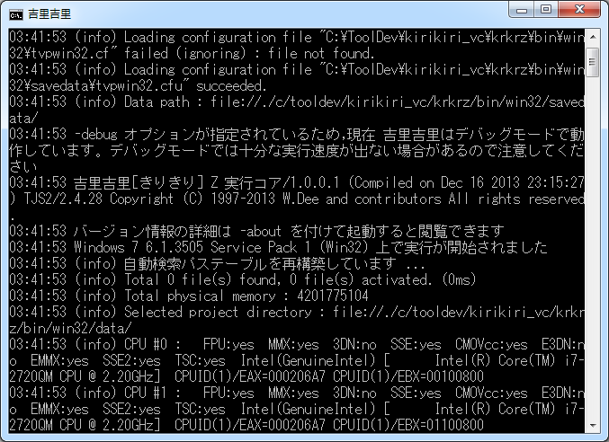

# コンソール

吉里吉里Z (現行版) には独立したコンソールウィンドウは存在しません。
コマンドラインから起動したときに **その端末 (コマンドライン) 上に**
ログメッセージが出力され、必要に応じて REPL を起動して対話的に
TJS 式を評価することができます。

## メッセージ表示

コマンドラインから起動すると、起動した端末上に吉里吉里システムや
ユーザスクリプトが [Debug.message](../reference/Debug.md#message) などで
出力するデバッグメッセージが流れます。表示レベルは
[コマンドラインオプション](CommandLine.md) の `-loglevel=` で調整可能です。

Win32 ビルドは windowed subsystem として作られているため、
`cmd.exe` / PowerShell 等から起動すると親プロセスのコンソールが
そのまま使われます。SDL ビルドは console subsystem なので
端末上で常にメッセージが見えます。



## 対話シェル ( REPL ) { #repl }

`KRKRZ_REPL=ON` でビルドされたバイナリにコマンドライン引数 `-repl`
( または `-repl=yes` ) を付けて起動すると、対話型 TJS シェル ( REPL )
が利用できます。Windows / macOS / Linux に対応します。

```
krkrz -repl data/        # SDL 版
krkrz64 -repl data/      # Win32 版
```

`-repl` を付けない場合は REPL は起動しません ( TTY 自動判定はありません )。
明示的に無効化したい場合は `-repl=no` / `-repl=off` / `-repl=false` /
`-repl=0` を指定します。

Win32 ( windowed subsystem ) 版は REPL 起動時に `AttachConsole` で親プロセス
のコンソールを取得し、無ければ `AllocConsole` で新規確保します。

### 操作

プロンプトは `krkrz>` です。継続入力中は `...` に変わります。
TJS の式や文を入力して改行すると評価され、結果が表示されます
( `;` を省略した式も評価されます )。括弧やクォートが閉じていない場合は
継続入力モードに入り、複数行の入力が可能です。
入力履歴はカレントディレクトリの `.krkrz_history` に保存されます。

REPL 内で使用できる特殊コマンド:

| コマンド | 説明 |
|---|---|
| `exit` / `quit` / `Ctrl+D` | REPL を抜け、アプリケーションも終了します |
| `.help` | ヘルプを表示します |
| `.clear` | 継続入力中のバッファをクリアします |
| `.depth [N]` | 結果表示の展開深さを表示または設定します |
| `.compact [on\|off]` | 結果表示のコンパクトモードを切り替えます |

### 結果表示

評価結果は [Debug.prettyPrint](../reference/Debug.md#prettyprint) と同じ整形で
表示されます。

- `void` → `(void)` 、null オブジェクト → `(null)`
- 数値 / 文字列 / オクテット列 → 式表記でそのまま
- 配列 → `[ e1, e2, ... ]` ( compact では `[e1, e2, ...]` )
- 辞書 → `%[ "key" => value, ... ]`
- 関数 / クラス / プロパティ → `(function)` / `(class)` / `(property)`
- その他オブジェクト → `(object: 0x...)`
- 展開深さに達した場合 → `[...]` / `%[...]`
- 循環参照 → `(recursion)`

REPL 実行中、エンジンが出力するログはレベル別に色分けされ
( `VERBOSE`=灰、`DEBUG`=シアン、`INFO`=デフォルト、`WARNING`=黄、
`ERROR`=赤、`CRITICAL`=太字赤 )、プロンプト行の上に割り込み表示されます。
