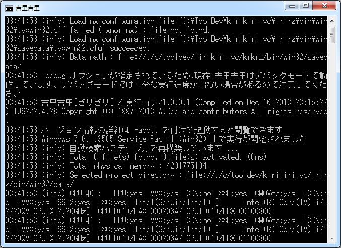

# コンソール

吉里吉里Z (現行版) には独立したコンソールウィンドウは存在しません。
コマンドラインから起動したときに **その端末 (コマンドライン) 上に**
ログメッセージが出力され、必要に応じて REPL を起動して対話的に
TJS 式を評価することができます。

## メッセージ表示

コマンドラインから起動すると、起動した端末上に吉里吉里システムや
ユーザスクリプトが [Debug.message](../reference/Debug.md#message) などで
出力するデバッグメッセージが流れます。表示レベルは
[コマンドラインオプション](CommandLine.md) の `-loglevel=` で調整可能です。

Win32 ビルドは windowed subsystem として作られているため、
`cmd.exe` / PowerShell 等から起動すると親プロセスのコンソールが
そのまま使われます。SDL ビルドは console subsystem なので
端末上で常にメッセージが見えます。



## 対話シェル ( REPL ) { #repl }

`KRKRZ_REPL=ON` でビルドされたバイナリにコマンドライン引数 `-repl`
( または `-repl=yes` ) を付けて起動すると、対話型 TJS シェル ( REPL )
が利用できます。Windows / macOS / Linux に対応します。

```
krkrz -repl data/        # SDL 版
krkrz64 -repl data/      # Win32 版
```

`-repl` を付けない場合は REPL は起動しません ( TTY 自動判定はありません )。
明示的に無効化したい場合は `-repl=no` / `-repl=off` / `-repl=false` /
`-repl=0` を指定します。

Win32 ( windowed subsystem ) 版は REPL 起動時に `AttachConsole` で親プロセス
のコンソールを取得し、無ければ `AllocConsole` で新規確保します。

#### 新規コンソールを強制する ( `-repl=new` )

`-repl=new` ( 別名 `-repl=window` / `-repl=separate` ) を指定すると、親や
継承したコンソールに attach せず、必ず**新規コンソールウィンドウ**を開きます。
ターミナルや別アプリから GUI を起動しつつ、REPL を起動元のコンソールに
食い込ませたくない場合に使います。

!!! note "Windows Terminal には載りません"
    本 exe は GUI ( windowed ) subsystem のため、実行中に確保するコンソールは
    「既定のターミナル アプリ」設定や `wt.exe` 経由に関わらず従来の conhost に
    なります ( GUI アプリは端末の擬似コンソールに参加できないため )。

## ブラウザ REPL ビューワー ( `-replweb` ) { #replweb }

`-replweb=<port>` ( 例 `-replweb=8899` ) を指定すると、`127.0.0.1:<port>` に
軽量な HTTP + SSE サーバが立ち上がり、**ブラウザから REPL を操作**できます
( `KRKRZ_REPL_WEB=ON` でビルドされている場合、既定 ON )。ブラウザで
`http://127.0.0.1:<port>/` を開くと、**上=ログ領域 / 下=入力行**の画面が出ます。

```
krkrz64 data/ -replweb=8899      # → http://127.0.0.1:8899/ を開く
```

コンソール ( conhost ) の制約を受けず、**テキスト選択・コピー・貼り付け・
スクロール・検索がすべてブラウザネイティブ**に効くのが利点です。ログはレベル
別に色分けされ、上部のフィルタで絞り込み・Clear もできます。入力欄では式・文の
評価 ( 下記「操作」と同じ )、`↑↓` で履歴、`.help` 等のドットコマンドが使えます。
複数のブラウザ ( タブ ) から同時に接続でき、同じログが流れます。

- **既定バインドは 127.0.0.1** ( ローカル専用 )。`[ホスト:]ポート` 書式で指定でき、
  `-replweb=0.0.0.0:8899` とすると全インタフェースにバインドし、**別マシンの
  ブラウザから接続**できます ( devkit / LAN 用途。ネットワーク露出のため信頼できる
  環境でのみ )。
- 実装は WIN32 ( Winsock ) / POSIX ソケット両対応 ( サーバ機構はプラットフォーム
  非依存。各 OS のソケットライブラリ初期化が要る環境ではそれを先に行うこと )。
- `-repl` ( コンソール ) / `-replfile` / `-replsocket` と独立に、同時起動も可能です。
- 値に `no` / `off` / `false` / `0` を与えると無効です。

### 操作

プロンプトは `krkrz>` です。継続入力中は `...` に変わります。
TJS の式や文を入力して改行すると評価され、結果が表示されます
( `;` を省略した式も評価されます )。括弧やクォートが閉じていない場合は
継続入力モードに入り、複数行の入力が可能です。
入力履歴はカレントディレクトリの `.krkrz_history` に保存されます。

REPL 内で使用できる特殊コマンド:

| コマンド | 説明 |
|---|---|
| `exit` / `quit` / `Ctrl+D` | REPL を抜け、アプリケーションも終了します |
| `.help` | ヘルプを表示します |
| `.clear` | 継続入力中のバッファをクリアします |
| `.depth [N]` | 結果表示の展開深さを表示または設定します |
| `.compact [on\|off]` | 結果表示のコンパクトモードを切り替えます |

### 結果表示

評価結果は [Debug.prettyPrint](../reference/Debug.md#prettyprint) と同じ整形で
表示されます。

- `void` → `(void)` 、null オブジェクト → `(null)`
- 数値 / 文字列 / オクテット列 → 式表記でそのまま
- 配列 → `[ e1, e2, ... ]` ( compact では `[e1, e2, ...]` )
- 辞書 → `%[ "key" => value, ... ]`
- 関数 / クラス / プロパティ → `(function)` / `(class)` / `(property)`
- その他オブジェクト → `(object: 0x...)`
- 展開深さに達した場合 → `[...]` / `%[...]`
- 循環参照 → `(recursion)`

REPL 実行中、エンジンが出力するログはレベル別に色分けされ
( `VERBOSE`=灰、`DEBUG`=シアン、`INFO`=デフォルト、`WARNING`=黄、
`ERROR`=赤、`CRITICAL`=太字赤 )、プロンプト行の上に割り込み表示されます。
