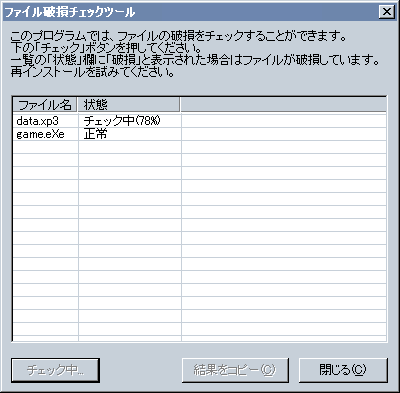

# ファイル破損チェックツール

## ファイル破損チェックツールについて

インストール時やインストール後のコンピュータの不調などにより、データは**破損**します。

「ファイル破損チェックツール」は、そのような「破損した」ファイルを検出する為のツールです。

ファイルの破損を検出する為には、あらかじめ

で、配布ファイルに署名を行っておかなければなりません。

ファイル破損チェックツールは、その**電子署名**の正当性も検査します(正当性が確認できないファイルは、このツールでは「破損」として扱われます)。

チェックの対象となるファイルは、このファイル破損チェックツールの置いてあるフォルダ以下のファイルとなります (ファイル破損チェックツールの置いてあるフォルダの階層下のフォルダも検索します)。そのため、このツールはインストール先フォルダに配置してください。

このツールがチェックするファイルは署名の行われているファイルのみで、署名の行われていないファイルに対してはチェックを行いません。しかし例外的に吉里吉里本体(やReleaserで作成された実行可能ファイル)だけは必ず署名のチェックを行うので、吉里吉里本体は必ず署名をしてください。

> **Note:**
> ファイル破損チェックツールは、ファイルの破損は検出できますが、「ファイルが存在しない」という状態は、それ自体では検出できません。
>
> ファイルの不足がエラーの原因であると考えられる場合は、このツールの「結果をコピー」で、このツールがチェックしたファイルの一覧をクリップボードにコピーできますので、それをエンドユーザから送って頂いて調査してください。

## ファイル破損チェックツールの設定ファイル

enduser-tools フォルダにある 「ファイル破損チェックツール.exe」がファイル破損チェックツールの本体ですが、その設定ファイルは「ファイル破損チェックツール.ini」となります。

ここにはファイル破損チェックツールの設定を書き込み、チェックツールの本体とともに配布する必要があります。

> **Note:**
> 「ファイル破損チェックツール.exe」の名称を変更した場合は、設定ファイルの名称も変更してください。たとえば「署名確認ツール.exe」にした場合、設定ファイルは「署名確認ツール.ini」にしてください。

以下に設定可能な項目を説明します。

- **[message]セクション - notice**  
  画面上部に表示するメッセージを指定します。
  
  notice= で始まる行は一行で(改行をいれずに)記述しなければなりませんが、[cr] を書くとそこに改行を入れることができます。
- **[message]セクション - caption**  
  ウィンドウのタイトルバーに表示する文字列を指定します。
- **[key]セクション - publickey**  
  電子署名の確認に用いる為の**公開鍵**を指定します。
  
  ここには、直接 ('設定名=' のようなものを記述せずに) 、公開鍵をコピー&ペーストして指定してください。

例は標準の(吉里吉里２ SDK配布ファイル内の)「ファイル破損チェックツール.ini」を参照してください。

## 使い方

ファイル破損チェックツール.exe を起動すると以下の画面が表示されます。

- **ファイル名一覧**  
  チェック対象となるファイルの一覧が表示されます。
  
  「状態」欄には「チェック中」「未チェック」「正常」「破損」のいずれかが表示されます。
  
  ファイルが破損していた場合は、該当ファイルは「破損」と表示されます。
- **チェック**  
  チェックを開始します。
  
  大きなファイルのチェックには時間がかかります。
- **結果をコピー**  
  結果をクリップボードにコピーします。
  
  エンドユーザがチェックした結果を送って頂く際に便利です。
  
  チェックが完了すると、有効状態(ボタンが押せる状態)になります。
  
  結果はタブ区切りのデータで、左から順に、ファイル名、ファイルの日付、ファイルサイズ、チェックの結果、となります。
  
  また、対象ディレクトリ化にある全てのファイルとディレクトリの一覧もコピーされます。想定していないファイルが存在する可能性がある場合は、この出力を見てチェックを行うことができます。
- **閉じる**  
  ウィンドウを閉じます。
