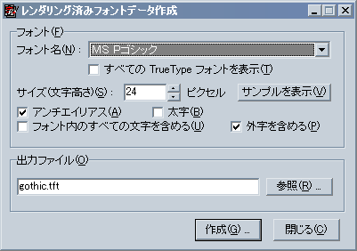

# レンダリング済みフォントデータ作成ツール

## レンダリング済みフォントデータ作成ツールについて

レンダリング済みフォントデータ作成ツールは、**レンダリング済みフォント** のデータを作成するためのツールです。[Font.mapPrerenderedFont](../reference/Font.md#mapprerenderedfont) で実際のフォントに割り当てることができるものです。

レンダリング済みとは、つまりあらかじめフォントをレンダリング ( この場合は TrueType アウトラインフォントを展開し、ビットマップフォントに変換すること ) しておいたもの、という意味です。これを使わない場合は、吉里吉里は必要に応じて実行時にレンダリングを行います。

レンダリング済みフォントは、制作者側の環境で作成するため、このフォントを使えばプレーヤ側の環境に左右されることなく同じフォントを使うことができます。

レンダリング済みフォントのデータはビットマップフォントデータです。つまり TrueType のようにスケーラブル ( 大きさを自由に変えられる ) フォントではないため、一つのフォントファイルでは一つの固定の大きさのフォントのみを扱うことになります。

> **Note:**
> レンダリング済みフォントのデータを作成しようとする元のフォントの著作者が、このような用途 ( そのフォントから作成した多数の文字のビットマップデータをゲームなどとともに配布し、そのビットマップデータを組み合わせて文字表示に用いること ) でそのフォントが使用されることを許可しているかどうかが定かでない場合は、そのフォントの著作者に確認をとることをお勧めします。
>
> ちなみにこのレンダリング済みフォントのファイルは吉里吉里独自の形式のもので、他の用途に流用される可能性はほとんどありません。
>
> 吉里吉里の作者は、このソフトウェアを使用して発生したいかなる問題にも関知しません。

このツールは OS の UNICODE サポートに強く依存しているため、Windows95 では動作しません。Windows 98/98SE/ME や Windows NT 4.0 では動作しますが一部の機能が制限されます。Windows 2000/XP ならばすべての機能を使用することができます。

もちろん、OS の種類による制限を受けるのはこのフォントを作成する環境でのことで、このツールで作成したレンダリング済みフォントデータを利用する側の OS の種類は関係ありません。

## レンダリング済みフォントデータ作成ツールの使い方

レンダリング済みフォントデータ作成ツール ( tools フォルダにある krkrfont.exe ) を実行すると、上の画面が表示されます。

- **「フォント名」**  
  レンダリング済みフォントデータを作成する元となるフォント名を指定します。縦書き用フォントを作成したい場合は先頭に @ マークのついたフォントを選択してください。
- **「すべての TrueType フォントを表示」**  
  チェックしない場合は 文字種が日本語であるフォントのみを「フォント名」に一覧表示しますが、チェックした場合はすべての TrueType フォントを表示します。
- **「サイズ(文字高さ)」**  
  作成するレンダリング済みフォントのサイズ ( 文字の高さ ) をピクセル単位で指定します。
- **「アンチエイリアス」**  
  アンチエイリアス処理を行うかどうかを指定します。アンチエイリアス処理を行うとフォントがなめらかになります。
- **「太字」**  
  太字にするかどうかを指定します。Windows NT 系の OS ( NT4, 2000, XP, Vista, 7 等 ) でのみチェックすることができます。
- **「フォント内のすべての文字を含める」**  
  フォント内に存在するすべての文字を含めるかどうかを指定します。Windows NT 系の OS ( ただし NT4 を除く ) でのみチェックすることができます。
  
  チェックすると、フォント内に含まれているすべての文字を出力するようになります。
  
  チェックをしないと、Shift JIS に該当する文字と半角英数／カナのみが出力されます。
  
  > **Note:**
  > チェックをしなかった場合の動作は、このツールの動作するロケールによって異なります。通常、日本語版 Windows 上で動作させる場合は Shift JIS に該当する文字などのみが出力されると言うことです。( といっても作者は日本語版 Windows 以外を持ってないのでわかりませんが )
- **「外字を含める」**  
  外字を含めるかどうかを指定します。Windows NT 系の OS ( ただし NT4 を除く ) でのみ選択することができます。その他の OS では常にチェックされた状態になります。
  
  外字は Windows 付属の「外字エディタ」などで作成することができます。
- **「サンプル」**  
  選択された条件で作成されるレンダリング済みフォントのサンプルを表示します。この「サンプル」では、出力されるすべての文字を確認することができます。
- **「出力ファイル」**  
  出力するファイルを指定します。出力するファイルの拡張子は .tft になります。「参照」をクリックするとダイアログボックスでファイルを指定することができます。
- **「作成」**  
  レンダリング済みフォントファイルを作成します。
- **「閉じる」**  
  このツールを終了します。
