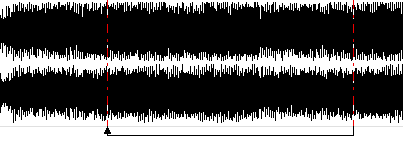
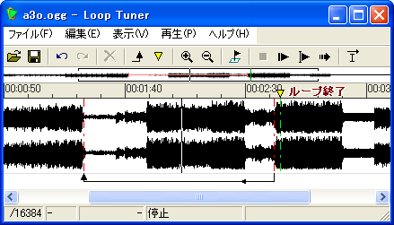
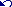
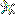
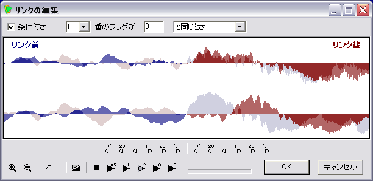
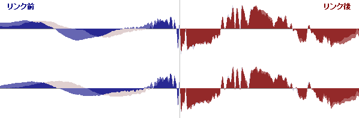
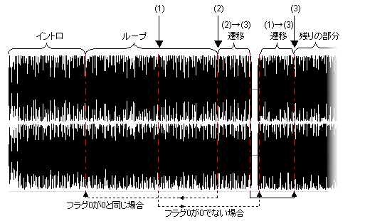

# ループチューナ

## ループチューナについて

ループチューナは、PCM形式 (.WAV や Ogg Vorbis など) のファイルに対し、

- 継ぎ目のない(シームレスな)ループを設定したり、条件によるジャンプ(再生位置の変更)を行う「**リンク**」
- 再生が特定の位置に達したとき、吉里吉里上でイベントを発生させる「**ラベル**」

といった情報を生成するツールです。

生成された情報は、PCM形式のファイル名の最後に .sli がついたファイル名 ( たとえば、se001.wav に対しては se001.wav.sli ) になり、[WaveSoundBuffer クラス](../reference/WaveSoundBuffer.md) で PCM 形式のファイルを開くときに自動的に読み込まれるようになります。

## シームレスなループとは

ループチューナを使わなくても、[WaveSoundBuffer.looping](../reference/WaveSoundBuffer.md#looping) プロパティを使えば、ループ再生をすることができます。しかし、これでは、サウンドの先頭から再生し、最後まで再生すればまた先頭にもどって、といった、単純なループしか行うことができません。

ループチューナを使えば、下図のように、サウンドの任意の場所まで再生したら、任意の場所に戻るといったループを設定することができます。弱起の曲をループさせたり、エンジンの始動縲怎Gンジン音のループのように、サウンドの先頭から繰り返して再生することができない場合に使うことができます。

この場合、繰り返しを行うタイミングを厳密に調整しないと、ループ位置で「プチッ」「ブツッ」といったクラックノイズが発生してしまいます。ループチューナでは、このタイミングの詳細な調整を支援する機能を持っているため、容易に調整を行うことができ、シームレスな(継ぎ目のない)ループを実現することができます。

また、希にいくら調整を行ってもこのノイズを取り除けない場合がありますが、ループチューナでは、リンクのすぐ付近で非常に短い(50ms程の)クロスフェードを行うことにより、このノイズを軽減する機能もあります。

## 条件付きリンク

「曲をループ再生しているが、とある条件に達したら、ループを抜けて次の旋律に進みたい」といった場合に、この条件付きリンクを使うことができます。

ループチューナでは、サウンドの再生位置を変更するための情報を「リンク」と呼んでいますが、このリンクに条件を付けることができます。

ループチューナでは16個の「フラグ」を管理することができ、これらのフラグは 0 縲鰀 9999 の値を持っています。これらの任意のリンクに対し、「○○番のフラグが○○である」「○○番のフラグが○○ではない」「○○番のフラグは○○以下である」などといった「条件」が合致すればリンクをたどる、といった設定を行うことができます。

フラグは、ループチューナ上でも値を変更してテストすることができるほか、[WaveSoundBuffer.flags プロパティ](../reference/WaveSoundBuffer.md#flags) を用いて、スクリプトから操作することもできます。

## ラベル

「再生位置が特定の場所に来たら、イベントを発生したい」といった用途のために、「ラベル」を設定することができます。

ラベルを通過すると、[WaveSoundBuffer.onLabel](../reference/WaveSoundBuffer.md#onlabel) イベントが発生します。イベントのパラメータにはラベル名が渡されるため、どのラベルを通過したかを知ることができます。

また、ラベルに特別な「**式**」を設定することにより、ラベル通過時にフラグの値を増減したり、値を設定したりすることができます。

上記の「条件付きリンク」と組み合わせれば、特定区間を４回だけ再生、といった使い方ができます。

## リンク、ラベルとバッファリング

吉里吉里の WaveSoundBuffer は、常にサウンドのバッファリングを行っています。デコード(ファイルからの読み出しや、圧縮音楽ファイルの展開) を行った後、すぐにそれを再生するのではなく、いったんバッファと呼ばれるメモリに蓄積してから再生します。

つまり、常に実際の再生位置に先駆けてデコードを行っており、標準の設定では最長で2秒間のズレがあります。

リンクの条件がテストされるのは、このデコードの時点であるため、フラグを操作しても、その効果が実際に得られるのは最長で２秒後となります。つまり、再生中に、リンクの直前、最長で２秒前までに条件を変更しても、そのリンクには影響しない可能性があり、注意が必要です。

「最長で２秒」と言うのは、場合によってはこれよりも短い場合がある、ということです。CPUに余力があり、デコードを十分行えれば、おおむね２秒をキープしますが、CPUが他の処理で奪われ、デコードが遅れると２秒を切ることがあります。

また、ラベルに関しては、ラベルのイベントが発生するのは、実際の「再生位置」がその場所に達した場合ですが、これに対し、ラベルの「式」が実行されるのは、「デコード位置」がその場所に達した場合なので注意が必要です。

## 読み込み可能な形式

ループチューナは、現時点で以下の PCM の形式のファイルを扱うことができます。

- 無圧縮 Wave ( 拡張子は .wav )
- MS-ADPCM ( 拡張子は .wav )
- Ogg Vorbis ( 拡張子は .ogg )

ループチューナは、吉里吉里本体と同じプラグインを使用します。標準の配布構成では、各プラグインを自動的に検出しますので、特別な設定は必要有りません。

## メイン画面

ループチューナ (krkrlt.exe) を起動すると、以下の画面が表示されます (以下の画面は、実際にファイルを読み込んだところ)

- **縮小波形表示部分**  
  ここには、サウンドの全体を縮小した波形が表示されます。赤い横線はリンク、緑の縦線はラベルを表しています。
  
  クリックをすると、その付近を波形表示部分に表示することができます。ダブルクリックをすると、その位置から再生を開始することができます。
  
  縮小波形の作成には時間がかかるため、サウンドを読み込んだ直後や、ウィンドウの横幅を変更した直後は全てが表示されないかもしれません (バックグラウンドで縮小波形を作成しますので、時間が経つにつれ表示されるようになります)。
- **タイムライン・ラベル表示部分**  
  ここには、タイムラインが表示され、波形のどの位置が、サウンドの先頭からどれほどの時間が経過した位置にあるのかを知ることができます。
  
  また、ラベルの情報もここに表示されます。逆三角形のマークはラベルを表しています。
  
  ラベルをクリックするとラベルを選択することができます。
  
  ラベルをダブルクリックすると、ラベル名を編集することができます。
- **波形表示部分**  
  ここには、サウンドの波形が表示されます。
  
  [表示|ズームイン]あるいは[表示|ズームアウト]で、波形の拡大や縮小を行うことができます。
  
  波形をクリックすると、その位置に点滅する縦棒が表示されます(これをキャレットと呼びます)。[再生|現在位置から再生] ではこの場所から再生を開始することができます。また、[表示|ズームイン]あるいは[表示|ズームアウト]では、この位置を中心にして拡大や縮小が行われます。
  
  波形上をダブルクリックすると、その位置から再生を開始することができます。
  
  波形が画面に収まりきらない場合は、下部にスクロールバーが表示されます。
  
  波形表示部分に表示される、縦の点線は、ラベルあるいはリンクの位置を表しています。この縦の点線はマウスでドラッグを行うことができ、位置の調整ができます。
- **リンク表示部分**  
  ここには、リンクの情報が表示されます。
  
  リンクは矢印で表示され、矢印の元の部分に再生位置が達したときに、矢印の先の部分に移動する、という意味になります。
  
  点線のリンクは、条件付きリンクを表しています。
  
  リンクをクリックすると、リンクを選択することができます。
  
  リンクをダブルクリックすると、リンクの編集画面を表示することができます。
- **[ファイル(F)|開く(O) ...]\() ショートカットキー: Ctrl+O**  
  操作対象となるサウンドファイルを開きます。すでに開かれているファイルに変更が加わっていた場合、変更を保存するかどうかを尋ねるダイアログボックスが表示されます。
- **[ファイル(F)|保存(S)]\() ショートカットキー: Ctrl+S**  
  現在の内容をファイルに保存します。ファイル名は、PCM形式のファイル名の最後に .sli がついたファイル名 ( たとえば、se001.wav に対しては se001.wav.sli ) になります。
- **[ファイル(F)|終了(X)]**  
  ループチューナを終了します。すでに開かれているファイルに変更が加わっていた場合、変更を保存するかどうかを尋ねるダイアログボックスが表示されます。
- **[編集(V)|元に戻す(U)]\() ショートカットキー: Ctrl+Z**  
  最後の編集を取り消し、直前の状態に戻します。
- **[編集(V)|やり直し(R)]\()**  
  「元に戻す」で元に戻した変更を、再度適用します。
- **[編集(V)|削除(D)]\() ショートカットキー: Del**  
  現在選択されているアイテムを削除します。
- **[編集(V)|新規リンクを作成(J)]\()**  
  新しいリンクを作成します。リンクは、前回クリックした場所をリンクの先とし、前々回クリックした場所をリンクの元として作成されます。従って、リンクを作成したい場合は、まずリンクの元となる場所をクリックし、次にリンクの先となる場所をクリックし、最後にこのメニューを選択してください。
- **[編集(V)|新規ラベルを作成(J)]\()**  
  新しいラベルを作成します。
- **[編集(V)|リンクの編集(T) ...]\()**  
  現在選択されているリンクを調整するための画面を開きます。
- **[編集(V)|再生位置にラベルを作成(A)]\() ショートカットキー: A または S**  
  現在の再生位置にラベルを作成します。ラベルをキーパンチで作成することができます。A キーだけの連打が難しい場合には S キーも使うことができますので、A キーと S キーを交互に押すと楽です。
- **[編集(V)|全てのラベルを削除(Q)]\() ショートカットキー: Ctrl + Q**  
  全てのラベルを削除します。
- **[表示(V)|ズームイン(I)]\() ショートカットキー: I**  
  波形を拡大します。
- **[表示(V)|ズームアウト(O)]\() ショートカットキー: O**  
  波形を縮小します。
- **[表示(V)|再生位置に画面を追従(F)]\() ショートカットキー: F**  
  再生位置に画面を追従します。
- **[表示(V)|ツールバーの表示(T)]**  
  ツールバーの表示/非表示を切り替えます。
- **[表示(V)|フラグの表示(G)]\()**  
  フラグ編集バーを表示します。
  
  フラグ編集バーには16個の編集欄があり、それぞれがフラグを表しています。値を変更することもできます。編集欄をダブルクリックすることにより、数値が 0 であれば 1 に、0 であれば 1 にする(トグルする)ことができます。
  
  左端の[C]ボタンをクリックすると、全てのフラグを 0 にすることができます。
- **[表示(V)|縮小波形の表示(E)]**  
  縮小波形の表示/非表示を切り替えます。
- **[表示(V)|ステータスバーの表示(S)]**  
  ステータスバーの表示/非表示を切り替えます。
- **[再生(P)|停止(Q)]\() ショートカットキー: Q**  
  再生を停止します。
- **[再生(P)|初めから再生(P)]\() ショートカットキー: P**  
  サウンドの初めから再生を開始します。
- **[再生(P)|現在位置から再生(C)]\() ショートカットキー: Space**  
  キャレット位置からサウンドの再生を開始します。
- **[再生(P)|リンクを無視して再生(G)]\() ショートカットキー: G**  
  この項目がチェックされている(押し込まれた表示になっている)状態では、全てのリンクを無視して再生します。再生位置がリンクの元の位置に達しても、リンクをたどりません。
- **[ヘルプ(H)|ヘルプ(H)]**  
  ヘルプを表示します。
- **[ヘルプ(H)|ループチューナについて(A)]**  
  ループチューナの著作権情報とバージョン情報を表示します。

## リンクの編集画面

[編集|リンクの編集] を選択するか、あるいはリンクをダブルクリックすることによりこの画面を表示することができます。

この画面で有効なショートカットキーについては、波形を右クリックした際に表示されるメニューを参照してください。

- **リンク条件**  
  最上部は、リンクの条件を編集する部分です。
  
  [条件付き] チェックボックスをチェックすることにより、このリンクを条件付きリンクとすることができます。条件は、右側の部分で指定します。
  
  条件は、以下の形式で指定することができます。
  
  
  
  `[A]番のフラグが[B][条件]`
  
  
  
  [A] には、比較対象となるフラグ番号 (0縲鰀15) を指定します。
  
  [B] には、比較対象となる数値 (0縲鰀9999) を指定します。
  
  [条件] には条件を指定します。条件は、「と同じとき」「でないとき」「より大きいとき」「以上のとき」「より小さいとき」「以下のとき」の６つです。
  
  
  
  比較対象となる数値は 0 縲鰀 9999 までを使用できますが、特別な用途でない限り、0 か 1 を用いた方がよいでしょう (メイン画面の「フラグの表示」で表示されるフラグ編集欄でも、 0 や 1 はダブルクリックで簡単に入力することができます )。
- **波形表示部分**  
  波形表示部分では、リンクの直前の波形とリンクの直後の波形を確認することができます。左側の青い波形がリンク前の波形、右側の赤い波形がリンク後の波形です。薄く見える波形は、それぞれリンク前に対するリンク後、リンク後に対するリンク前の波形で、重ね合わせて表示されます。
  
  波形は、マウスでドラッグすることにより調整することができます。また、波形表示部分の下部に並んでいるリンク調整ボタンでも調整することができます。
- **リンク調整ボタン**  
  リンク調整ボタンは12個ありますが、左側の6個はリンク前の位置を調整し、右側の6個はリンク後の位置を調整します。
  
  - **前のクロッシング・ポイントへ()**  
    直前のクロッシング・ポイント(波形が -Inf ラインと交差する点) を探し、そこに移動します。
  - **前へ20ステップ()**  
    前へ20ステップ移動します。1ステップは、波形の倍率により、倍率が1/16ならば16サンプル、倍率が1/1ならば1サンプルです。
  - **前へ1ステップ()**  
    前へ1ステップ移動します。
  - **次へ1ステップ()**  
    次へ1ステップ移動します。
  - **次へ20ステップ()**  
    次へ20ステップ移動します。
  - **次のクロッシング・ポイントへ()**  
    直後のクロッシング・ポイント(波形が -Inf ラインと交差する点) を探し、そこに移動します。
- **倍率変更ボタン()**  
  倍率を変更します。倍率は、このボタンの横に /1 などとして表示されています。/1 は 1/1 (1ピクセルが1サンプル) を表します。/16 ならば 1/16 (1ピクセルが16サンプル) を表します。
- **リンクをスムーズにする()**  
  リンクをスムーズにします。このボタンがチェックされている(押し込まれた表示になっている)状態では、ループチューナおよび吉里吉里は、リンク前の波形とリンク後の波形を、短いクロスフェード(50ms) でミックスして再生します。これにより、リンク前とリンク後の波形がうまくあわないために発生する「プチッ」「ブツッ」といったクラックノイズを軽減することができます。
- **再生を停止()**  
  再生を停止します。
- **再生()**  
  リンク付近を再生します。0.5秒前、1秒前、2秒前、3秒前、5秒前のそれぞれから再生ができます。
  
  再生のボタンをクリックすると、そのボタンがマークされます (色が変わります)。以降、スペースキーを押すと、そのボタンをクリックするのと同じ動作となります (最後にクリックしたボタンと同じ時間、リンク前から再生されます)。
- **[OK] ボタン**  
  変更を確定し、ウィンドウを閉じます。
- **[キャンセル] ボタン**  
  変更を破棄し、ウィンドウを閉じます。

> **Note:**
> 無条件リンクと、一つ以上の条件付きリンクのリンク元が同じ位置にあった場合は、条件つきリンクの条件のテストが優先され、いずれの条件にも合致しなかった場合は無条件リンクとなります。
>
> 無条件リンクが複数あった場合はどのリンクが使用されるかは不定となります。
>
> 条件リンクが複数あった場合は、テストの順番は不定となります。
>
> この場合の「同じ位置」とは、厳密に全く同じ位置、という意味です。1サンプルでも位置がずれていた場合は同じ位置とは見なされません。

## ラベルの式

ラベルは、特別な書式の「式」を設定することにより、そのラベルを通過する際に、フラグに対して特別な処理をさせることができます。

ラベルに「式」を記述する場合は、ラベル名の先頭を ':' (コロン) で始めなければなりません。

式は、操作対象のフラグと、その対象にどのような処理を行うかを表す「**演算子**(オペレータ)」、演算子のパラメータとなる「**オペランド**」が順に並びます (一部の演算子にはオペランドがありません)。

操作対象のフラグは、'[' ']' (大括弧) でフラグ番号(0縲鰀15)を囲って指定します。オペランドは、数値の場合は数値をそのまま記述し、他のフラグを指定したい場合は、'[' ']' (大括弧) でフラグ番号(0縲鰀15)を囲って指定します。

演算子には以下の種類があります。

- **=**  
  フラグの値にオペランドの値を代入します
- **+=**  
  フラグの値にオペランドの値を加算します
- **-=**  
  フラグの値からオペランドの値を減算します
- **++**  
  フラグの値を1つ増やします
- **--**  
  フラグの値を1つ減らします

いずれの場合も、フラグの値の範囲は必ず 0 縲鰀 9999 となります。 0 を下回る場合は 0に、 9999 を上回る場合は 9999 に修正されます。

例:

`:[0]=1    `0番のフラグの値に 1 を代入

`:[1]=[0]  `1番のフラグの値に0番のフラグの値を代入

`:[1]+=3   `1番のフラグの値に 3 を加算

`:[0]++    `1番のフラグの値を1つ増やす

> **Note:**
> 複数のラベルが同じ位置にあった場合は、実行の順序は不定となります。

## ヒントとTips

- **リンクの調整**  
  リンクによるPCMの継ぎ目では、調整がよくないと、クラックノイズが発生してしまいます。「リンクをスムーズにする」(スムーズリンク)の機能を用いて、このクラックノイズを軽減することはできますが、まずはスムーズリンクなしで調整を行うことをおすすめします。
  
  
  
  音源+シーケンサなどの電子環境で生成された音楽であれば、多くの場合、下図のように、リンクの前後でほぼ一致するポイントを見つけることができると思います。
  
  
  
  
  
  そのほか、ノイズが入るのは仕方がないとしても、それを目立たなくする以下のようなポイントがあります。
  
  - 継ぎ目にする位置は、スネアあるいはシンバル系のドラムの直前をループの継ぎ目にするとノイズが目立ちません。高い音、破裂音などの直前も好都合です
  - 継ぎ目にする位置は、クロッシングポイントにするとノイズが目立ちません
- **条件付きリンクによる曲進行の制御**  
  イントロから始まってループし、ゲームなどの進行によって、とある条件でループを抜け、別のループに入る、といった、ゲームの進行・情景を反映した曲進行の制御を、条件付きリンクとフラグの操作によって実現することができます。
  
  ただし、もちろん、リンクはループチューナであらかじめ指定した位置でしか動作しません。リンクの条件を変更しても、リンクの位置に達しなければ再生位置が変わらないと言うことです。
  
  もしループが長い場合など、ループの終端に達しなければループを抜けられないのが問題であるならば、ループの途中でもループを抜けられるように曲の構成を工夫しなければなりません。
  
  たとえば、下図のようにします。
  
  
  
  
  
  
  再生開始時は、フラグ0 は 0 です。「イントロ」が再生され、「ループ」部分が繰り返し再生されます。
  
  ここで、ゲームなどが進行し、フラグ0 が 1 になると、(1)か(2)の時点でこの「ループ」から抜けることになります。
  
  もし、(1)でループを抜けると、「(1)→(3)遷移」を経て(3)まで再生され、「残りの部分」が再生されます。
  
  また、もし(2)でループを抜けると、「(2)→(3)遷移」を経た後、リンクによって(3)までジャンプし、「残りの部分」が再生されます。
  
  
  
  様々な応用が考えられると思います。
