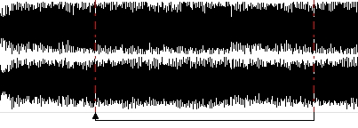
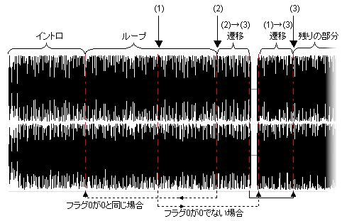

# ループチューナ

## ループチューナについて

ループチューナ (`krkrloop`) は、音声ファイル (WAV / Ogg Vorbis / Ogg Opus) に対し、

- 継ぎ目のない(シームレスな)ループを設定したり、条件によるジャンプ(再生位置の変更)を行う「**リンク**」
- 再生が特定の位置に達したとき、吉里吉里上でイベントを発生させる「**ラベル**」

といった情報を、波形を見ながら作成・試聴するツールです。吉里吉里2 のループチューナ (krkrlt.exe) の後継で、[標準ツール](Tools.md) のひとつです。

生成された情報は、音声ファイル名の最後に .sli がついたファイル名 ( たとえば、bgm01.ogg に対しては bgm01.ogg.sli ) になり、[WaveSoundBuffer クラス](../reference/WaveSoundBuffer.md) で音声ファイルを開くときに自動的に読み込まれるようになります。

ループチューナの試聴は、吉里吉里本体のループ処理 (WaveLoopManager) を移植した処理で行っています。リンクのたどり方・条件の判定・スムーズなリンクのクロスフェード・ラベルの式は本体と同じで、サンプル単位で本体と同じ位置でリンクをたどります。

## シームレスなループとは

ループチューナを使わなくても、[WaveSoundBuffer.looping](../reference/WaveSoundBuffer.md#looping) プロパティを使えば、ループ再生をすることができます。しかし、これでは、サウンドの先頭から再生し、最後まで再生すればまた先頭にもどって、といった、単純なループしか行うことができません。

ループチューナを使えば、下図のように、サウンドの任意の場所まで再生したら、任意の場所に戻るといったループを設定することができます。弱起の曲をループさせたり、エンジンの始動〜エンジン音のループのように、サウンドの先頭から繰り返して再生することができない場合に使うことができます。



この場合、繰り返しを行うタイミングを厳密に調整しないと、ループ位置で「プチッ」「ブツッ」といったクラックノイズが発生してしまいます。ループチューナでは、サンプル単位までの拡大表示やゼロクロスへの吸着など、このタイミングの詳細な調整を支援する機能を持っているため、容易に調整を行うことができ、シームレスな(継ぎ目のない)ループを実現することができます。

また、希にいくら調整を行ってもこのノイズを取り除けない場合がありますが、リンクを「**スムーズ**」(Smooth) にすると、リンクのすぐ付近で非常に短い (50ms の) クロスフェードを行い、このノイズを軽減することができます。クロスフェードは、リンク元の 25ms 手前からリンク元までの音と、リンク先の 25ms 手前からリンク先の 25ms 後までの音を混ぜ合わせます (音声の先頭や末尾の近くでは短くなります)。

## 条件付きリンク

「曲をループ再生しているが、とある条件に達したら、ループを抜けて次の旋律に進みたい」といった場合に、この条件付きリンクを使うことができます。

ループチューナでは、サウンドの再生位置を変更するための情報を「リンク」と呼んでいますが、このリンクに条件を付けることができます。

吉里吉里では 16 個 (0〜15 番) の「フラグ」を管理することができ、これらのフラグは 0 〜 9999 の値を持っています。任意のリンクに対し、「○○番のフラグが○○である」「○○番のフラグが○○ではない」「○○番のフラグは○○以下である」などといった「条件」が合致すればリンクをたどる、といった設定を行うことができます。

条件は次の 6 種類です (.sli ファイルでの表記を括弧内に示します)。

| 条件 | 意味 |
|---|---|
| = (`eq`) | フラグが値と等しいとき |
| ≠ (`ne`) | フラグが値と等しくないとき |
| > (`gt`) | フラグが値より大きいとき |
| ≥ (`ge`) | フラグが値以上のとき |
| < (`lt`) | フラグが値より小さいとき |
| ≤ (`le`) | フラグが値以下のとき |

比較する値は 0 〜 9999 を使用できますが、特別な用途でない限り、0 か 1 を用いた方がよいでしょう。

フラグは、ループチューナ上でも値を変更してテストすることができるほか、[WaveSoundBuffer.flags プロパティ](../reference/WaveSoundBuffer.md#flags) を用いて、スクリプトから操作することもできます。

> **Note:**
> 無条件リンクと、一つ以上の条件付きリンクのリンク元が同じ位置にあった場合は、条件付きリンクの条件のテストが優先され、いずれの条件にも合致しなかった場合は無条件リンクとなります。
>
> 無条件リンクが複数あった場合はどのリンクが使用されるかは不定となります。
>
> 条件付きリンクが複数あった場合、テストの順番は追加した順ではありません。複数の条件が同時に成り立つような組み合わせは避けてください。
>
> この場合の「同じ位置」とは、厳密に全く同じ位置、という意味です。1サンプルでも位置がずれていた場合は同じ位置とは見なされません。

## ラベル

「再生位置が特定の場所に来たら、イベントを発生したい」といった用途のために、「ラベル」を設定することができます。

ラベルを通過すると、[WaveSoundBuffer.onLabel](../reference/WaveSoundBuffer.md#onlabel) イベントが発生します。イベントのパラメータにはラベル名が渡されるため、どのラベルを通過したかを知ることができます。ラベルの一覧と位置は [WaveSoundBuffer.labels](../reference/WaveSoundBuffer.md#labels) プロパティでも得られます。

また、ラベルに特別な「**式**」を設定することにより、ラベル通過時にフラグの値を増減したり、値を設定したりすることができます (後述の「ラベルの式」を参照)。

上記の「条件付きリンク」と組み合わせれば、特定区間を４回だけ再生、といった使い方ができます。

> **Note:**
> ラベル名に ' (シングルクォーテーション) は使えません。

## ラベルの式

ラベルは、特別な書式の「式」を設定することにより、そのラベルを通過する際に、フラグに対して特別な処理をさせることができます。

ラベルに「式」を記述する場合は、ラベル名の先頭を ':' (コロン) で始めなければなりません。

式は、操作対象のフラグと、その対象にどのような処理を行うかを表す「**演算子**(オペレータ)」、演算子のパラメータとなる「**オペランド**」が順に並びます (一部の演算子にはオペランドがありません)。

操作対象のフラグは、'[' ']' (大括弧) でフラグ番号(0〜15)を囲って指定します。オペランドは、数値の場合は数値をそのまま記述し、他のフラグを指定したい場合は、'[' ']' (大括弧) でフラグ番号(0〜15)を囲って指定します。

演算子には以下の種類があります。

- **=**  
  フラグの値にオペランドの値を代入します
- **+=**  
  フラグの値にオペランドの値を加算します
- **-=**  
  フラグの値からオペランドの値を減算します
- **++**  
  フラグの値を1つ増やします (オペランドは書きません)
- **--**  
  フラグの値を1つ減らします (オペランドは書きません)

いずれの場合も、フラグの値の範囲は必ず 0 〜 9999 となります。 0 を下回る場合は 0に、 9999 を上回る場合は 9999 に修正されます。

例:

| 式 | 意味 |
|---|---|
| `:[0]=1` | 0番のフラグの値に 1 を代入 |
| `:[1]=[0]` | 1番のフラグの値に0番のフラグの値を代入 |
| `:[1]+=3` | 1番のフラグの値に 3 を加算 |
| `:[0]++` | 0番のフラグの値を1つ増やす |

記号の間には空白を入れてもかまいません。書式が正しくない式 (フラグ番号が 16 以上、`=` などにオペランドがない、など) は、本体では何もしません (onLabel イベントは発生します)。ループチューナのラベルの編集画面では、入力中の名前が正しい式かどうかが表示されます。

> **Note:**
> 複数のラベルが同じ位置にあった場合は、実行の順序は不定となります。

## リンク、ラベルとバッファリング

吉里吉里の WaveSoundBuffer は、常にサウンドのバッファリングを行っています。デコード(ファイルからの読み出しや、圧縮音楽ファイルの展開) を行った後、すぐにそれを再生するのではなく、いったんバッファと呼ばれるメモリに蓄積してから再生します。

つまり、常に実際の再生位置に先駆けてデコードを行っています。

リンクの条件がテストされるのは、このデコードの時点であるため、フラグを操作しても、その効果が実際に得られるのはバッファの長さぶん後になります。つまり、再生中に、リンクの直前に条件を変更しても、そのリンクには影響しない可能性があり、注意が必要です。条件を変えるのは、余裕を持ってリンクより前にしてください。

また、ラベルに関しては、ラベルのイベントが発生するのは、実際の「再生位置」がその場所に達した場合ですが、これに対し、ラベルの「式」が実行されるのは、「デコード位置」がその場所に達した場合なので注意が必要です。

> **Note:**
> ループチューナの試聴では、ほぼ再生位置のとおりにデコードするため、この遅れはほとんどありません。フラグを操作するタイミングが厳しい場合は、実際に吉里吉里上で確かめてください。

## 扱える形式

ループチューナは、以下の形式の音声ファイルを扱うことができます。

- WAV (整数 PCM 8 / 16 / 24 / 32bit、浮動小数点 32 / 64bit。WAVE_FORMAT_EXTENSIBLE も可)
- Ogg Vorbis
- Ogg Opus

位置はすべて**サンプル単位** (1 チャンネルあたりのサンプル数) で扱います。

> **Note:**
> Ogg Opus は常に 48kHz で再生されるため、.sli の位置も 48kHz のサンプル数になります。WAV や Ogg Vorbis を Opus に変換する場合は、[音声フォーマットコンバータ](AudioConverter.md) が .sli の位置を換算して一緒に書き出します。
>
> Opus のヘッダゲインは本体が常に適用するので、ループチューナでもヘッダゲインを適用した音量で波形を表示・試聴します。

吉里吉里2 のループチューナで扱えた MS-ADPCM 形式の WAV には対応していません。

## 起動

```
krkrloop                    画面を開く
krkrloop <音声ファイル>      画面を開き、そのファイルを開く
```

画面はブラウザのウィンドウで開きます (起動や画面の共通事項は [標準ツール](Tools.md) を参照)。«開く…» (Ctrl+O) で音声ファイルを選ぶと、同じフォルダの «音声ファイル.sli» があれば一緒に読み込みます。

.sli が本体の読めない書式だった場合は、画面下部にその旨が表示され、リンクとラベルは空の状態で開きます (このまま保存すると、その .sli は上書きされます)。

## 画面

画面は、上部のツールバー、左側の波形表示、右側のリンク・ラベル・フラグの一覧、下部のステータスバーからなります。

- **全体表示**  
  波形表示の上の細長い部分には、サウンドの全体を縮小した波形が表示されます。リンク元とラベルの位置が縦線で、いま波形表示に出ている範囲が枠で示されます。クリックやドラッグで、その付近を波形表示に表示することができます。
- **波形表示**  
  上から順に、時間の目盛り、ラベル、波形 (チャンネルごと)、リンクが表示されます。
  
  - ラベルは逆三角形のマークと名前で表示されます。':' で始まる (式を持つ) ラベルは色を変えて表示されます
  - リンクは、下部に矢印で表示されます。矢印の元の部分 (リンク元、From) に再生位置が達したときに、矢印の先の部分 (リンク先、To) に移動する、という意味になります。波形上には、リンク元が実線、リンク先が点線の縦線で示されます
  - 条件付きリンクは色を変えて表示され、`[0]=1` のように条件が添えられます。スムーズなリンクには `~` が付きます
  - 波形をクリックすると、その位置に縦棒 (キャレット) が表示されます。波形をドラッグすると範囲を選択できます
  - 再生中は、再生位置が赤い縦線で表示されます
- **リンク・ラベルの一覧**  
  右側には、リンクとラベルの一覧がそれぞれ位置の順に表示されます。クリックすると選択して、その位置を表示します。ダブルクリックすると編集画面を開きます。
- **フラグ**  
  右側の下部には、16 個のフラグの値が表示されます (後述)。
- **ステータスバー**  
  キャレットの位置、選択範囲、再生位置、表示の倍率と、操作の結果などのメッセージが表示されます。位置は「分:秒 (サンプル位置)」の形で表示されます。

### 拡大・縮小とスクロール

- マウスホイールで左右にスクロールします
- Ctrl+ホイールで、マウスの位置を中心に拡大・縮小します
- ツールバーの «＋» «－» (キー + / -) で拡大・縮小、«全体» (キー 0) で全体を表示します。キーで拡大・縮小するときは、キャレットの位置が中心になります
- 1 サンプルが 64 ピクセルになるまで拡大できます。十分に拡大すると、波形は 1 サンプルずつ点で表示されます

### リンクとラベルの追加・編集

- **リンクの追加** (ツールバーの «リンク追加»、一覧の «＋»、キー L)  
  リンクの編集画面が開きます。範囲を選択しているときは、選択範囲の終わりをリンク元、始まりをリンク先とした値が入っています (選択した範囲をループする設定になります)。
- **ラベルの追加** (ツールバーの «ラベル追加»、一覧の «＋»、キー B)  
  キャレットの位置にラベルを追加します。ラベルの編集画面が開くので、名前を入力します。
- **編集** (一覧や波形上のリンク・ラベルをダブルクリック、または選択して Enter)  
  リンクの編集画面では、リンク元 (From)・リンク先 (To) の位置 (サンプル単位)、スムーズにするかどうか、条件 (「条件なし」と 6 種類の条件、フラグ番号、値) を編集できます。ラベルの編集画面では、位置と名前を編集できます。
- **移動**  
  波形表示のラベルのマーク、リンクの矢印の両端は、マウスでドラッグして位置を調整できます。
- **ゼロクロスへの吸着**  
  ツールバーの «ゼロクロス» がチェックされている(既定)と、ドラッグした位置を、近くの «波形が 0 をまたぐ点» (ゼロクロス・ポイント) に合わせます。ステレオなどの場合は全チャンネルを足した波形で判定します。継ぎ目のノイズを抑えるのに役立ちます。サンプル単位で細かく合わせたいときはチェックを外してください。
- **削除** (ツールバーの «削除»、キー Delete)  
  選択しているリンクまたはラベルを削除します。
- **元に戻す / やり直し** (ツールバーの «↶» «↷»、Ctrl+Z / Ctrl+Y)  
  リンクとラベルの変更を、元に戻したりやり直したりできます。

リンクの編集画面では、次の内容は受け付けません。

- 音声の範囲 (0 〜 全体のサンプル数) の外の位置
- 0 〜 15 以外のフラグ番号、0 〜 9999 以外の値
- 条件なしでリンク元とリンク先が同じリンク (そこから先へ進めなくなります)

### フラグ

右側のフラグ欄には 16 個の編集欄があり、それぞれがフラグ [0] 〜 [15] を表しています。値 (0 〜 9999) を書き換えると、すぐに試聴に反映されます。0 以外の値のフラグは枠の色が変わります。

再生中に ':' で始まるラベルを通過すると、その式のとおりにフラグが変わり、表示も更新されます。«0 に戻す» で全てのフラグを 0 にします。

> **Note:**
> 本体では、フラグは WaveSoundBuffer.open で全て 0 に戻りますが、ループチューナでは再生を始めてもフラグは戻りません。最初から試すときは «0 に戻す» を押してください。

### 試聴

- **▶ 再生 / ■ 停止** (Space)  
  キャレットの位置から再生します。再生中に押すと停止します。
- **先頭から** (Home)  
  サウンドの先頭から再生します。
- **波形をダブルクリック**  
  その位置から再生します。再生中に時間の目盛りをクリックすると、その位置へ再生位置を移します。
- **リンク試聴** (P)  
  選択しているリンクの、リンク元の 2 秒手前から 4 秒間再生します。継ぎ目の確認に使います。
- **追従**  
  チェックされている(既定)と、再生中は表示を再生位置に合わせてスクロールします。
- **末尾で先頭へ**  
  チェックすると、末尾まで再生したら先頭に戻って再生を続けます ([WaveSoundBuffer.looping](../reference/WaveSoundBuffer.md#looping) を真にしたときの動作です)。チェックしないと、末尾で再生を終えます。
- **リンク無視**  
  チェックすると、全てのリンクを無視して再生します。再生位置がリンク元に達しても、リンクをたどりません。

再生中は、リンクをたどったときや、ラベルを通過したときに、ステータスバーにその内容が表示されます。

再生はリンクやフラグの変更をすぐに反映します。リンクのたどり方は本体と同じで、条件・同じリンク元のリンクの優先順・スムーズなリンクのクロスフェード・ラベルの式もそのまま再現されます。

### 保存

«保存» (Ctrl+S) で、リンクとラベルを «音声ファイル.sli» に保存します。変更を保存していないときは、ボタンが «保存 *» になります。保存していない変更があるまま別のファイルを開こうとしたり、画面を閉じようとしたりすると、確認が表示されます。

保存するときは、書き出した内容を本体と同じ規則で読み直せることを確かめてから書き込みます。また、リンクやラベルの位置が音声の範囲の外にある場合などは、保存したうえで、その問題をステータスバーに警告として表示します。

### WAV 書き出し

«WAV 書き出し…» (Ctrl+E) で、音声を WAV ファイルに書き出します。内容は次のどちらかを選びます。

- **選択範囲をそのまま / 全体をそのまま**  
  範囲を選択しているときはその範囲を、選択していないときは全体を、そのまま書き出します。
- **リンクをたどって再生した音 (ループを展開)**  
  開始位置 (キャレットまたは先頭) から、いまのフラグの値で再生したときと同じ規則 (条件・スムーズ・ラベルの式) でリンクをたどった音を、指定した秒数 (最大 3600 秒) ぶん書き出します。«末尾で先頭へ戻る» も指定できます。継ぎ目を別の波形エディタで確かめるときなどに使います。リンクだけが続いて先へ進めなくなった場合は、そこまでで打ち切ります。

ビット数は 16bit / 24bit / 32bit float から選びます。出力先の既定は、音声ファイルと同じフォルダの «名前_range.wav» «名前_out.wav» «名前_loop.wav» です。既にあるファイルには、«上書きする» をチェックしないと書き出しません。

### キー操作

| キー | 操作 |
|---|---|
| Ctrl+O | 音声ファイルを開く |
| Ctrl+S | .sli を保存 |
| Ctrl+E | WAV 書き出し |
| Ctrl+Z | 元に戻す |
| Ctrl+Y / Ctrl+Shift+Z | やり直し |
| Space | キャレットから再生 / 停止 |
| Home | 先頭から再生 |
| P | 選択しているリンクを試聴 |
| L | リンクを追加 |
| B | キャレット位置にラベルを追加 |
| Enter | 選択しているリンク / ラベルを編集 |
| Delete / Backspace | 選択しているリンク / ラベルを削除 |
| + / - | キャレットを中心に拡大 / 縮小 |
| 0 | 全体を表示 |
| ← / → | キャレットを 1 ピクセルぶん (最小 1 サンプル) 移動。Shift を押しながらだと 1 サンプルずつ |
| Ctrl+ホイール | マウスの位置を中心に拡大 / 縮小 |
| ホイール | スクロール |

## コマンドラインでの使い方

`--cli` を付けると、画面を開かずに .sli の内容を表示したり、確かめたりできます。

```
krkrloop --cli info  <音声ファイル>...     長さと .sli の内容を表示
krkrloop --cli check <音声ファイル>...     .sli を本体が読めて、位置が音声の範囲内か調べる
```

`--json` を付けると、結果を JSON で出力します。

`info` の出力例:

```
> krkrloop --cli info bgm.wav
bgm.wav: 44100 Hz 132300 サンプル (3.000 秒)
    Link  110250 → 44100 Smooth
    Link  88200 → 132300 [0] eq 1
    Label 44100 «loopstart»
    Label 100000 «:[0]++»
```

`check` は、次の問題を報告します。

- .sli を本体が読めない (書式の誤り)
- リンク元・リンク先・ラベルの位置が音声の範囲 (0 〜 全体のサンプル数) の外にある
- 条件付きリンクのフラグ番号が 0 〜 15 の外にある
- 条件なしでリンク元とリンク先が同じリンクがある

```
> krkrloop --cli check bgm/bgm01.ogg bgm/bgm02.opus
bgm/bgm01.ogg: 44100 Hz 132300 サンプル (3.000 秒)
    問題なし
bgm/bgm02.opus: 48000 Hz 144000 サンプル (3.000 秒)  .sli なし
    問題なし
```

.sli のない音声ファイルは «.sli なし» と表示され、問題なしとして扱われます。

終了コード:

| コード | 意味 |
|---|---|
| 0 | 成功 (`check` では問題なし) |
| 1 | `check` で問題が見つかった |
| 2 | 失敗 (音声ファイルを読めない、など) |

音声を別の形式に変換し直したときに、.sli の位置がずれていないかを確かめるのにも使えます。

## .sli ファイルの書式

.sli ファイルはテキストファイル (UTF-8) です。ループチューナが書き出す書式は次のとおりです。

```
#2.00
# Sound Loop Information (utf-8)
# Generated by krkrz_tools
Link { From=110250;           To=44100;            Smooth=True;  Condition=no; RefValue=0;          CondVar=0;  }
Link { From=88200;            To=132300;           Smooth=False; Condition=eq; RefValue=1;          CondVar=0;  }
Label { Position=44100;            Name='loopstart';                                 }
Label { Position=100000;           Name=':[0]++';                                    }
```

- 先頭行は `#2.00`、`#` で始まる行はコメントです
- `Link` の `From` / `To` はリンク元・リンク先の位置 (サンプル単位)、`Smooth` はスムーズにするかどうか (`True` / `False`)、`Condition` は条件 (`no` / `eq` / `ne` / `gt` / `ge` / `lt` / `le`)、`CondVar` は比較するフラグの番号、`RefValue` は比較する値です
- `Label` の `Position` はラベルの位置 (サンプル単位)、`Name` はラベル名です
- キー名の大文字・小文字は区別しません

先頭が `#` でないファイルは旧形式として扱われ、`LoopStart=n` と `LoopLength=n` から、«LoopStart + LoopLength» から «LoopStart» へのリンクが 1 本作られます。

## ヒントとTips

- **リンクの調整**  
  リンクによるPCMの継ぎ目では、調整がよくないと、クラックノイズが発生してしまいます。スムーズなリンクを用いて、このクラックノイズを軽減することはできますが、まずはスムーズなしで調整を行うことをおすすめします。
  
  音源+シーケンサなどの電子環境で生成された音楽であれば、多くの場合、リンクの前後で波形がほぼ一致するポイントを見つけることができると思います。リンク元とリンク先を交互に拡大表示して見比べたり、«リンク試聴» を繰り返したりしながら調整してください。«ループを展開» で WAV 書き出しをすると、継ぎ目を別の波形エディタで確かめることもできます。
  
  そのほか、ノイズが入るのは仕方がないとしても、それを目立たなくする以下のようなポイントがあります。
  
  - 継ぎ目にする位置は、スネアあるいはシンバル系のドラムの直前をループの継ぎ目にするとノイズが目立ちません。高い音、破裂音などの直前も好都合です
  - 継ぎ目にする位置は、ゼロクロス・ポイントにするとノイズが目立ちません
- **非可逆圧縮とループ位置**  
  Ogg Vorbis や Ogg Opus に変換すると、波形がわずかに変わります。ループ位置は、実際に使う形式のファイルを開いて確かめることをおすすめします。
- **条件付きリンクによる曲進行の制御**  
  イントロから始まってループし、ゲームなどの進行によって、とある条件でループを抜け、別のループに入る、といった、ゲームの進行・情景を反映した曲進行の制御を、条件付きリンクとフラグの操作によって実現することができます。
  
  ただし、もちろん、リンクはループチューナであらかじめ指定した位置でしか動作しません。リンクの条件を変更しても、リンクの位置に達しなければ再生位置が変わらないと言うことです。
  
  もしループが長い場合など、ループの終端に達しなければループを抜けられないのが問題であるならば、ループの途中でもループを抜けられるように曲の構成を工夫しなければなりません。
  
  たとえば、下図のようにします。
  
  
  
  再生開始時は、フラグ0 は 0 です。「イントロ」が再生され、「ループ」部分が繰り返し再生されます。
  
  ここで、ゲームなどが進行し、フラグ0 が 1 になると、(1)か(2)の時点でこの「ループ」から抜けることになります。
  
  もし、(1)でループを抜けると、「(1)→(3)遷移」を経て(3)まで再生され、「残りの部分」が再生されます。
  
  また、もし(2)でループを抜けると、「(2)→(3)遷移」を経た後、リンクによって(3)までジャンプし、「残りの部分」が再生されます。
  
  様々な応用が考えられると思います。
