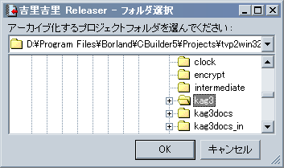
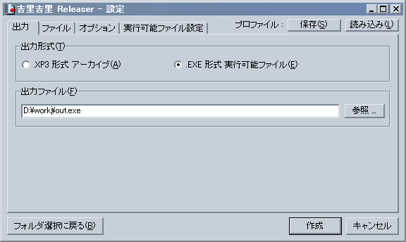
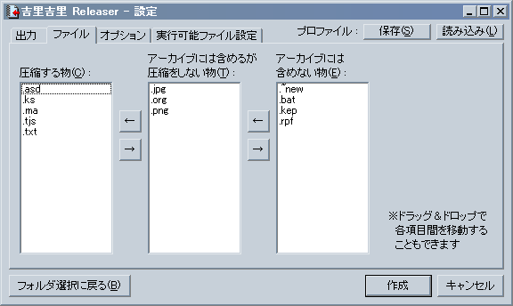
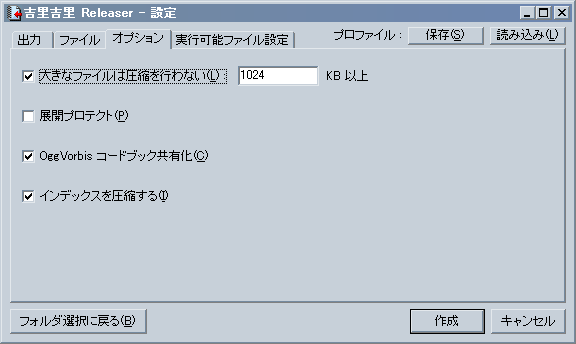
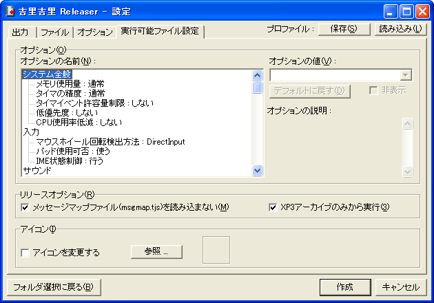

# Releaser

## Releaserについて

Releaser は、フォルダをアーカイブファイルにまとめるためのツールです。

また、吉里吉里のプロジェクトフォルダを指定し、そのプロジェクトフォルダを内部に持った単一の実行可能ファイルを作成することができます。

## Releaser の使い方




Releaser ( tools フォルダにある krkrrel.exe ) を実行すると、最初にフォルダを指定するように求められますのでフォルダを指定してください。

ここで指定したフォルダの中にあるファイルを対象にします。

> **Note:**
> Releaser は、最終的なアーカイブを作成する過程で内容が全く同一のファイルを見つけると、たとえファイル名が異なっていても一つにまとめて、一つ分のファイルの容量しか使用しないという機能があります。

> **Note:**
> Releaser は、CVS メタ情報ディレクトリ("CVS"という名前で、中に"Repository"という名前のファイルが存在するディレクトリ)を自動的に無視します。また、名前の先頭が . (ドット)で始まるファイルやディレクトリ(UNIX風の隠しファイルや Subversion メタ情報ディレクトリなど)を無視します。

> **Note:**
> Releaser は、アーカイブを作成すると、アーカイブを作成したディレクトリに **default.rpf** というファイルを作成します。この中にはアーカイブを作成する際のオプションが記述されており、次回アーカイブを作成するときに同じ設定で簡単に作成することができます。

## Releaser の設定画面

フォルダを選択した後は設定画面になります。

- **「フォルダ選択に戻る」ボタン**  
  フォルダ選択をやり直す事ができます。
- **「プロファイル : 保存」ボタン**  
  現在の設定をファイルに保存します。
- **「プロファイル : 読み込み」ボタン**  
  設定をファイルから読み込みます。
- **「作成」ボタン**  
  現在の設定に基づき、アーカイブファイルや EXE 形式の実行可能ファイルを出力します。
- **「キャンセル」(または終了) ボタン**  
  Releaser を終了します。
- **「出力」タブ**  
  
  
  - **「出力形式」**  
    「.XP3 アーカイブ」を選ぶと、xp3 形式 ( 吉里吉里標準のアーカイブ形式 ) のファイルを出力します。「.EXE 形式実行可能ファイル」を選ぶと、実行可能ファイルを出力します。「.EXE 形式実行可能ファイル」を選んだ場合は、Releaser ( krkrrel.exe ) と同じフォルダか、その親のフォルダにおいてある krkr.eXe が使用されます。
  - **「出力ファイル」**  
    出力するファイルを指定してください。「参照」ボタンをクリックするとファイルをダイアログボックスで指定することができます。
- **「ファイル」タブ**  
  
  
  
  拡張子ごとに、「圧縮するもの」「アーカイブには含めるが圧縮しないもの」「アーカイブには含めないもの」を選ぶ事ができます。通常、デフォルトの分類のままでかまいません。
  
  「圧縮するもの」にファイルを分類すると圧縮が行われるため、ファイルサイズが小さくなります。また、テキストエディタやバイナリエディタで中を覗いても簡単には解読できない状態になります。しかし、圧縮を行うと展開時に時間がかかるというデメリットもあります。PNG や JPEG や ERI などは既に圧縮されていて、「圧縮する」に分類しても効果が薄い上に、展開に余計に時間がかかるようになるので、圧縮することはお勧めできません。
- **「オプション」タブ**  
  
  
  - **「大きなファイルを圧縮しない」**  
    もし該当するファイルが「圧縮するもの」に分類されていても、指定されたサイズ以上であれば圧縮を行わない、という設定です。吉里吉里の構造上、圧縮されたファイルはメモリ上に展開しなければならないため、大きなファイルを圧縮するのは実行時のコストが高くなります。
  - **「展開プロテクト」**  
    チェックすると、アーカイブ内部のインデックス ( 格納されているファイルのリスト ) に「展開プロテクト」の属性を付加します。これによりアーカイブ展開ツールに対し「著作者はファイルが展開されることを望んでいない」という意思表示をすることができます。
  - **「OggVorbisコードブック共有化」**  
    チェックすると、OggVorbis ファイル ( .ogg ファイル ) のベクトル量子化用コードブックを共有させます。OggVorbisファイルは複数のファイル間で共通のコードブックをファイルごとに持っている場合が多いので、それらを一つにまとめてサイズの節約を行うことができます。
  - **「インデックスを圧縮する」**  
    チェックすると、アーカイブ内部のインデックス ( 格納されているファイルのリスト ) を圧縮し、サイズの節約をすることができます。
  
  > **Note:**
  > 「オプション」タブの「展開プロテクト」をチェックしても**実際に展開ができないように暗号化をしたりする訳ではありません**。意思表示を行うことができるだけです。また、アーカイブ展開ツールを作成される方は ( もしいるとして ) この展開プロテクトフラグの存在を考慮してください ( このフラグがたっていれば展開を拒否したり、展開する前に警告をするなど )。
- **「実行可能ファイル設定」タブ**  
  出力形式に実行可能ファイルを指定した場合にのみ表示されます。
  
  ここの設定画面は
  
  と同じです。
  
  
  
  
  
  - **「オプション」**  
    実行可能ファイルに対するデフォルトのオプションを設定できます。
  - **「アイコン」**  
    実行可能ファイルのアイコンを指定することができます。

## コマンドラインオプション

Releaser は以下のコマンドラインオプションを受け付けます。

- **フォルダ名**  
  ターゲットのフォルダを指定します。
- **-**go****  
  すぐにアーカイブを作成し、そのまま終了します。バッチ処理などで用いてください。オプションなどはあらかじめ、ターゲットのフォルダに default.rpf という名前で保存しておいてください (これなくても -nowriterpf -out オプションと組み合わせてアーカイブを作ることは可能です )。
- **-nowriterpf**  
  終了時に default.rpf を書き出しません。
- **-out ファイル名**  
  出力ファイル名を指定します。
- **-rpf ファイル名**  
  読み込むプロファイルを指定します。

たとえば、以下のように指定します。

```
krkrrel project -out ..\release\data.xp3 -nowriterpf -go
```
