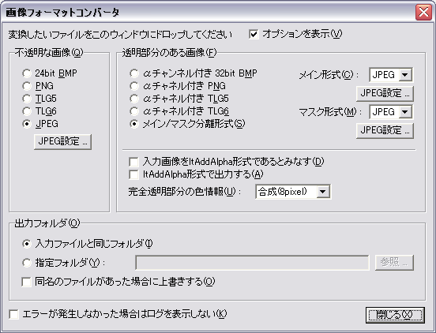

# 画像フォーマットコンバータ

## 画像フォーマットコンバータについて

画像フォーマットコンバータ ( tools フォルダにある krkrtpc.exe ) は、吉里吉里の画像の相互変換を行うためのツールです。

様々な画像の用意に使えます。


入力ファイルフォーマットとしては BMP, PNG, JPEG, PSD、出力ファイルフォーマットとしては BMP, PNG, TLG5, TLG6, JPEG のいずれかを選択できます。

吉里吉里が用いるようなメイン/マスク分離形式の透過画像を読み込んだり、出力する事もできます。ここで用いている「マスク」という用語はアルファチャネルと同義です。


基本的には画像フォーマットを変換するだけなので、これで出力した画像は、他のソフトやツールにも使えると思います。


なお、このツールに限ったことではありませんが、**バックアップはお忘れなく！**

## 入力画像フォーマット

入力ファイルフォーマットとしては、以下の形式を用いることができます。

- **BMP**  
  Windows 標準ビットマップ形式です。32 bit (bpp) 形式の BMP はアルファチャンネル付き BMP であると見なされます。
  
  その他の形式の BMP は、不透明な画像(透過情報を持たない画像)であると見なされます (後述のメイン/マスク分離形式に用いた場合を除く)。
- **PNG**  
  Portable Network Graphic 形式です。透明部分のある(アルファチャネルや透過情報を持った) PNG も読み込むことができます。
- **PSD**  
  Adobe Photoshop 3 以降で用いられる形式です。ただし、このツールで読み込める PSD には大きな以下の制限があります。
  
  - カラーモードが RGB のもの以外を読み込めない
  - 16bit/チャンネルのものを読み込めない
  - 無圧縮とRLE圧縮のみ対応 ( Photoshop3.0 形式の場合は RLE圧縮のみ対応 )
  
  この形式はメイン/マスク分離形式としては読み込むことができません。
  大体のデータは読み込めますが、読み込めないデータもあります。
  
  カラーモードに RGB 以外(CMYKなど)を使用している場合は RGB に変換してください。16bit/チャンネルを使用している場合は 8bit/チャンネルに変換してください。
  
  「通常」以外のブレンドモードのレイヤーを含む場合は、このツールに入力する前に「表示部分の統合」を行っておけば大丈夫です。
  
  
  
  PSD ファイルの読み込み機能は、出力形式にて「ltAddAlpha形式で出力する」が選択されるか、しないかによって大きく変わります。
  
  
  
  「ltAddAlpha形式で出力する」が選択されている場合は、「通常」「覆い焼き(リニア)」「焼き込み(リニア)」「乗算」「スクリーン」「オーバーレイ」「ハードライト」「ソフトライト」「覆い焼きカラー」「焼き込みカラー」「比較(明)」「比較(暗)」「差の絶対値」「除外」のレイヤーが含まれた PSD ファイルを読み込むことができます。また、「通常」のみで構成された画像であれば、複数枚のレイヤーが重なっていても対応できます (他のモードでは、複数枚のレイヤーが重なっていると対応できません)。
  
  
  
  「ltAddAlpha形式で出力する」が選択されている場合は、「通常」のレイヤーと「覆い焼き(リニア)」のレイヤーにのみ対応できます。この場合は、レイヤーが下から(奥から)順に、「任意の数の『通常』レイヤー」「任意の数の『覆い焼き(リニア)』レイヤー」の順になっていなければなりません。「任意の数」とは、0枚、つまりレイヤーが全くないか、あるいは1枚以上のレイヤーです。
  
  - **「ltAddAlpha形式で出力する」が選択されている場合に読み込み可能な例**  
    - 「通常」レイヤー1枚の上に「覆い焼き(リニア)」レイヤー1枚
    - 「通常」レイヤーがなくて、「覆い焼き(リニア)」レイヤーが1枚だけ
    - 「通常」レイヤー1枚のみ
    - 「通常」レイヤー3枚の上に「覆い焼き(リニア)」レイヤー2枚
  - **「ltAddAlpha形式で出力する」が選択されている場合に読み込めない例**  
    - 「通常」レイヤー1枚の上に「覆い焼き(リニア)」レイヤー1枚、その上にさらに「通常」レイヤー1枚
      (覆い焼きリニアのレイヤーは通常レイヤーの間に挟むことはできません)
    - 「覆い焼き(リニア)」レイヤー1枚の上に「通常」レイヤー1枚、さらにその上に「覆い焼き(リニア)」レイヤー1枚
      (通常のレイヤーは覆い焼きリニアのレイヤーの間に挟むことはできません)
    - 「覆い焼き」レイヤー1枚のみ
      (覆い焼きは覆い焼きでも、扱えるのは「覆い焼きリニア」のレイヤーだけです)
  
  Photoshopの「通常」は吉里吉里のアルファ合成、「覆い焼き(リニア)」は吉里吉里の加算合成に相当します。ltAdditiveAlpha(加算アルファ合成)ではアルファ合成と加算合成の両方を同時に表現できるため、このようなレイヤー構成のPhotoshopデータを読み込むことができます。
- **JPEG**  
  フルカラーとグレイスケールの一般的な JPEG 形式を読み込めます。後述のメイン/マスク分離形式の入力として使うこともできます。
- **メイン/マスク分離形式**  
  メイン/マスク分離形式は、メイン(色情報)の画像とマスク(透過情報)の画像が別々のファイルになっているものです。
  
  マスク画像は、メイン画像のファイル名の最後に _m のついたファイル名になります ( たとえば test.jpg に対して test_m.jpg )。
  
  メイン/マスク分離形式として有効な入力画像フォーマットは、それぞれ BMP, JPEG, PNG です。メインとマスクのフォーマットが異なっていてもかまいません。

> **Note:**
> TLG5 や TLG6 形式は入力として用いることができません。ERI 形式は現時点では未対応です。

## 出力画像フォーマット

出力画像フォーマットとしては以下の形式を用いることができます。

- **24bit/32bit BMP**  
  24bit BMP はアルファチャンネルを持たない BMP です。
  
  32bit BMP はアルファチャネルを持った BMP で、一つのファイル内に メインとマスクを持っている BMP です。
- **PNG**  
  フルカラーの PNG、あるいはアルファチャンネル付きの PNG です。
- **TLG5**  
  フルカラーの TLG5、あるいはアルファチャンネル付きの TLG5 です。
  
  > **Note:**
  > TLG5 形式は圧縮に結構時間がかかります。プログラムが止まってしまったように見えるかも知れません。
- **TLG6**  
  フルカラーの TLG6、あるいはアルファチャンネル付きの TLG6 です。
  
  > **Note:**
  > TLG6 形式は TLG5 形式と同じく、圧縮に結構時間がかかります。プログラムが止まってしまったように見えるかも知れません。
  
  TLG6画像についてはTLG5画像と同じく、タグ情報を書き出します。
- **メイン/マスク分離形式**  
  透明部分のある画像において、メイン/マスクを別々のファイルに記録する方式です。それぞれ、BMP, JPEG, PNG を選択できます。
  
  マスク画像は、メイン画像のファイル名の最後に _m のついたファイル名になります ( たとえば test.jpg に対して test_m.jpg )。
  
  メインとマスクを別々の画像形式にすることができますが、BMP と BMP 、PNG と PNG の組み合わせはほとんど意味がないので、上記の 32bit BMP か アルファチャネル付き PNG を選択した方が良いでしょう。
  
  どちらか、あるいは両方に JPEG を用いればファイルサイズは節約できますが、画質は悪くなります。
  
  メイン/マスク分離形式に TLG5 や TLG6 形式を指定することはできません。

## タグ情報

画像フォーマットコンバータは、TLG画像やPNG画像に「タグ情報」を書き出します。「タグ情報」は、画像どのように表示されるべきかなどを含む情報です。このタグ情報は[Layer.loadImages](../reference/Layer.md#loadimages)メソッドの戻り値として得ることができます。


以下のタグ情報が書き出されます。

- ****mode** (TLGのみ)**  
  画像の表示モードです。「不透明な画像」の場合はmode=opaqueで、出力形式がltAddAlphaならばmode=addalphaという情報を書き出します。
  
  「透明部分のある画像」で出力形式がltAddAlphaでない場合は、PSD ファイル以外や、「通常」のレイヤーのみを含む PSD ファイルを読み込んだ場合は mode=alpha になります。PSD ファイルで、「通常」以外のレイヤーを読み込んだ場合は、それぞれのブレンドモードに対応する情報が書き出されます。
  
  KAGの場合、これはimageタグのmode属性にそのまま対応し、imageタグでmode属性を省略したときの初期値になります。つまり、KAGではmode属性を指定しなくても、自動的にその画像に適したmode属性が設定されると言うことになります。
  
  
  
  吉里吉里は、TJSのグローバルオブジェクトに imageTagLayerType という辞書配列を持ち、TLG画像の持つタグ情報の mode とレイヤのタイプがどう対応づけられるかを表しており、以下のように定義されています。
  
  ```
  global.imageTagLayerType = %[
      opaque      :%[type:ltOpaque            ],
      rect        :%[type:ltOpaque            ],
      alpha       :%[type:ltAlpha             ],
      transparent :%[type:ltAlpha             ],
      addalpha    :%[type:ltAddAlpha          ],
      add         :%[type:ltAdditive          ],
      sub         :%[type:ltSubtractive       ],
      mul         :%[type:ltMultiplicative    ],
      dodge       :%[type:ltDodge             ],
      darken      :%[type:ltDarken            ],
      lighten     :%[type:ltLighten           ],
      screen      :%[type:ltScreen            ],
      psnormal    :%[type:ltPsNormal          ],
      psadd       :%[type:ltPsAdditive        ],
      pssub       :%[type:ltPsSubtractive     ],
      psmul       :%[type:ltPsMultiplicative  ],
      psscreen    :%[type:ltPsScreen          ],
      psoverlay   :%[type:ltPsOverlay         ],
      pshlight    :%[type:ltPsHardLight       ],
      psslight    :%[type:ltPsSoftLight       ],
      psdodge     :%[type:ltPsColorDodge      ],
      psdodge5    :%[type:ltPsColorDodge5     ],
      psburn      :%[type:ltPsColorBurn       ],
      pslighten   :%[type:ltPsLighten         ],
      psdarken    :%[type:ltPsDarken          ],
      psdiff      :%[type:ltPsDifference      ],
      psdiff5     :%[type:ltPsDifference5     ],
      psexcl      :%[type:ltPsExclusion       ],
  ]
  ```
  
  それぞれのレイヤのタイプについては
  
  を参照してください。
- ****offs_x** **offs_y** **offs_unit** (TLG, PNG)**  
  これらは、変換元がPNGで、そのPNGがその画像の左上隅からのオフセット(oFFsチャンク)の情報を含んでいる場合のみに出力されます。
  
  offs_x は横位置の左端からの距離、offs_y は縦位置の上端からの距離です。offs_unit は **pixel** か **micrometer** のどちらかになり、距離の単位を示します。
- ****vpag_w** **vpag_h** **vpag_unit** (TLG, PNG)**  
  これらは、変換元がPNGで、そのPNGが Virtual PAGe、つまり画像全体のサイズ(vpAgチャンク)の情報を含んでいる場合のみに出力されます。
  
  この情報を PNG に出力するソフトウェアとして [ImageMagick](http://www.imagemagick.org/)ユーティリティがありますが、この **ImageMagick** で trim (トリム)を行った際に、トリム前の画像サイズとしてこの情報が出力されます。
  
  vpag_w は画像全体の横のサイズ、vpag_h は画像全体の縦のサイズ、offs_unit は **pixel** か **micrometer** のどちらかになり、サイズの単位を示します。
- ****reso_x** **reso_y** **reso_unit** (TLG, PNG)**  
  これらは、変換元がPNGで、そのPNGがその画像の解像度(pHYsチャンク)の情報を含んでいる場合のみに出力されます。
  
  reso_x は横方向の解像度、reso_y は縦方向の解像度です。reso_unit は **meter** になり、解像度の単位を示します。

## 画像フォーマットコンバータの使い方

変換は、変換したいファイルを画像フォーマットコンバータのウィンドウの上にドロップすることで行うことができます。複数のファイルをドロップする事もできます。


不透明な画像、透明部分を持った画像にそれぞれ別の形式を指定することができます。


ここで言う「不透明な画像」とは、画像全域が完全に不透明な画像(たとえば、KAGで使うような背景画像)を言います。「透明部分を持った画像」とは、透明になる部分がある画像(たとえばKAGで使うような前景画像)を言います。

なお、画像形式として等価情報を持っている形式でも、結果的に画像のすべてのピクセルが完全不透明であれば、「不透明な画像」として扱われます。


変換終了後、各ファイルの変換が成功したか、エラーになったかを確認できるログが表示されますので確認してください。


以下は、画面の説明です。





実行すると、上の画面が表示されます。

- **「オプションを表示」**  
  チェックされている状態では、下の設定部分が表示されます。チェックをはずすと、ウィンドウは上部部分だけとなり、横に細長くなります。オプション設定が必要ない場合にウィンドウをコンパクトにすることができます。
- **「不透明な画像 - 24bit BMP」**  
  不透明な画像の出力形式として 24bit BMP を選択します。
- **「不透明な画像 - PNG」**  
  不透明な画像の出力形式として PNG を選択します。
- **「不透明な画像 - TLG5」**  
  不透明な画像の出力形式として TLG5 を選択します。
- **「不透明な画像 - TLG6」**  
  不透明な画像の出力形式として TLG6 を選択します。
- **「不透明な画像 - JPEG」**  
  不透明な画像の出力形式として JPEG を選択します。
- **「不透明な画像 - JPEG オプション...」**  
  不透明な画像の出力形式として JPEG を選択した場合の、JPEG の圧縮クオリティを選択します。
- **「透明部分のある画像 - 32bit BMP (メイン+マスク)」**  
  透過情報を持った画像の出力形式として 32bit BMP を選択します。
- **「透明部分のある画像 - αチャネル付き PNG (メイン+マスク)」**  
  透過情報を持った画像の出力形式として アルファチャネル付き PNG を選択します。
- **「透明部分のある画像 - αチャネル付き TLG5 (メイン+マスク)」**  
  透過情報を持った画像の出力形式として アルファチャネル付き TLG5 を選択します。
- **「透明部分のある画像 - αチャネル付き TLG6 (メイン+マスク)」**  
  透過情報を持った画像の出力形式として アルファチャネル付き TLG6 を選択します。
- **「透明部分のある画像 - メイン/マスク分離形式」**  
  透過情報を持った画像の出力形式としてメイン/マスク分離形式を指定します。メイン/マスクに何を用いるかを下で選択します。また、JPEG の場合、「JPEG オプション」ボタンをクリックすることによって、JPEG の圧縮クオリティを選択することができます。
- **「透明部分のある画像 - 入力画像をltAddAlpha形式であるとみなす」**  
  このオプションがチェックされていると、入力画像をltAddAlpha形式、つまり吉里吉里の[Layer.type](../reference/Layer.md#type)プロパティでltAddAlphaを指定して表示するに適した、加算アルファ合成形式であると見なします。このオプションに影響される入力画像形式はBMP、PNG、メイン/マスク分離形式で、PSD形式は影響されません。
  
  このオプションがチェックされていないと、入力画像はltAlpha形式であると見なされます。ほとんどのグラフィックソフトの出力形式やPNGの仕様はltAlpha形式である為、通常はこのオプションはチェックしないでください。
  
  このオプションのチェックされていない状態で、かつ後述の「ltAddAlpha形式で出力する」がチェックされていると、画像フォーマットコンバータはltAlpha形式からltAddAlpha形式への変換を行います。
  
  このオプションをチェックすると、「ltAddAlpha形式で出力する」のオプションは自動的にチェックされます。また、「完全透明部分の色情報」のオプションは使用不可になります(アルファ情報も色情報も画像フォーマットコンバータでは加工されなくなります)。
- **「透明部分のある画像 - ltAddAlpha形式で出力する」**  
  このオプションがチェックされていると、出力画像をltAddAlpha形式で出力します。
  
  このオプションがチェックされていないと、出力画像の形式はltAlpha形式、あるいは PSD ファイルからの入力の場合はそのファイルに含まれているレイヤーのブレンドモードに対応した形式になります。
  
  様々なグラフィックソフトや、PNGの仕様ではltAlpha形式の画像のみを受け付けますので、出力画像を吉里吉里に使用する訳ではない場合は、通常はチェックしないでください。
  
  このオプションがチェックされていると、「完全透明部分の色情報」のオプションは使用不可になります(アルファ情報も色情報も画像フォーマットコンバータでは加工されなくなります)。
- **「透明部分のある画像 - 完全透明部分の色情報」**  
  画像の完全に透明な部分の処理を指定します。
  
  通常、ltAlpha 形式の画像の場合、完全に透明な部分でも色の情報を持っています。その部分は完全に透明なので表示するときは単に無視されるのですが、画像の加工 ( JPEG等による圧縮も含む ) を行うときは無視されません。
  
  この完全に透明な部分の処理の方式を指定します。
  
  - **除去**  
    除去を指定すると、完全に透明な部分の色情報は除去されます ( 正確には真っ黒で塗りつぶされる )。
    
    通常はこの指定でOKです。
  - **そのまま**  
    処理を行いません。元の画像そのままになります。
    
    完全透明部分にゴミがある場合、そのゴミまで圧縮することになるので圧縮率が悪くなります。
  - **合成**  
    完全透明部分の色を、その周りにある不透明な部分の色から推測し、合成します。
    
    合成の強度を 1, 2, 3, 5, 8 pixel から選べます。ここでピクセル単位で指定された距離内にある不透明な部分のピクセルの色から、完全透明部分の色を合成します。値が大きいほど処理に時間がかかります。ここで指定した距離外にある完全透明な部分の色は除去されます。
    
    たとえば JPEG でメイン画像を圧縮する場合、JPEG の特性上、急激な色の変化がある場所ではモスキートノイズが発生します。これは前景画像の場合、もし「合成」処理をおこなわず、完全不透明部分と不透明部分の境界で急激な色の変化がある場合、その部分に発生しやすくなります。「合成」処理を行うと、完全透明部分の色を不透明部分の色から合成するため、色の変化の差を抑え、モスキートノイズの発生を抑えることができます。また、一般的な JPEG では 色の情報が隣のピクセルと混ざりますが、これも「合成」処理を行うことで、(合成しなかった場合の) 意図しない完全透明部分の色と不透明部分の色が混ざる事を抑えることができます。
    
    通常は「除去」を選んでください。完全に透明な部分には色の情報は必要ありません。また除去を行えば画像の圧縮後のファイルサイズも小さくすることができます。
  
  「ltAddAlpha形式で出力する」がチェックされている場合はこのオプションは使用不可になります。ltAddAlpha形式での「完全透明」は、不透明度0、色は真っ黒以外にあり得ないからです。
- **「出力フォルダ - 入力ファイルと同じフォルダ」**  
  出力するファイルを、入力ファイルとおなじフォルダに出力するようにします。
- **「出力フォルダ - 指定フォルダ」**  
  出力ファイルを、下の入力欄に指定したフォルダに出力します。
  
  「参照 ...」ボタンをクリックすると、出力フォルダを選択するダイアログボックスを表示することができます。
  
  入力欄に相対フォルダを指定した場合は、入力ファイルのあるフォルダからの相対位置で指定することができます。
- **「出力フォルダ - 同名のファイルがあった場合に上書きする」**  
  このチェックボックスをチェックすると、同名のファイルがあった場合、上書きします。
- **「エラーが発生しなかった場合はログを表示しない」**  
  このチェックボックスをチェックすると、変換が終わって、変換中にエラーが発生しなかった場合は、ログを確認するためのウィンドウを表示しません。
- **「閉じる」**  
  このツールを終了します。
