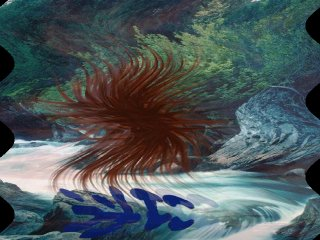
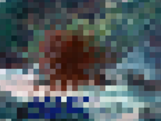
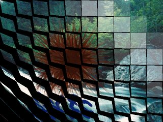
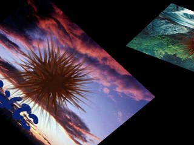
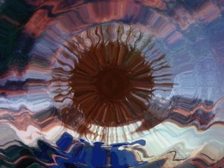

# トランジションについて

## トランジションとは

トランジションは、時間をかけて画面の入れ替えを行う物です。吉里吉里Zのトランジションは、レイヤ単体に対して行うことも、レイヤツリーに対して行うこともできます。

レイヤに切り替わり元を指定した場合は、二つのレイヤが入れ替わることになります。

前者の場合は該当するレイヤが、後者の場合はレイヤのツリー構造がそのままそっくり入れ替わります。

[Layer.beginTransition](../reference/Layer.md#begintransition) メソッドを参照してください。

吉里吉里Zはトランジションを「**トランジションハンドラ**」と呼ばれる物で管理しています。これらは Layer.beginTransition メソッドの name 引数で指定する物で、現バージョンでは吉里吉里本体内に３つ持っています。プラグインにより拡張することもできます。

以下、吉里吉里本体に内蔵しているトランジションハンドラと、拡張トランジションプラグイン ( extrans.dll / extNagano.dll ) で使用可能になるトランジションハンドラを説明します。

## オプションの指定

- **TJS2 から利用する場合**  
  Layer.beginTransition メソッドの options 引数に、辞書配列の形で指定します。たとえば、"universal" トランジションを、vague=100 time=2000 rule=rule1.png で指定する場合は、options 引数に以下のように指定します。
  
  
  
  `%[vague:100, time:2000, rule:"rule1.png"]`
- **KAG から利用する場合**  
  KAG の場合、trans タグにオプションを、属性としてそのまま記述します。ただし、オプション以外にも指定する属性 ( layer, children, method 属性 ) があります。これらの属性と一緒にオプションを指定することになります。
  
  たとえば、背景レイヤに、子レイヤも含めて、vague=100 time=2000 rule=rule1.png の "universal" トランジションを行うには以下のようにします。
  
  
  
  `@trans layer=base children=true method=universal vague=100 time=2000 rule=rule1.png`
  
  
  
  また、たとえば "wave" トランジションを maxomega=0.1 maxh=20 で使いたい場合は以下のようにします。
  
  
  
  `@trans layer=base children=true method=wave maxomega=0.1 maxh=20`

## 内蔵トランジションハンドラ

吉里吉里は本体内に以下の３つのトランジションハンドラを持っています。

- ****crossfade****  
  "crossfade" トランジション (クロスフェードトランジション) は、最も単純なトランジションで、単純なクロスフェードを行います。
  
  オプションは以下の通りです。
  
  - **time (必須)**  
    トランジションを行っている時間をミリ秒単位で指定します。
- ****universal****  
  "universal" トランジション (ユニバーサルトランジション) は、ルール画像と呼ばれる、グレースケールの画像に従ってトランジションを行う物です。ルール画像は rule オプションで指定し、この画像のより暗いところからより早く切り替わり元 ( KAG における裏画面 ) に切り替わります。
  
  ルール画像が、トランジションを行おうとした画面より小さい場合はタイル状に敷き詰められ、トランジションを行おうとした画面よりも大きい場合は左上の部分のみが使われます。
  
  KAG のリファレンスに詳しい説明があります。
  
  オプションは以下の通りです。
  
  - **time (必須)**  
    トランジションを行っている時間をミリ秒単位で指定します。
  - **rule (必須)**  
    ルール画像ファイル名を指定します。ルール画像は 256 階調グレースケールの画像である必要があります。それ以外の画像を指定した場合は強制的にグレースケールに変換されます。
  - **vague**  
    「あいまい領域値」を指定します。小さい値 ( 0 とか ) を指定すると、画面の切り替わり前の部分と切り替わり後の部分の境界がはっきりします。大きい値 ( 128 とか ) を指定すると、この境界はぼやけ、なめらかになります。ルール画像によって最適な値があります。省略すると 64 が指定されたと見なされます。
- ****scroll****  
  "scroll" トランジション (スクロールトランジション) は、切り替わり元か切り替わり先のどちらかあるいは両方をスライドさせ、スクロール効果を出すことのできるトランジションです。
  
  オプションは以下の通りです。
  
  - **time (必須)**  
    トランジションを行っている時間をミリ秒単位で指定します。
  - **from**  
    切り替わり元 ( KAG における裏ページ ) のレイヤがどちらの方向から現れてくるかを指定します。
    
    TJS で指定する場合、sttLeft を指定すると左から(デフォルト)、sttTop を指定すると上から、sttRight を指定すると右から、sttBottom を指定すると下から現れてきます。
    
    KAG の trans タグで指定する場合、"left" を指定すると左から(デフォルト)、"top" を指定すると上から、"right" を指定すると右から、"bottom" を指定すると下から現れてきます。
  - **stay**  
    切り替わり元および切り替わり先の画像がどのように動くかを指定します。
    
    TJS で指定する場合、ststNoStay を指定すると、切り替わり先の画像が切り替わりもとの画像に押されるようにして出ていきます (デフォルト)。２画面をつなげてスクロールさせている効果を出すことができます。ststStaySrc を指定すると、切り替わり先の画像が移動して出ていき、その背後から切り替わり元の画像が現れます。ststStayDest を指定すると、切り替わり先の画像は静止して、そこに切り替わり元の画像が入ってきます。
    
    KAG で指定する場合、"nostay" が ststNoStay、"stayback" が ststStaySrc、"stayfore" が ststStayDest を表します。

## 拡張トランジションプラグイン

拡張トランジションプラグイン ( extrans.dll ) は 吉里吉里Z用のプラグインで、本体に内蔵されていないようなトランジションをいくつか使用可能にする物です。

使用可能にするには、他のプラグインと同じく、[Plugins.link](../reference/Plugins.md#link) メソッドで接続する必要があります ( KAG の場合は loadplugin タグ )。接続されるだけで以下のトランジションハンドラが使用可能になります。

- **wave**  
  "wave" (波) トランジションは、ラスタスクロールによる波を表現し、切り替えるトランジションです。
  
  
  
  
  
  
  
  以下のオプションがあります。
  
  - **time (必須)**  
    トランジションを行っている時間をミリ秒単位で指定します。
  - **wavetype**  
    波の動きを指定します。0 を指定するとトランジションの最初と最後で波が細かく、中程で波がおおらかになります。1 を指定すると最初に波が細かく、だんだんおおらかになります。2 を指定すると最初は波がおおらかで、徐々に細かくなります。デフォルトは 0 です。
  - **maxh**  
    波の横幅の最大値をピクセル単位で指定します。値を大きくすると波の刻みが深くなります。デフォルトは 50 です。
  - **maxomega**  
    波の角速度 ( rad/pixel ) の最大値を指定します。値を大きくすると波が細かくなります。小さくすると波がおおらかになります。デフォルトは 0.2 です。
  - **bgcolor1**  
    初期背景色を 0xRRGGBB 形式で指定します。
  - **bgcolor2**  
    最終背景色を 0xRRGGBB 形式で指定します。背景色は、初期背景色から始まり、徐々に最終背景色に変わっていきます。
- **mosaic**  
  "mosaic" (モザイク) トランジションは、矩形のモザイクがかかったような表現をするトランジションです。
  
  
  
  
  
  
  
  以下のオプションがあります。
  
  - **time (必須)**  
    トランジションを行っている時間をミリ秒単位で指定します。
  - **maxsize**  
    モザイクの矩形の大きさの最大値を指定します。デフォルトは 30 です。値を大きくするとモザイクが荒くなります。
- **turn**  
  "turn" トランジションは、小さなカードがいくつもくるりとひっくり返るような表現をするトランジションです。
  
  
  
  
  
  
  
  以下のオプションがあります。
  
  - **time (必須)**  
    トランジションを行っている時間をミリ秒単位で指定します。
  - **bgcolor**  
    背景色を 0xRRGGBB 形式で指定します。
- **rotatezoom**  
  "rotatezoom" トランジションは、トランジション元 ( KAG における裏画面 ) を回転させながらズームインあるいはズームアウトさせるトランジションです。
  
  
  
  
  
  
  
  以下のオプションがあります。
  
  - **time (必須)**  
    トランジションを行っている時間をミリ秒単位で指定します。
  - **factor**  
    初期拡大率を指定します。0 を指定すると最初は見えません。中央から回転しながらズームインします。2 を指定すると２倍の拡大率から徐々に等倍まで回転しながらズームアウトします。3 以上の数や実数も指定できます。デフォルトは 1 (等倍) になっています。
  - **accel**  
    拡大縮小の動作を、加速度的に行うかどうかを指定します。-2 以下の負の数を指定すると、最初が早く、徐々に遅くなります。2 以上の正の数を指定すると、最初は遅く、徐々に早くなります。0 を指定すると直線的な動きになります。しかし視覚効果で直線的には見えないかも知れません。デフォルトは 0 です。
  - **twist**  
    どちらの方向にどれだけ回転するかを指定します。正の数を指定すると、反時計回りに回転します。負の数を指定すると時計回りに回転します。指定する値は回転数です。デフォルトは 2 です。
  - **twistaccel**  
    回転の動作を、加速度的に行うかどうかを指定します。-2 以下の負の数を指定すると、最初が早く、徐々に遅くなります。2 以上の正の数を指定すると、最初は遅く、徐々に早くなります。0 を指定すると直線的な動きになります。デフォルトは -2 です。
- **rotatevanish**  
  "rotatevanish" トランジションは、トランジション先 ( KAG における表画面 ) を回転させながらズームアウトさせるトランジションです。
  
  
  
  
  
  
  
  以下のオプションがあります。
  
  - **time (必須)**  
    トランジションを行っている時間をミリ秒単位で指定します。
  - **accel**  
    拡大縮小の動作を、加速度的に行うかどうかを指定します。-2 以下の負の数を指定すると、最初が早く、徐々に遅くなります。2 以上の正の数を指定すると、最初は遅く、徐々に早くなります。0 を指定すると直線的な動きになります。しかし視覚効果で直線的には見えないかも知れません。デフォルトは 2 です。
  - **twist**  
    どちらの方向にどれだけ回転するかを指定します。正の数を指定すると、反時計回りに回転します。負の数を指定すると時計回りに回転します。指定する値は回転数です。デフォルトは 2 です。
  - **twistaccel**  
    回転の動作を、加速度的に行うかどうかを指定します。-2 以下の負の数を指定すると、最初が早く、徐々に遅くなります。2 以上の正の数を指定すると、最初は遅く、徐々に早くなります。0 を指定すると直線的な動きになります。デフォルトは 2 です。
- **rotateswap**  
  "rotateswap" トランジションは、トランジション先とトランジション元を回転させながら入れ替えるトランジションです。トランジション先 ( KAG における表画面 ) は回転しながら奥に行き、そのかわりトランジション元 ( KAG における裏画面 ) が回転しながら手前に来ます。
  
  
  
  
  
  
  
  以下のオプションがあります。
  
  - **time (必須)**  
    トランジションを行っている時間をミリ秒単位で指定します。
  - **twist**  
    どちらの方向にどれだけ回転するかを指定します。正の数を指定すると、反時計回りに回転します。負の数を指定すると時計回りに回転します。指定する値は回転数です。デフォルトは 1 です。
  - **bgcolor**  
    背景色を 0xRRGGBB 形式で指定します。
- **ripple**  
  "ripple" トランジションは、波紋が広がっていくような表現を行いながら入れ替えるトランジションです。
  
  
  
  
  
  
  
  以下のオプションがあります。
  
  - **time (必須)**  
    トランジションを行っている時間をミリ秒単位で指定します。
  - **centerx**  
    波紋の中心 X 座標を指定します。省略すると画像の中央になります。
  - **centery**  
    波紋の中心 Y 座標を指定します。省略すると画像の中央になります。
  - **rwidth**  
    波紋の細かさを指定します。16, 32, 64, 128 のいずれかを指定することができ、数値が小さければ小さいほど細かい波紋になります。省略すると 128 が指定されたと見なされます。
  - **roundness**  
    波紋が縦に長い楕円になるか、真円になるか、横に長い楕円になるかを指定します。0.0 〜 1.0 (ただし 0.0 は含まず) の範囲の数値を指定すると ( たとえば 0.5 など )、縦に長い楕円になります。1.0 を指定すると真円になります。1.0 よりも大きい数値を指定すると (たとえば 2 など )、横に長い楕円になります。省略すると 1.0 が指定されたと見なされます。
  - **speed**  
    波の広がる速度を指定します。省略すると 6.0 が指定されたと見なされます。
  - **maxdrift**  
    波の激しさを指定します。省略すると 24 が指定されたと見なされます。
  
  > **Note:**
  > ripple トランジションは、初めて実行するときに、かなり大きなメモリを割り当てて ( 0.5〜4MB ほどでオプションによって異なります ) 、
  > なめらかにトランジションを実行するための数値計算をあらかじめ完了させ、そのメモリに格納しておきます。
  > これには少し時間 ( 0.01秒〜0.5秒ほど ) がかかる場合があります。
  >
  > トランジションを行う画像のサイズ、centerx, centery, rwidth, roundness, maxdrift の各条件がすべて同じならば、前回の
  > 数値計算の情報を再利用します。過去４つまでの条件に対する数値計算の結果が保持されています ( キャッシュされています )。
  > それ以上の新たな条件に対する数値計算が要求された場合は、一番古い情報から削除されていきます。
  >
  > これらをふまえ、このトランジションを良く使う場合は、実行前にダミーで一回トランジションを実行しておくと、以降の
  > 数値計算を避けることができます。

## 追加トランジションプラグイン ( extNagano.dll )

追加トランジションプラグイン ( extNagano.dll ) は、吉里吉里２用に公開されていた同名 DLL の復元版で、12 種類のトランジションハンドラを追加します。extrans.dll と同じく [Plugins.link](../reference/Plugins.md#link) メソッド ( KAG の場合は loadplugin タグ ) で接続すると使用可能になります。

いずれのトランジションも、トランジションを行っている時間をミリ秒単位で指定する **time** オプションが必須です。以下では time 以外のオプションを説明します。

- **3duniversal**  
  ルール画像の各画素の色成分にしたがって画素を移動させながら切り替える万能トランジションです。ルール画像の R(H) が移動開始時間 ( 0〜255 )、G(S) が移動スピード、B(B) が移動方向 ( 0:上 / 63:右 / 127:下 / 191:左 ) として解釈されます。
  
  - **rule**  
    切り替えに使うルール画像を指定します。画像ファイルのパス、またはレイヤオブジェクトを指定できます。
  - **type**  
    ルール成分の解釈を "RGB" または "HSB" で指定します。デフォルトは "RGB" です。
  - **speed1, accel1, bound1**  
    変化前画像のベーススピード、ベース加速度、ハネ返り時間 ( 0〜127 ) を指定します。speed1 / accel1 には別名 s1 / a1 もあります。
  - **speed2, accel2, bound2**  
    変化後画像に対する同様の指定です。speed2 / accel2 には別名 s2 / a2 もあります。
- **blurfade**  
  ぼかしながらのクロスフェードです。
  
  - **exponent**  
    切り替えのペースを指定します。1 より大きいと前半が緩やかに、1 より小さいと前半が急になります。デフォルトは 1 です。
  - **blur1, blur1x, blur1y**  
    元画像のぼかし量を指定します。blur1 は x/y 両方向に同じ値を指定します。
  - **blur2, blur2x, blur2y**  
    先画像のぼかし量を指定します。blur2 は x/y 両方向に同じ値を指定します。
  - **prerender**  
    ぼかし画像の生成タイミングを指定します。0 で毎フレーム生成、1 で開始前に生成 ( スムーズ )、2 は 1 の軽量版です。
  - **type**  
    ぼかしの種類を指定します。0 で平均値ぼかし、1 でバイリニアぼかしです。
- **scanline**  
  スキャンラインごとに左右交互にスライドさせて切り替えます。オプションは time のみです。
- **zoomfade**  
  元画像を拡大しながら次画像へ切り替えます。
  
  - **zoom1**  
    元画像の目標ズーム値を指定します。
  - **zoom2**  
    先画像の開始ズーム値を指定します。
- **rgbfade**  
  RGB 成分ごとにタイミングをずらしたクロスフェードです。
  
  - **delayR, delayG, delayB, delayA**  
    各成分の遅れを 0〜255 で指定します。
- **spin**  
  二枚のラインを回転させて切り替えます。
  
  - **type1, type2**  
    回転タイプを -1〜11 で指定します。-1 でなし、0,1 で直方体回転、4〜7 でドア回転などになります。
- **flutter**  
  紙をめくり上げるような表現のトランジションです。
  
  - **back**  
    めくれた紙の背面の色を 0xAARRGGBB 形式で指定します。AA=00 で前面の反転色、AA=ff で 0xRRGGBB の色になります。
  - **alpha**  
    めくれた紙の背面の透明度を指定します。
  - **slip**  
    紙のズレ量を指定します。
- **book**  
  本のページをめくるような表現のトランジションです。
  
  - **dir**  
    めくる方向を指定します。-1 でランダム、0 で左頁を右へ、1 で右頁を左へめくります。
- **imagewipe**  
  任意のルール画像を使うワイプです。
  
  - **rule**  
    切り替えに使うルール画像を指定します。画像ファイルのパス、またはレイヤオブジェクトを指定できます。
  - **dir**  
    ワイプの進行方向を指定します。0 で白→黒、1 で黒→白の順に切り替わります。
- **honeyturn**  
  extrans の turn を六角形に拡張しためくり表現です ( 元 DLL でも未完成の効果です )。
  
  - **size**  
    六角形の一辺の長さをピクセル単位で指定します。
  - **dir**  
    各六角形の回転方向を 1〜9 ( テンキーと同じ方向 ) で指定します。
  - **order**  
    六角形の回転する順序を 1〜9 ( テンキーと同じ方向 ) で指定します。
  - **twist**  
    ひねり量を指定します。
- **morphing**  
  三角形パッチを変形させながらフェードします。三角形パッチは隙間なく敷き詰めるように指定してください。
  
  - **before**  
    変形前の三角形群を指定します。三角形 1 つにつき 6 個 ( ax1, ay1, ax2, ay2, ax3, ay3 ) の数値、n 個で 6n 個の数値配列になります。
  - **after**  
    変形後の三角形群を同様に 6n 個の数値配列で指定します。
- **multiripple**  
  複数の波紋が広がりながら切り替わるトランジションです。
  
  - **count**  
    波源の個数を 1〜20 で指定します。
  - **wavecount**  
    各波源の波の個数を指定します。
  - **rwidth**  
    各波源の波の波長を指定します。
  - **maxdrift**  
    各波源の波の振幅スケールを指定します。0 で波なしになります。
  - **roundness**  
    円形度を指定します。1.0 未満で縦長楕円、1.0 で真円、1.0 より大きいと横長楕円になります。
  - **delaylast**  
    最後の 1 個の波源の遅れを指定します。1.0 で遅れ無し、大きいほど遅くなります。
