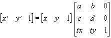

# Layer

Layer クラスは、**レイヤ**を管理するためのクラスです。

## メンバー一覧

### コンストラクタ

- [Layer](#layer)

### プロパティ

- [parent](#parent)
- [children](#children)
- [order](#order)
- [absolute](#absolute)
- [absoluteOrderMode](#absoluteordermode)
- [visible](#visible)
- [cached](#cached)
- [nodeVisible](#nodevisible)
- [neutralColor](#neutralcolor)
- [hasImage](#hasimage)
- [opacity](#opacity)
- [window](#window)
- [isPrimary](#isprimary)
- [left](#left)
- [top](#top)
- [width](#width)
- [height](#height)
- [imageLeft](#imageleft)
- [imageTop](#imagetop)
- [imageWidth](#imagewidth)
- [imageHeight](#imageheight)
- [clipLeft](#clipleft)
- [clipTop](#cliptop)
- [clipWidth](#clipwidth)
- [clipHeight](#clipheight)
- [type](#type)
- [face](#face)
- [holdAlpha](#holdalpha)
- [imageModified](#imagemodified)
- [hitType](#hittype)
- [hitThreshold](#hitthreshold)
- [cursor](#cursor)
- [cursorX](#cursorx)
- [cursorY](#cursory)
- [hint](#hint)
- [showParentHint](#showparenthint)
- [focusable](#focusable)
- [prevFocusable](#prevfocusable)
- [nextFocusable](#nextfocusable)
- [joinFocusChain](#joinfocuschain)
- [focused](#focused)
- [enabled](#enabled)
- [nodeEnabled](#nodeenabled)
- [attentionLeft](#attentionleft)
- [attentionTop](#attentiontop)
- [useAttention](#useattention)
- [imeMode](#imemode)
- [callOnPaint](#callonpaint)
- [font](#font)
- [name](#name)
- [mainImageBuffer](#mainimagebuffer)
- [mainImageBufferForWrite](#mainimagebufferforwrite)
- [mainImageBufferPitch](#mainimagebufferpitch)
- [provinceImageBuffer](#provinceimagebuffer)
- [provinceImageBufferForWrite](#provinceimagebufferforwrite)
- [provinceImageBufferPitch](#provinceimagebufferpitch)
- [ignoreHintSensing](#ignorehintsensing)
- [nodeFocusable](#nodefocusable)

### メソッド

- [moveBefore](#movebefore)
- [moveBehind](#movebehind)
- [bringToBack](#bringtoback)
- [bringToFront](#bringtofront)
- [loadImages](#loadimages)
- [loadProvinceImage](#loadprovinceimage)
- [getMainPixel](#getmainpixel)
- [setMainPixel](#setmainpixel)
- [getMaskPixel](#getmaskpixel)
- [setMaskPixel](#setmaskpixel)
- [getProvincePixel](#getprovincepixel)
- [setProvincePixel](#setprovincepixel)
- [getLayerAt](#getlayerat)
- [releaseCapture](#releasecapture)
- [setPos](#setpos)
- [setClip](#setclip)
- [setSize](#setsize)
- [setSizeToImageSize](#setsizetoimagesize)
- [setImagePos](#setimagepos)
- [setImageSize](#setimagesize)
- [independMainImage](#independmainimage)
- [independProvinceImage](#independprovinceimage)
- [fillRect](#fillrect)
- [colorRect](#colorrect)
- [drawText](#drawtext)
- [drawGlyph](#drawglyph)
- [copyRect](#copyrect)
- [copy9Patch](#copy9patch)
- [piledCopy](#piledcopy)
- [operateRect](#operaterect)
- [stretchCopy](#stretchcopy)
- [operateStretch](#operatestretch)
- [affineCopy](#affinecopy)
- [operateAffine](#operateaffine)
- [doBoxBlur](#doboxblur)
- [adjustGamma](#adjustgamma)
- [doGrayScale](#dograyscale)
- [flipLR](#fliplr)
- [flipUD](#flipud)
- [convertType](#converttype)
- [update](#update)
- [setCursorPos](#setcursorpos)
- [focus](#focus)
- [focusPrev](#focusprev)
- [focusNext](#focusnext)
- [setMode](#setmode)
- [removeMode](#removemode)
- [setAttentionPos](#setattentionpos)
- [beginTransition](#begintransition)
- [stopTransition](#stoptransition)
- [assignImages](#assignimages)
- [saveLayerImage](#savelayerimage)
- [copyToBitmapFromMainImage](#copytobitmapfrommainimage)
- [copyFromBitmapToMainImage](#copyfrombitmaptomainimage)
- [dump](#dump)
- [releaseTouchCapture](#releasetouchcapture)

### イベント

- [onClick](#onclick)
- [onDoubleClick](#ondoubleclick)
- [onMouseDown](#onmousedown)
- [onMouseUp](#onmouseup)
- [onMouseMove](#onmousemove)
- [onMouseEnter](#onmouseenter)
- [onMouseLeave](#onmouseleave)
- [onMouseWheel](#onmousewheel)
- [onKeyDown](#onkeydown)
- [onKeyUp](#onkeyup)
- [onKeyPress](#onkeypress)
- [onHitTest](#onhittest)
- [onBlur](#onblur)
- [onFocus](#onfocus)
- [onNodeDisabled](#onnodedisabled)
- [onNodeEnabled](#onnodeenabled)
- [onSearchPrevFocusable](#onsearchprevfocusable)
- [onSearchNextFocusable](#onsearchnextfocusable)
- [onBeforeFocus](#onbeforefocus)
- [onPaint](#onpaint)
- [onTransitionCompleted](#ontransitioncompleted)
- [onTouchDown](#ontouchdown)
- [onTouchUp](#ontouchup)
- [onTouchMove](#ontouchmove)
- [onTouchScaling](#ontouchscaling)
- [onTouchRotate](#ontouchrotate)
- [onMultiTouch](#onmultitouch)

---

### Layer

コンストラクタ

**引数**

| 引数 | 既定値 | 説明 |
| --- | --- | --- |
| `window` | `&nbsp;` | このレイヤを保有することになるウィンドウ ( [Window](Window.md) クラスの オブジェクト ) を指定します。 ウィンドウはいったん決定したら変更することはできません。 |
| `parent` | `&nbsp;` | このレイヤの親となるレイヤを指定します。 null を指定するとプライマリレイヤになります。 プライマリレイヤはウィンドウに一つのみ存在することができ、また、レイヤを用いる場合は かならず一つ存在しなければならない、すべてのレイヤの親となるレイヤです。 ただし、描画デバイス ( [Window.drawDevice](Window.md#drawdevice) で設定可能) によっては、ウィンドウが 複数のプライマリレイヤを持つことができる物があります。 レイヤの親は、[Layer.parent](Layer.md#parent) プロパティで変更することができます。 |

**解説**

Layer オブジェクトの構築

Layer クラスのオブジェクトを構築します。

Layer クラスは非表示の状態で構築されます。

---

### parent

プロパティ \ アクセス: `r/w`

**解説**

親レイヤ

親レイヤオブジェクトを表します。

値を設定することもできます。値を設定するとそのレイヤの子になります。

異なるウィンドウや異なるプライマリレイヤに所属するレイヤの子になったり、自分自身や自分の子孫の
子になることはできません。

---

### children

プロパティ \ アクセス: `r`

**解説**

子レイヤ配列

子レイヤの格納された配列オブジェクトを表します。

ここで得られた配列に値を書き込んだり、項目の削除や追加などをしても実際のレイヤの状態には反映されません。読み取りのみが行えると考えてください。

---

### order

プロパティ \ アクセス: `r/w`

**解説**

相対位置

同じ親を持つ兄弟レイヤ間での順位を表します。値が小さいほど奥に表示されます。

値を設定すると兄弟レイヤ間での順位を変えることができます。値を設定すると
親レイヤの [Layer.absoluteOrderMode](Layer.md#absoluteordermode) プロパティが偽に設定されます。

**関連:** [Layer.absolute](Layer.md#absolute) / [Layer.absoluteOrderMode](Layer.md#absoluteordermode) / [Layer.bringToBack](Layer.md#bringtoback) / [Layer.bringToFront](Layer.md#bringtofront)

---

### absolute

プロパティ \ アクセス: `r/w`

**解説**

絶対位置

同じ親を持つ兄弟レイヤ間での重ね合わせ順序を表します。値が小さいほど奥に表示されます。

[Layer.order](Layer.md#order) プロパティと違い、同じ兄弟間で値は連続している必要はありません。

値を設定すると兄弟レイヤ間での順位を変えることができます。値を設定すると
親レイヤの [Layer.absoluteOrderMode](Layer.md#absoluteordermode) プロパティが真に設定されます。

**関連:** [Layer.order](Layer.md#order) / [Layer.absoluteOrderMode](Layer.md#absoluteordermode) / [Layer.bringToBack](Layer.md#bringtoback) / [Layer.bringToFront](Layer.md#bringtofront)

---

### absoluteOrderMode

プロパティ \ アクセス: `r/w`

**解説**

絶対位置モードかどうか

直属の子レイヤの重ね合わせ順モードを表します。値を設定することもできます。

偽を指定すると相対位置指定となり、[Layer.order](Layer.md#order) プロパティが
その順位を表すようになります。

真を指定すると絶対位置指定となり、[Layer.absolute](Layer.md#absolute) プロパティが
その順位を表すようになります。

**関連:** [Layer.order](Layer.md#order) / [Layer.absolute](Layer.md#absolute) / [Layer.bringToBack](Layer.md#bringtoback) / [Layer.bringToFront](Layer.md#bringtofront)

---

### visible

プロパティ \ アクセス: `r/w`

**解説**

可視かどうか

可視かどうかを表します。値を設定することもできます。

偽を指定すると不可視になります。真を指定すると可視になります。

---

### cached

プロパティ \ アクセス: `r/w`

**解説**

キャッシュを行うか

キャッシュを行うかどうかを表します。値を設定することもできます。

キャッシュを行う設定の場合、自分自身と子レイヤをすべて重ね合わせた状態の画像をあらかじめ持っておくことになり、以後、自分や子レイヤに変更が加わらない限り、自分自身と子レイヤの重ね合わせに関する画像演算を行いません(変更があった場合は自動的にキャッシュを再構成します)。

キャッシュを行わない設定の場合は、画面更新の際に毎回重ね合わせの演算が行われます。

デフォルトではキャッシュは行いませんが、トランジション中は自動的にキャッシュが有効になります (ただしこのプロパティはトランジション中などで自動的に有効になるようなキャッシュの有無の状態までは表しません )。

あるレイヤの画像とその子レイヤの画像や状態に変化がないことが分かっていて、かつ画面が頻繁に書き換わるような場合では、そのレイヤではキャッシュを行った方が全体のパフォーマンスがあがります。

---

### nodeVisible

プロパティ \ アクセス: `r`

**解説**

ノードが可視かどうか

ノードが可視かどうかを表します。

親レイヤの中で一つでも不可視のレイヤがあると偽になります。

親レイヤがすべて可視ならば真になります。

---

### neutralColor

プロパティ \ アクセス: `r/w`

**解説**

中性色

レイヤの中性色を 0xAARRGGBB 形式で表します。値を設定することもできます。

レイヤの中性色は、[Layer.type](Layer.md#type) プロパティを変更したときに、そのタイプの中性色に設定されます。

中性色は、レイヤ画像のサイズが拡張されたときに、拡張された部分を塗りつぶす初期値になります。

値を設定することにより、レイヤ画像のサイズ拡張時の初期色を指定することができます。

---

### hasImage

プロパティ \ アクセス: `r/w`

**解説**

レイヤが画像を持っているかどうか

レイヤが画像を持っているかどうかを表します。値を設定することもできます。

真を指定するとレイヤは画像を持ちます。これがデフォルトです。

偽を指定するとレイヤの画像は開放され、レイヤは画像を持たなくなります。

[Layer.type](Layer.md#type)プロパティを設定するとhasImageは真にリセットされます。

レイヤが画像を持たない場合、[Layer.type](Layer.md#type)が**ltOpaque**ならばレイヤは全面
[Layer.neutralColor](Layer.md#neutralcolor)で塗りつぶされているとして表示されます。

それ以外のタイプの場合は完全に透明として扱われます。

このプロパティが偽のレイヤは[Layer.hitType](Layer.md#hittype)がhtMaskの場合は全面が不透明度0 (完全に透明)であると見なされます。また、描画やフォントを操作することはできません。

このプロパティが偽のレイヤは、通常、複数の子レイヤをまとめ、自分自身は透明なだけのレイヤとして使います。

---

### opacity

プロパティ \ アクセス: `r/w`

**解説**

不透明度

レイヤの不透明度を表します。値を設定することができます。

値は 0 ～ 255 の整数で、値が大きいほど不透明な表示になります。

---

### window

プロパティ \ アクセス: `r`

**解説**

ウィンドウオブジェクト

このレイヤを保持しているウィンドウオブジェクトを表します。

---

### isPrimary

プロパティ \ アクセス: `r`

**解説**

プライマリレイヤかどうか

プライマリレイヤかどうかを表します。

プライマリレイヤは親を持たないレイヤで、一番奥に表示されるレイヤです。

---

### left

プロパティ \ アクセス: `r/w`

**解説**

左端位置

レイヤ左端位置を、親レイヤの表示座標におけるピクセル単位で指定します。

値を設定することもできます。

**関連:** [Layer.setPos](Layer.md#setpos)

---

### top

プロパティ \ アクセス: `r/w`

**解説**

上端位置

レイヤ上端位置を、親レイヤの表示座標におけるピクセル単位で指定します。

値を設定することもできます。

**関連:** [Layer.setPos](Layer.md#setpos)

---

### width

プロパティ \ アクセス: `r/w`

**解説**

横幅

レイヤの表示横幅をピクセル単位で指定します。

値を設定することもできます。

**関連:** [Layer.setSize](Layer.md#setsize)

---

### height

プロパティ \ アクセス: `r/w`

**解説**

縦幅

レイヤの表示縦幅をピクセル単位で指定します。

値を設定することもできます。

**関連:** [Layer.setSize](Layer.md#setsize)

---

### imageLeft

プロパティ \ アクセス: `r/w`

**解説**

レイヤ画像左端オフセット

レイヤの表示オフセットの左端をピクセル単位で指定します。

値を設定することもできます。

**関連:** [Layer.setImagePos](Layer.md#setimagepos)

---

### imageTop

プロパティ \ アクセス: `r/w`

**解説**

レイヤ画像上端オフセット

レイヤの表示オフセットの上端をピクセル単位で指定します。

値を設定することもできます。

**関連:** [Layer.setImagePos](Layer.md#setimagepos)

---

### imageWidth

プロパティ \ アクセス: `r/w`

**解説**

画像横幅

レイヤの画像の横幅をピクセル単位で指定します。

値を設定することもできます。

**関連:** [Layer.setImageSize](Layer.md#setimagesize)

---

### imageHeight

プロパティ \ アクセス: `r/w`

**解説**

画像縦幅

レイヤの画像の縦幅をピクセル単位で指定します。

値を設定することもできます。

**関連:** [Layer.setSize](Layer.md#setsize)

---

### clipLeft

プロパティ \ アクセス: `r/w`

**解説**

描画クリップ矩形左端位置

描画クリップ矩形の左端をピクセル単位で指定します。

値を設定することもできます。

**関連:** [Layer.setClip](Layer.md#setclip)

---

### clipTop

プロパティ \ アクセス: `r/w`

**解説**

描画クリップ矩形上端位置

描画クリップ矩形の上端をピクセル単位で指定します。

値を設定することもできます。

**関連:** [Layer.setClip](Layer.md#setclip)

---

### clipWidth

プロパティ \ アクセス: `r/w`

**解説**

描画クリップ矩形横幅

描画クリップ矩形の横幅をピクセル単位で指定します。

値を設定することもできます。

**関連:** [Layer.setClip](Layer.md#setclip)

---

### clipHeight

プロパティ \ アクセス: `r/w`

**解説**

描画クリップ矩形縦幅

描画クリップ矩形の縦幅をピクセル単位で指定します。

値を設定することもできます。

**関連:** [Layer.setClip](Layer.md#setclip)

---

### type

プロパティ \ アクセス: `r/w`

**解説**

レイヤ表示タイプ

レイヤの表示タイプを表します。値を設定することもできます。

- `**ltOpaque**` または `**ltCoverRect**` を指定すると、ピクセルごとのアルファブレンドが無効になります。`ltCoverRect`も`ltOpaque`も同じ意味です。
[Layer.opacity](Layer.md#opacity) プロパティが 255 の場合は、完全に不透明の矩形として表示される
事になります。マスク画像は無視されます。このタイプに適した描画方式([Layer.face](Layer.md#face)で指定)は`**dfOpaque**`です。
- `**ltAlpha**` または `**ltTransparent**` を指定すると、ピクセルごとのアルファブレンドが有効になります。`ltTransparent`も`ltAlpha`も同じ意味です。
マスク画像が透過に用いられます。このタイプに適した描画方式は`**dfAlpha**`です。
- `**ltAddAlpha**` を指定すると、ピクセルごとの加算アルファブレンドが有効になります。このタイプに適した描画方式は `**dfAddAlpha**` です。
- `**ltAdditive**` を指定すると、加算合成が行われます。マスク画像は無視されます。このタイプに適した描画方式は `**dfOpaque**` です。
- `**ltSubtractive**` を指定すると、減算合成が行われます。マスク画像は無視されます。このタイプに適した描画方式は `**dfOpaque**` です。
- `**ltMultiplicative**` を指定すると、乗算合成が行われます。マスク画像は無視されます。このタイプに適した描画方式は `**dfOpaque**` です。
- `**ltDodge**` を指定すると、覆い焼き合成が行われます。マスク画像は無視されます。このタイプに適した描画方式は `**dfOpaque**` です。
- `**ltDarken**` を指定すると、比較(暗)合成が行われます。マスク画像は無視されます。このタイプに適した描画方式は `**dfOpaque**` です。
- `**ltLighten**` を指定すると、比較(明)合成が行われます。マスク画像は無視されます。このタイプに適した描画方式は `**dfOpaque**` です。
- `**ltScreen**` を指定すると、スクリーン乗算合成が行われます。マスク画像は無視されます。このタイプに適した描画方式は `**dfOpaque**` です。

この他のレイヤ表示タイプについては [グラフィックシステム](../guide/GraphicSystem.md) を参照してください。

**関連:** [Layer.face](Layer.md#face)

---

### face

プロパティ \ アクセス: `r/w`

**解説**

描画方式

レイヤへの描画方式を表します。値を設定することもできます。

吉里吉里 2.23 beta 1 以前では「描画面」と呼ばれていました。

- `**dfAlpha**` または `**dfBoth**` を指定すると、画像はアルファチャンネルつき画像と見なされ、描画されます。`dfBoth` でも `dfAlpha` でも同じになります。この描画方法に対応するレイヤタイプは `ltTransparent` または `ltAlpha` です。
- `**dfAddAlpha**` を指定すると、画像は加算アルファチャンネルつき画像として見なされ、描画されます。この描画方法に対応するレイヤタイプは `ltAddAlpha` です。
-  `**dfOpaque**` または `**dfMain**` を指定すると、レイヤの画像はすべて完全不透明であると見なされ、描画されます。この描画方法に対応するレイヤタイプは `ltOpaque` または `ltCoverRect`、または `ltAdditive` のような算術/論理演算を行うレイヤタイプです。
- `**dfMask**` を指定すると、マスク画像(アルファチャンネル)を描画の対象にします。
- `**dfProvince**` を指定すると、領域画像を描画の対象にします。
- `**dfAuto**` を指定すると、現在の [Layer.type](Layer.md#type) プロパティに従って描画方式が自動的に決定されます。作成された直後のレイヤの描画方式は dfAuto です。

このプロパティの値によっては操作できないメソッドがあります。

**関連:** [Layer.type](Layer.md#type)

---

### holdAlpha

プロパティ \ アクセス: `r/w`

**解説**

アルファチャンネルを保護するか

描画においてアルファチャンネルを保護するかどうかを指定します。値を設定することもできます。

デフォルトでは偽です。

吉里吉里 2.23 beta 1 以前では、各描画メソッドに hda というパラメータがあり、それがこのプロパティと同じ動作をしていましたが、2.23 beta 2 よりプロパティとして分離されました。

いくつかの描画演算では、[Layer.face](Layer.md#face) プロパティが **dfOpaque** のとき、画像のアルファチャンネル(マスク画像)を保持するかどうかをこのプロパティで指定できます。多くのメソッドでは、このプロパティを偽にした方が高速な描画が可能です。[Layer.type](Layer.md#type) が **ltAlpha** でも **ltAddAlpha** でも無い場合は、画像のアルファチャンネルは使用されないので、このプロパティを偽に設定しても問題有りません。ただし、このプロパティが偽だとアルファチャンネルは破壊されます。

以下のメソッドはこのプロパティの影響を受けません。

[Layer.loadImages](Layer.md#loadimages)

[Layer.loadProvinceImage](Layer.md#loadprovinceimage)

[Layer.setMainPixel](Layer.md#setmainpixel)

[Layer.setMaskPixel](Layer.md#setmaskpixel)

[Layer.setProvincePixel](Layer.md#setprovincepixel)

[Layer.piledCopy](Layer.md#piledcopy)

[Layer.adjustGamma](Layer.md#adjustgamma)(常にアルファチャンネルは保護されます)

[Layer.doGrayScale](Layer.md#dograyscale)(常にアルファチャンネルは保護されます)

[Layer.flipLR](Layer.md#fliplr)

[Layer.flipUD](Layer.md#flipud)

[Layer.assignImages](Layer.md#assignimages)

以下のメソッドはこのプロパティの影響を受けます。

[Layer.copyRect](Layer.md#copyrect)

[Layer.stretchCopy](Layer.md#stretchcopy)

[Layer.affineCopy](Layer.md#affinecopy)

[Layer.fillRect](Layer.md#fillrect)

[Layer.colorRect](Layer.md#colorrect)

[Layer.drawText](Layer.md#drawtext)

[Layer.operateRect](Layer.md#operaterect)

[Layer.operateStretch](Layer.md#operatestretch)

[Layer.operateAffine](Layer.md#operateaffine)

---

### imageModified

プロパティ \ アクセス: `r/w`

**解説**

画像が変更されたか

レイヤの画像が変更されたかどうかを表します。値を設定することもできます。

レイヤの画像に描画を行ったり、レイヤの画像のサイズを変更したりすると自動的に真に設定されます。

このプロパティを偽に設定しておけば、レイヤの画像が変更されると真になるので、
レイヤの画像が変更されたかどうかを知ることができます。

このプロパティ自体は、レイヤの動作に影響を与えません。

---

### hitType

プロパティ \ アクセス: `r/w`

**解説**

当たり判定のタイプ

マウスイベントの当たり判定のタイプを表します。値を設定することもできます。

`**htProvince**` を指定すると、領域画像において 0 以外の領域のみマウスイベントを受け取る
ようになります。

`**htMask**` を指定すると、マスク(不透明度)画像の値が、[Layer.hitThreshold](Layer.md#hitthreshold) プロパティで指
定した値以上の場合のみマウスイベントを受け取るようになります。

受け取られなかったマウスイベントは、より奥のレイヤで処理されます。

初期状態では `htMask` となっています。

---

### hitThreshold

プロパティ \ アクセス: `r/w`

**解説**

当たり判定の敷居値

マウスイベントの当たり判定の式位置を表します。値を設定することもできます。

このプロパティは [Layer.hitType](Layer.md#hittype) プロパティが htMask の時のみ有効で、
マスク(不透明度)画像の値がこのプロパティで指定した値以上の場合にマウスメッセージが受け取られます。

0 を指定するとすべてのマウスメッセージが受け取られます。256 を指定するとすべてのマウスメッセージは
受け取られません。

初期状態では 16 となっています。

---

### cursor

プロパティ \ アクセス: `r/w`

**解説**

マウスカーソル

レイヤのマウスカーソルを表します。値を設定することもできます。

マウスカーソルには、cr で始まる**マウスカーソル定数** か、.cur の拡張子を持つ
マウスカーソルや .ani の拡張子を持つアニメーションマウスカーソルのストレージ名を
指定することができます。

---

### cursorX

プロパティ \ アクセス: `r/w`

**解説**

マウスカーソル x 位置

レイヤのマウスカーソルの x 座標値を、表示座標におけるピクセル単位で表します。値を設定することもできます。

値を設定するときは、cursorX プロパティを設定しただけではマウスカーソルは移動しません。
続いて cursorY プロパティを設定したときにマウスカーソルが移動します。

**関連:** [Layer.setCursorPos](Layer.md#setcursorpos)

---

### cursorY

プロパティ \ アクセス: `r/w`

**解説**

マウスカーソル y 位置

レイヤのマウスカーソルの y 座標値を、表示座標におけるピクセル単位で表します。値を設定することもできます。

値を設定するときは、cursorX プロパティを設定しただけではマウスカーソルは移動しません。
続いて cursorY プロパティを設定したときにマウスカーソルが移動します。

**関連:** [Layer.setCursorPos](Layer.md#setcursorpos)

---

### hint

プロパティ \ アクセス: `r/w`

**解説**

ヒント

レイヤのヒント文字列を表します。値を設定することもできます。

ヒント文字列はレイヤ上にマウスカーソルを少し静止させたときに、マウスカーソルの近くに
表示される文字列です。

ヒントを表示させたくない場合は空文字列を指定します。

**関連:** [Layer.showParentHint](Layer.md#showparenthint)

---

### showParentHint

プロパティ \ アクセス: `r/w`

**解説**

親レイヤのヒントを引き継ぐか

親レイヤのヒントを引き継ぐかどうかを表します。値を設定することもできます。

真の場合は、[Layer.hint](Layer.md#hint) プロパティが空文字列の場合は、親レイヤをさか
のぼり、ヒントが設定されているレイヤのヒントをそのまま引き継いで
表示します。Layer.hint プロパティが空文字列でなかった場合はそれを表示します。

偽の場合は、Layer.hint プロパティが空文字列でなければそれを表示し、空文字列であれば
ヒントは表示しません。

---

### focusable

プロパティ \ アクセス: `r/w`

**解説**

フォーカスを受け取れるかどうか

フォーカスを受け取れるかどうかを表します。値を設定することもできます。

真の場合はレイヤはフォーカスを受け取れます。

偽の場合はレイヤはフォーカスを受け取れません。

---

### prevFocusable

プロパティ \ アクセス: `r`

**解説**

前方のフォーカスを受け取れるレイヤ

フォーカスを受け取れるレイヤを前方検索します。

該当するレイヤがなければ null になります。

---

### nextFocusable

プロパティ \ アクセス: `r`

**解説**

後方のフォーカスを受け取れるレイヤ

フォーカスを受け取れるレイヤを後方検索します。

該当するレイヤがなければ null になります。

---

### joinFocusChain

プロパティ \ アクセス: `r/w`

**解説**

フォーカスチェーンに参加するか

フォーカスチェーンに参加するかどうかを表します。

真を指定するとフォーカスチェーンに参加し、[Layer.prevFocusable](Layer.md#prevfocusable) などに
現れるようになったり、TAB キーなどでそのレイヤにフォーカスを移動したりできるように
なります。

偽を指定するとフォーカスチェーンには参加しませんが、フォーカスを [Layer.focus](Layer.md#focus)
メソッドなどで受け取ることはできます。

---

### focused

プロパティ \ アクセス: `r`

**解説**

フォーカスされているかどうか

フォーカスされているかどうかを表します。

真の場合はフォーカスされています。偽の場合はされていません。

---

### enabled

プロパティ \ アクセス: `r/w`

**解説**

操作可能かどうか

レイヤが操作可能かどうかを表します。値を設定することもできます。

真の場合は操作可能で、フォーカスなどを受け取ることができます。

偽の場合は操作不能で、フォーカスなどを受け取ることはできません。

---

### nodeEnabled

プロパティ \ アクセス: `r`

**解説**

レイヤノードが操作可能かどうか

レイヤノードが操作可能かどうかを表します。

自分自身が操作不能だったり、親のレイヤの中に操作不能なレイヤがある場合は偽になります。

それ以外の場合は真になります。

---

### attentionLeft

プロパティ \ アクセス: `r/w`

**解説**

注視左端位置

注視左端位置を、表示座標におけるピクセル単位で表します。値を設定することもできます。

**関連:** [Layer.setAttentionPos](Layer.md#setattentionpos) / [Layer.useAttention](Layer.md#useattention)

---

### attentionTop

プロパティ \ アクセス: `r/w`

**解説**

注視上端位置

注視上端位置を、表示座標におけるピクセル単位で表します。値を設定することもできます。

**関連:** [Layer.setAttentionPos](Layer.md#setattentionpos) / [Layer.useAttention](Layer.md#useattention)

---

### useAttention

プロパティ \ アクセス: `r/w`

**解説**

注視情報を使用するかどうか

注視情報を使用するかどうかを表します。値を設定することもできます。

真が指定された場合は、そのレイヤの注視情報が使用されます。

偽が指定された場合は、そのレイヤの親の注視情報が ( もしあれば ) 使用されます。

**関連:** [Layer.setAttentionPos](Layer.md#setattentionpos) / [Layer.attentionLeft](Layer.md#attentionleft) / [Layer.attentionTop](Layer.md#attentiontop)

---

### imeMode

プロパティ \ アクセス: `r/w`

**解説**

IMEモード

IMEのモードを表します。値を設定することもできます。

レイヤにフォーカスが設定されると、IMEはここで指定したモードに切り替わります。

設定可能な値は以下の通りです。

- `**imDisable**` を指定すると、IMEは無効になります。IMEを使用した入力はできませんし、ユーザの操作でもIMEを有効にすることはできません。

- `**imClose**` を指定すると、IMEは無効になります。imDisableと異なり、ユーザの操作でIMEを有効にすることができます。

- `**imOpen**` を指定すると、IMEは有効になります。

- `**imDontCare**` を指定すると、IMEの有効/無効の状態は、前の状態を引き継ぎます。ユーザの操作によってIMEを有効にしたり無効にしたりすることができます。日本語入力においては、半角/全角文字をユーザに自由に入力させる場合の一般的なモードです。

- `**imSAlpha**` を指定すると、IMEは有効になり、半角アルファベット入力モードになります。

- `**imAlpha**` を指定すると、IMEは有効になり、全角アルファベット入力モードになります。

- `**imHira**` を指定すると、IMEは有効になり、ひらがな入力モードになります。

- `**imSKata**` を指定すると、IMEは有効になり、半角カタカナ入力モードになります。

- `**imKata**` を指定すると、IMEは有効になり、全角カタカナ入力モードになります。

- `**imChinese**` を指定すると、IMEは有効になり、2バイト中国語入力を受け付けるモードになります。日本語環境では使用できません。

- `**imSHanguel**` を指定すると、IMEは有効になり、1バイト韓国語入力を受け付けるモードになります。日本語環境では使用できません。

- `**imHanguel**` を指定すると、IMEは有効になり、2バイト韓国語入力を受け付けるモードになります。日本語環境では使用できません。

未指定時は imDisable になります。

**関連:** [Window.imeMode](Window.md#imemode)

---

### callOnPaint

プロパティ \ アクセス: `r/w`

**解説**

onPaint イベントを呼ぶかどうか

[Layer.onPaint](Layer.md#onpaint) イベントを呼ぶかどうかを表します。値を設定することもできます。

真を指定すると、次回の画面への描画の直前に onPaint イベントを呼ぶようになります。onPaint イベント
が処理し終わるとこのプロパティは自動的に偽に戻されます。

偽が指定されている状態では onPaint イベントは発生しません。

[Layer.update](Layer.md#update) メソッドはこのプロパティを真に設定します。

---

### font

プロパティ \ アクセス: `r`

**解説**

フォント

[Layer.drawText](Layer.md#drawtext) メソッドで描画に使用するフォントを表す [Font](Font.md) クラスの
オブジェクトです。

---

### name

プロパティ \ アクセス: `r/w`

**解説**

レイヤ名

レイヤ名を表します。値を設定することもできます。

このプロパティで設定した内容は、Layerクラスの動作には影響しません。

---

### mainImageBuffer

プロパティ \ アクセス: `r`

**解説**

メイン画像バッファポインタ

メイン画像 ( 色とマスク(不透明度)の情報を含む 32bpp のビットマップ ) の画像バッファ左上隅へのポインタ
を表します。

このプロパティは、プラグインなどのために画像バッファへの直接のアクセスの手段を提供する
ためにあります。

整数型で返されますが、プラグインなどでは適切な型 ( const unsigned long * 等 ) にキャストして使って
ください。

このプロパティで得られたポインタには値を書き込まないでください。
[Layer.mainImageBufferForWrite](Layer.md#mainimagebufferforwrite) で得られたポインタならば書き込むことができます。

レイヤに画像が割り当てられていない場合は NULL (0) が返ります。

画像のサイズは [Layer.imageWidth](Layer.md#imagewidth) と [Layer.imageHeight](Layer.md#imageheight) プロパティが
表しています。

ポインタの計算方法は [Layer.mainImageBufferPitch](Layer.md#mainimagebufferpitch) を参照してください。

**関連:** [Layer.mainImageBufferForWrite](Layer.md#mainimagebufferforwrite) / [Layer.mainImageBufferPitch](Layer.md#mainimagebufferpitch)

---

### mainImageBufferForWrite

プロパティ \ アクセス: `r`

**解説**

メイン画像バッファポインタ(書き込み用)

メイン画像 ( 色とマスク(不透明度)の情報を含む 32bpp のビットマップ ) の画像バッファ左上隅へのポインタ
を表します。

このプロパティは、プラグインなどのために画像バッファへの直接のアクセスの手段を提供する
ためにあります。

整数型で返されますが、プラグインなどでは適切な型 ( unsigned long * 等 ) にキャストして使って
ください。

このプロパティで得られたポインタには [Layer.mainImageBuffer](Layer.md#mainimagebuffer) と異なり、
値を書き込むことができます。吉里吉里内部では全く同じ画像は複数のレイヤ間等で共有しますが、
このプロパティを参照するとその共有状態を解除します。

レイヤに画像が割り当てられていない場合は NULL (0) が返ります。

画像のサイズは [Layer.imageWidth](Layer.md#imagewidth) と [Layer.imageHeight](Layer.md#imageheight) プロパティが
表しています。

ポインタの計算方法は [Layer.mainImageBufferPitch](Layer.md#mainimagebufferpitch) を参照してください。

**関連:** [Layer.mainImageBuffer](Layer.md#mainimagebuffer) / [Layer.mainImageBufferPitch](Layer.md#mainimagebufferpitch)

---

### mainImageBufferPitch

プロパティ \ アクセス: `r`

**解説**

メイン画像バッファピッチ

メイン画像 ( 色とマスク(不透明度)の情報を含む 32bpp のビットマップ ) の画像バッファのピッチ
( 一つ下のスキャンラインまでのバイト数 ) を表します。

このプロパティは、プラグインなどのために画像バッファへの直接のアクセスの手段を提供する
ためにあります。

tjs_uint32 が 32bit の整数型、tjs_uint8 が 8bit (1byte) の整数型として、画像位置 (x, y) への
ポインタは C 言語で書くと以下のように計算することができます。

`( (tjs_uint32*)( (tjs_uint8*)mainImageBuffer + y*mainImageBufferPitch )) + x`

このプロパティは、次のスキャンラインまでのピクセル数ではなく、バイト数を返すことに
注意してください。この数値は画像横幅ぴったりに必要なバイト数よりも若干大きい場合があります。

このプロパティは値が負になり得ますので注意してください。

**関連:** [Layer.mainImageBuffer](Layer.md#mainimagebuffer) / [Layer.mainImageBufferForWrite](Layer.md#mainimagebufferforwrite)

---

### provinceImageBuffer

プロパティ \ アクセス: `r`

**解説**

領域画像バッファポインタ

領域画像 ( 領域の情報を含む 8bpp のビットマップ ) の画像バッファ左上隅へのポインタ
を表します。

このプロパティは、プラグインなどのために画像バッファへの直接のアクセスの手段を提供する
ためにあります。

整数型で返されますが、プラグインなどでは適切な型 ( const unsigned char * 等 ) にキャストして使って
ください。

このプロパティで得られたポインタには値を書き込まないでください。
[Layer.provinceImageBufferForWrite](Layer.md#provinceimagebufferforwrite) で得られたポインタならば書き込むことができます。

画像が割り当てられていない場合は NULL (0) が返ります。画像が割り当てられていない場合は
全域が領域番号 0 であると見なす必要があります。

画像のサイズは [Layer.imageWidth](Layer.md#imagewidth) と [Layer.imageHeight](Layer.md#imageheight) プロパティが
表しています。

ポインタの計算方法は [Layer.provinceImageBufferPitch](Layer.md#provinceimagebufferpitch) を参照してください。

**関連:** [Layer.provinceImageBufferForWrite](Layer.md#provinceimagebufferforwrite) / [Layer.provinceImageBufferPitch](Layer.md#provinceimagebufferpitch)

---

### provinceImageBufferForWrite

プロパティ \ アクセス: `r`

**解説**

領域画像バッファポインタ(書き込み用)

領域画像 ( 領域の情報を含む 8bpp のビットマップ ) の画像バッファ左上隅へのポインタ
を表します。

このプロパティは、プラグインなどのために画像バッファへの直接のアクセスの手段を提供する
ためにあります。

整数型で返されますが、プラグインなどでは適切な型 ( unsigned char * 等 ) にキャストして使って
ください。

このプロパティで得られたポインタには [Layer.provinceImageBuffer](Layer.md#provinceimagebuffer) と異なり、
値を書き込むことができます。吉里吉里内部では全く同じ画像は複数のレイヤ間等で共有しますが、
このプロパティを参照するとその共有状態を解除します。

レイヤに画像が割り当てられていない場合は自動的にこのプロパティを参照した時点で
割り当てられ、全域が領域番号 0 で初期化されます。

画像のサイズは [Layer.imageWidth](Layer.md#imagewidth) と [Layer.imageHeight](Layer.md#imageheight) プロパティが
表しています。

ポインタの計算方法は [Layer.provinceImageBufferPitch](Layer.md#provinceimagebufferpitch) を参照してください。

**関連:** [Layer.provinceImageBuffer](Layer.md#provinceimagebuffer) / [Layer.provinceImageBufferPitch](Layer.md#provinceimagebufferpitch)

---

### provinceImageBufferPitch

プロパティ \ アクセス: `r`

**解説**

領域画像バッファピッチ

領域画像 ( 領域の情報を含む 8bpp のビットマップ ) の画像バッファのピッチ
( 一つ下のスキャンラインまでのバイト数 ) を表します。

このプロパティは、プラグインなどのために画像バッファへの直接のアクセスの手段を提供する
ためにあります。

tjs_uint8 が 8bit (1byte) の整数型として、画像位置 (x, y) への
ポインタは C 言語で書くと以下のように計算することができます。

`(tjs_uint8*)provinceImageBuffer + y*provinceImageBufferPitch + x`

このプロパティの数値は画像横幅ぴったりに必要なバイト数よりも若干大きい場合があります。

このプロパティは値が負になり得ますので注意してください。

**関連:** [Layer.provinceImageBuffer](Layer.md#provinceimagebuffer) / [Layer.provinceImageBufferForWrite](Layer.md#provinceimagebufferforwrite)

---

### ignoreHintSensing

プロパティ \ アクセス: `r/w`

**解説**

ヒント表示判定有無

ヒント表示判定有無を表します。

trueを設定するとこのレイヤではヒント判定が行われません。

falseを設定すると判定が行われます。

**関連:** [Window.onHintChanged](Window.md#onhintchanged)

---

### nodeFocusable

プロパティ \ アクセス: `r/w`

**解説**

TODO: nodeFocusable の説明

---

### moveBefore

メソッド

**引数**

| 引数 | 既定値 | 説明 |
| --- | --- | --- |
| `layer` | `&nbsp;` | ここで指定したレイヤの手前に移動します。 兄弟レイヤ ( 同じ親を持つレイヤ ) のみを指定できます。 |

**解説**

指定レイヤの手前に移動

重ね合わせ順において、指定されたレイヤの手前に移動します。

このメソッドは [Layer.absoluteOrderMode](Layer.md#absoluteordermode) プロパティを false に設定します。

---

### moveBehind

メソッド

**引数**

| 引数 | 既定値 | 説明 |
| --- | --- | --- |
| `layer` | `&nbsp;` | ここで指定したレイヤの奥に移動します。 兄弟レイヤ ( 同じ親を持つレイヤ ) のみを指定できます。 |

**解説**

指定レイヤの奥に移動

重ね合わせ順において、指定されたレイヤの奥に移動します。

このメソッドは [Layer.absoluteOrderMode](Layer.md#absoluteordermode) プロパティを false に設定します。

---

### bringToBack

メソッド

**解説**

一番奥に移動

重ね合わせ順において、兄弟レイヤ ( 同じ親を持つレイヤ ) の中でもっとも奥に移動します。

このメソッドを実行すると親レイヤの [Layer.absoluteOrderMode](Layer.md#absoluteordermode) プロパティが偽に設定されます。

**関連:** [Layer.order](Layer.md#order) / [Layer.absolute](Layer.md#absolute) / [Layer.absoluteOrderMode](Layer.md#absoluteordermode) / [Layer.bringToFront](Layer.md#bringtofront)

---

### bringToFront

メソッド

**解説**

一番手前に移動

重ね合わせ順において、兄弟レイヤ ( 同じ親を持つレイヤ ) の中でもっとも手前に移動します。

このメソッドを実行すると親レイヤの [Layer.absoluteOrderMode](Layer.md#absoluteordermode) プロパティが偽に設定されます。

**関連:** [Layer.order](Layer.md#order) / [Layer.absolute](Layer.md#absolute) / [Layer.absoluteOrderMode](Layer.md#absoluteordermode) / [Layer.bringToBack](Layer.md#bringtoback)

---

### loadImages

メソッド

**引数**

| 引数 | 既定値 | 説明 |
| --- | --- | --- |
| `image` | `&nbsp;` | 読み込む画像ストレージを指定します。 ここで指定したストレージ名(拡張子を除く) に _m を付加した画像ストレージが 存在すれば、マスク(不透明度)画像として読み込まれます。 ここで指定したストレージ名(拡張子を除く) に _p を付加した画像ストレージが 存在すれば、領域画像として読み込まれます。 |
| `colorkey` | `clNone` | 読み込む画像のカラーキー ( 透明色 ) を指定します。 0xRRGGBB 形式で色を指定すると、その色をカラーキーとします。 `**clPalIdx**` に 任意のパレットインデックスを加算した数値を指定すると、 そのパレットインデックスが透明色になります ( 256 色以下の画像の場合 )。 `**clAdapt**` を指定すると、画像の一番上のラインにおいて もっとも多く使われている色が自動的に透明色になります。 `**clAlphaMat**` に 0xRRGGBB 形式の色を表す数値を加算したものを指定すると、画像がその色の上に αブレンド(ltAlphaの方式)を用いて重ね合わせられます。 たとえば、(clAlphaMat + 0xffffff) を指定すると、 読み込まれた画像が白い色の上に重ね合わせられます。 画像は全て不透明な画像となります ( 画像は全て不透明となりますが、 このモードではタグ情報はいっさい変更されないので 注意してください )。 |

**戻り値**

タグ情報の辞書配列

**解説**

画像の読み込み

レイヤに画像を読み込みます。

このメソッドはレイヤの画像サイズは変更しますが、画像サイズがレイヤの表示サイズより小さかった場合を
除いて、レイヤの表示サイズは変更しません。

戻り値としてタグ情報(その画像のレイヤタイプや表示位置など、画像そのものに対する情報)の辞書配列が返ります。KAG の「タグ」の意味と混同しないように注意してください。

画像がタグ情報を持たない場合は null が返ります。

現バージョンでは、タグ情報は PNG, TLG5/6 形式のみが持つことができます。取得可能な情報については、[画像フォーマットコンバータ](../guide/TPC.md) を参照してください。

---

### loadProvinceImage

メソッド

**引数**

| 引数 | 既定値 | 説明 |
| --- | --- | --- |
| `image` | `&nbsp;` | 領域画像として読み込む画像ストレージを指定します。 |

**解説**

領域画像の読み込み

レイヤの領域画像を読み込みます。それ以外の画像はそのままとなります。

読み込もうとした画像がレイヤの画像サイズと異なる場合は例外が発生します。

---

### getMainPixel

メソッド

**引数**

| 引数 | 既定値 | 説明 |
| --- | --- | --- |
| `x` | `&nbsp;` | 色を取得する ( レイヤの画像座標での ) x 座標を指定します。 |
| `y` | `&nbsp;` | 色を取得する ( レイヤの画像座標での ) y 座標を指定します。 |

**戻り値**

0xRRGGBB 形式の色番号

**解説**

メイン画像の色の取得

レイヤメイン画像 ( 色を保持している画像 ) の任意の位置の色を取得します。

画像座標として無効な ( 範囲外の ) 位置を指定すると例外が発生します。

---

### setMainPixel

メソッド

**引数**

| 引数 | 既定値 | 説明 |
| --- | --- | --- |
| `x` | `&nbsp;` | 色を設定する ( レイヤの画像座標での ) x 座標を指定します。 |
| `y` | `&nbsp;` | 色を設定する ( レイヤの画像座標での ) y 座標を指定します。 |
| `color` | `&nbsp;` | 設定する色を 0xRRGGBB 形式で指定します。 |

**解説**

メイン画像の色の設定

レイヤメイン画像 ( 色を保持している画像 ) の任意の位置の色を設定します。

画像座標として無効な ( 範囲外の ) 位置を指定すると例外が発生します。

---

### getMaskPixel

メソッド

**引数**

| 引数 | 既定値 | 説明 |
| --- | --- | --- |
| `x` | `&nbsp;` | 値を取得する ( レイヤの画像座標での ) x 座標を指定します。 |
| `y` | `&nbsp;` | 値を取得する ( レイヤの画像座標での ) y 座標を指定します。 |

**戻り値**

マスク画像の値 ( 0 ～ 255 )

**解説**

マスク画像の値の取得

レイヤマスク画像 ( 不透明度を保持している画像 ) の任意の位置の値 ( 0 ～ 255 ) を取得します。

画像座標として無効な ( 範囲外の ) 位置を指定すると例外が発生します。

---

### setMaskPixel

メソッド

**引数**

| 引数 | 既定値 | 説明 |
| --- | --- | --- |
| `x` | `&nbsp;` | 値を設定する ( レイヤの画像座標での ) x 座標を指定します。 |
| `y` | `&nbsp;` | 値を設定する ( レイヤの画像座標での ) y 座標を指定します。 |
| `value` | `&nbsp;` | 設定する値 ( 0 ～ 255 ) を指定します。 |

**解説**

マスク画像の値の設定

レイヤマスク画像 ( 不透明度を保持している画像 ) の任意の位置の値 ( 0 ～ 255 ) を設定します。

画像座標として無効な ( 範囲外の ) 位置を指定すると例外が発生します。

---

### getProvincePixel

メソッド

**引数**

| 引数 | 既定値 | 説明 |
| --- | --- | --- |
| `x` | `&nbsp;` | 値を取得する ( レイヤの画像座標での ) x 座標を指定します。 |
| `y` | `&nbsp;` | 値を取得する ( レイヤの画像座標での ) y 座標を指定します。 |

**戻り値**

領域画像の値 ( 0 ～ 255 )

**解説**

領域画像の値の取得

レイヤ領域画像の任意の位置の値 ( 0 ～ 255 ) を取得します。

画像座標として無効な ( 範囲外の ) 位置を指定すると例外が発生します。

---

### setProvincePixel

メソッド

**引数**

| 引数 | 既定値 | 説明 |
| --- | --- | --- |
| `x` | `&nbsp;` | 値を設定する ( レイヤの画像座標での ) x 座標を指定します。 |
| `y` | `&nbsp;` | 値を設定する ( レイヤの画像座標での ) y 座標を指定します。 |
| `value` | `&nbsp;` | 設定する値 ( 0 ～ 255 ) を指定します。 |

**解説**

領域画像の値の設定

レイヤ領域画像の任意の位置の値 ( 0 ～ 255 ) を設定します。

画像座標として無効な ( 範囲外の ) 位置を指定すると例外が発生します。

---

### getLayerAt

メソッド

**引数**

| 引数 | 既定値 | 説明 |
| --- | --- | --- |
| `x` | `&nbsp;` | 取得したいレイヤの位置の x 座標を表示座標上でピクセル単位で指定します。 このメソッドを実行するレイヤの表示座標が用いられます ( プライマリレイヤ上の 表示座標ではありません ) |
| `y` | `&nbsp;` | 取得したいレイヤの位置の y 座標を表示座標上でピクセル単位で指定します。 このメソッドを実行するレイヤの表示座標が用いられます ( プライマリレイヤ上の 表示座標ではありません ) |
| `exclude_self` | `false` | レイヤの検索から自分自身を除外するかどうかを指定します。 偽を指定すると、自分自身のレイヤも検索に含まれます。 真を指定すると、自分自身のレイヤは検索から除外され、あたかも存在しないかのように扱われます。 この引数を省略すると偽が指定されたと見なされます。 |
| `get_disabled` | `false` | 無効になっているレイヤのオブジェクトを得るかどうかを指定します。 偽を指定すると、無効 ([Layer.enabled](Layer.md#enabled) プロパティが偽など) になっているレイヤが指定位置にあった場合、null が返ります。 真を指定すると、無効になっているレイヤが指定位置にあった場合は、そのレイヤオブジェクトを返します。 この引数を省略すると偽が指定されたと見なされます。 |

**戻り値**

指定位置にあったレイヤオブジェクト。指定位置にレイヤが無かった場合などは null が戻ります。

**解説**

指定位置のレイヤを取得

x,y で示された位置にあるレイヤオブジェクトを返します。

当たり判定は通常のマウスイベントの当たり判定と同じ機構が用いられます。つまり、指定位置を、レイヤの重ね順において一番手前から見ていき、最初に当たり判定に該当したレイヤが返されます。

exclude_self 引数で真を指定すると、このメソッドを実行するレイヤを検索の対象から除外することができます。

**関連:** [Layer.hitType](Layer.md#hittype) / [Layer.hitThreshold](Layer.md#hitthreshold) / [Layer.onHitTest](Layer.md#onhittest)

---

### releaseCapture

メソッド

**解説**

マウスイベントキャプチャの解除

マウスイベントキャプチャを解除します。

マウスイベントキャプチャとは、最初にマウスボタンを押下した位置にあったレイヤのみに、マウスボタンを放すまでずっとマウスイベントが占有的に送られる機能です。

このメソッドは、この機能を解除し、通常のマウスイベントの処理状態に戻します。

このメソッドを実行すると、同じウィンドウに属しているレイヤのマウスキャプチャは、たとえメソッドを実行するレイヤとキャプチャの対象となっているレイヤが異なっていても解除されます。

このメソッドはキャプチャ状態でない場合は何もしません。

---

### setPos

メソッド

**引数**

| 引数 | 既定値 | 説明 |
| --- | --- | --- |
| `left` | `&nbsp;` | レイヤの ( 親レイヤの表示座標での ) 左端位置をピクセル単位で指定します。 この値は [Layer.left](Layer.md#left) プロパティでも取得や設定ができます。 |
| `top` | `&nbsp;` | レイヤの ( 親レイヤの表示座標での ) 上端位置をピクセル単位で指定します。 この値は [Layer.top](Layer.md#top) プロパティでも取得や設定ができます。 |
| `width` | `void` | レイヤの横幅をピクセル単位で指定します。 この値は [Layer.width](Layer.md#width) プロパティでも取得や設定ができます。 この引数と height 引数が省略された場合は left 引数と top 引数による位置の変更のみとなります。 |
| `height` | `void` | レイヤの縦幅をピクセル単位で指定します。 この値は [Layer.height](Layer.md#height) プロパティでも取得や設定ができます。 この引数と width 引数が省略された場合は left 引数と top 引数による位置の変更のみと なります。 |

**解説**

レイヤ表示位置の設定

レイヤの表示位置を設定します。

---

### setClip

メソッド

**引数**

| 引数 | 既定値 | 説明 |
| --- | --- | --- |
| `left` | `&nbsp;` | 描画クリップ矩形の ( レイヤの画像座標での ) 左端位置をピクセル単位で指定します。 この値は [Layer.clipLeft](Layer.md#clipleft) プロパティでも取得や設定ができます。 |
| `top` | `&nbsp;` | 描画クリップ矩形の ( レイヤの画像座標での ) 上端位置をピクセル単位で指定します。 この値は [Layer.clipTop](Layer.md#cliptop) プロパティでも取得や設定ができます。 |
| `width` | `void` | 描画クリップ矩形の横幅をピクセル単位で指定します。 この値は [Layer.clipWidth](Layer.md#clipwidth) プロパティでも取得や設定ができます。 |
| `height` | `void` | 描画クリップ矩形の縦幅をピクセル単位で指定します。 この値は [Layer.clipHeight](Layer.md#clipheight) プロパティでも取得や設定ができます。 |

**解説**

描画クリップ矩形の設定

レイヤの**描画クリップ矩形**を設定します。

レイヤに対する描画は、この描画クリップ矩形内に制限されます ( 矩形外にはみ出た部分は
描画されません )。ただし、[Layer.flipLR](Layer.md#fliplr) や [Layer.flipUD](Layer.md#flipud) のように
描画クリップ矩形の影響を受けないメソッドもあります。

初期値は、クリップ矩形はレイヤ画像領域全体に設定されています ( レイヤ全面
に描画する事ができます )。

描画クリップ矩形は、画像読み込みや画像サイズが変更されたり、レイヤの表示タイプが
変更されると初期値に戻ります。

また、このメソッドを引数なしで呼び出すと、描画クリップ矩形を初期値に戻すことができます。

---

### setSize

メソッド

**引数**

| 引数 | 既定値 | 説明 |
| --- | --- | --- |
| `width` | `&nbsp;` | レイヤの表示の横幅をピクセル単位で指定します。 この値は [Layer.width](Layer.md#width) プロパティでも取得や設定ができます。 |
| `height` | `&nbsp;` | レイヤの表示の縦幅をピクセル単位で指定します。 この値は [Layer.height](Layer.md#height) プロパティでも取得や設定ができます。 |

**解説**

レイヤ表示サイズの設定

レイヤの表示サイズを設定します。

---

### setSizeToImageSize

メソッド

**解説**

レイヤ表示サイズを画像サイズに合わせる

レイヤの表示サイズを画像サイズと同じにします。

画像サイズを変更する多くの操作では表示サイズまでは変更しませんが、
このメソッドを使うと表示サイズを画像サイズと同じにすることができます。

---

### setImagePos

メソッド

**引数**

| 引数 | 既定値 | 説明 |
| --- | --- | --- |
| `left` | `&nbsp;` | レイヤに表示する画像の左端位置 ( x オフセット ) をピクセル単位で指定します。 この値は [Layer.imageLeft](Layer.md#imageleft) プロパティでも取得や設定ができます。 |
| `top` | `&nbsp;` | レイヤに表示する画像の上端位置 ( y オフセット ) をピクセル単位で指定します。 この値は [Layer.imageTop](Layer.md#imagetop) プロパティでも取得や設定ができます。 |

**解説**

レイヤ画像オフセットの設定

レイヤ画像オフセットを指定します。

レイヤ画像サイズはレイヤ表示サイズより大きくすることができますが、すべてを表示する
ことはできませんので、このメソッドや [Layer.imageLeft](Layer.md#imageleft) や [Layer.imageTop](Layer.md#imagetop)
プロパティで表示オフセットを指定することになります。

オフセットは、 0 か、負の数値になります。

---

### setImageSize

メソッド

**引数**

| 引数 | 既定値 | 説明 |
| --- | --- | --- |
| `width` | `&nbsp;` | レイヤ画像の横幅をピクセル単位で指定します。 この値は [Layer.imageWidth](Layer.md#imagewidth) プロパティでも取得や設定ができます。 |
| `height` | `&nbsp;` | レイヤ画像の縦幅をピクセル単位で指定します。 この値は [Layer.imageHeight](Layer.md#imageheight) プロパティでも取得や設定ができます。 |

**解説**

レイヤ画像サイズの設定

レイヤ画像サイズを指定します。

サイズが拡張される場合は、レイヤの表示サイズは変更されませんが、サイズが縮小
される場合はレイヤの表示サイズも縮小されます。

---

### independMainImage

メソッド

**引数**

| 引数 | 既定値 | 説明 |
| --- | --- | --- |
| `copy` | `true` | 共有状態を解除する際、元の画像をコピーするかどうかを指定します。 真を指定すると元の画像をコピーします。偽を指定すると元の画像はコピーされず、画像の 内容は不定となります。 |

**解説**

メイン画像の共有の解除

レイヤ画像の共有状態を強制的に解除します。

吉里吉里は、assignImages などで画像をまるごと他のレイヤにコピーした場合、実際には
画像バッファのコピーを行わず、同一の画像を共有するようになります。

通常、画像に変更を加えようとする直前でこの共有状態は自動的に解除されますが、
このメソッドで強制的に解除することができます。

copy 引数に false を指定した場合は、画像の共有は解除されますが、元の画像を
引き継ぐことは保証されません ( 画像の内容は不定になります ) が、共有の解除を
より高速に行うことができます。レイヤの画像全部を書き換える場合は元の画像を
引き継ぐ必要はありませんので、描画を行う前にあらかじめこのメソッドに false を
指定して呼び出すと効率が良くなる場合があります。

このメソッドは、画像が共有されていない場合は何もしません。

---

### independProvinceImage

メソッド

**引数**

| 引数 | 既定値 | 説明 |
| --- | --- | --- |
| `copy` | `true` | 共有状態を解除する際、元の画像をコピーするかどうかを指定します。 真を指定すると元の画像をコピーします。偽を指定すると元の画像はコピーされず、画像の 内容は不定となります。 |

**解説**

領域画像の共有の解除

領域画像の共有状態を強制的に解除します。

吉里吉里は、assignImages などで画像をまるごと他のレイヤにコピーした場合、実際には
画像バッファのコピーを行わず、同一の画像を共有するようになります。

通常、画像に変更を加えようとする直前でこの共有状態は自動的に解除されますが、
このメソッドで強制的に解除することができます。

copy 引数に false を指定した場合は、画像の共有は解除されますが、元の画像を
引き継ぐことは保証されません ( 画像の内容は不定になります ) が、共有の解除を
より高速に行うことができます。レイヤの画像全部を書き換える場合は元の画像を
引き継ぐ必要はありませんので、描画を行う前にあらかじめこのメソッドに false を
指定して呼び出すと効率が良くなる場合があります。

このメソッドは、画像が共有されていない場合は何もしません。

---

### fillRect

メソッド

**引数**

| 引数 | 既定値 | 説明 |
| --- | --- | --- |
| `left` | `&nbsp;` | 塗りつぶす矩形の左端位置を ( 画像位置における ) ピクセル単位で指定します。 |
| `top` | `&nbsp;` | 塗りつぶす矩形の上端位置を ( 画像位置における ) ピクセル単位で指定します。 |
| `width` | `&nbsp;` | 塗りつぶす矩形の横幅を ( 画像位置における ) ピクセル単位で指定します。 |
| `height` | `&nbsp;` | 塗りつぶす矩形の縦幅を ( 画像位置における ) ピクセル単位で指定します。 |
| `value` | `&nbsp;` | 塗りつぶす色や値を指定します。 この値は、[Layer.face](Layer.md#face) プロパティの値によって意味が変わります。 `**dfAlpha** (または**dfBoth**)  ` : 0xAARRGGBB 形式で不透明度と色を指定してください。メインとマスクの両方が塗りつぶされます。 `**dfAddAlpha**              ` : 0xAARRGGBB 形式で不透明度と色を指定してください。メインとマスクの両方が塗りつぶされます。 `**dfOpaque** (または**dfMain**) ` : 0xRRGGBB 形式で色を指定してください。[Layer.holdAlpha](Layer.md#holdalpha) プロパティが真の時は、メインのみが塗りつぶされ、マスクはそのままになります。偽の時は dfAlpha や dfAddAlpha の時と同じく、0xAARRGGBB 形式での不透明度と色の指定を受け付け、メインとマスクの両方が塗りつぶされます。 `**dfMask**                  ` : マスク(不透明度)の値 ( 0 ～ 255 ) を指定してください。マスクのみが塗りつぶされ、メインはそのままになります。 `**dfProvince**              ` : 領域の値 ( 0 ～ 255 ) を指定してください。領域のみが塗りつぶされます。 |

**解説**

矩形塗りつぶし

指定されたレイヤ画像の矩形を指定された方法で塗りつぶします。

---

### colorRect

メソッド

**引数**

| 引数 | 既定値 | 説明 |
| --- | --- | --- |
| `left` | `&nbsp;` | 塗りつぶす矩形の左端位置を ( 画像位置における ) ピクセル単位で指定します。 |
| `top` | `&nbsp;` | 塗りつぶす矩形の上端位置を ( 画像位置における ) ピクセル単位で指定します。 |
| `width` | `&nbsp;` | 塗りつぶす矩形の横幅を ( 画像位置における ) ピクセル単位で指定します。 |
| `height` | `&nbsp;` | 塗りつぶす矩形の縦幅を ( 画像位置における ) ピクセル単位で指定します。 |
| `value` | `&nbsp;` | 塗りつぶす色や値を指定します。 この値は、[Layer.face](Layer.md#face) プロパティの値によって意味が変わります。 `**dfAlpha** (または**dfBoth**)   ` : 0xRRGGBB 形式で色を指定してください `**dfAddAlpha**                   ` : 0xRRGGBB 形式で色を指定してください `**dfOpaque** (または**dfMain**)  ` : 0xRRGGBB 形式で色を指定してください `**dfMask**                       ` : マスク(不透明度)の値 ( 0 ～ 255 ) を指定してください `**dfProvince**                   ` : 領域の値 ( 0 ～ 255 ) を指定してください dfOpaque を指定した場合は、マスク情報は無視されます(マスク情報が保持されるか破壊されるかは [Layer.holdAlpha](Layer.md#holdalpha) プロパティによります)。また、dfMask を指定した場合は、色の情報はそのままになります。 dfAlpha の場合でかつ opa が負の場合はこの引数は無視されます。 |
| `opa` | `255` | 塗りつぶす不透明度 ( -255 ～ 0 ～ 255 ) を指定します。 この引数は、[Layer.face](Layer.md#face) プロパティの値が dfMask や dfProvince の場合は無視されます ( 常に完全不透明 )。 負の数の指定は [Layer.face](Layer.md#face) が dfAlpha の場合のみに有効で、 この場合は value 引数は無視され、画像から不透明度が取り除かれます ( -255 を指定すると矩形は完全に透明になります )。 |

**解説**

矩形半透明塗りつぶし

指定されたレイヤ画像の矩形を指定された方法で塗りつぶします。

[Layer.fillRect](Layer.md#fillrect) と異なり、透明度を指定して半透明で塗りつぶすことができます。

---

### drawText

メソッド

**引数**

| 引数 | 既定値 | 説明 |
| --- | --- | --- |
| `x` | `&nbsp;` | 文字描画を開始する原点の ( 画像位置における ) x 座標をピクセル単位で指定します。 |
| `y` | `&nbsp;` | 文字描画を開始する原点の ( 画像位置における ) y 座標をピクセル単位で指定します。 |
| `text` | `&nbsp;` | 描画する文字を指定します。 |
| `color` | `&nbsp;` | 描画する文字の色を 0xRRGGBB 形式で指定します。 |
| `opa` | `255` | 描画する文字の不透明度 ( -255 ～ 0 ～ 255 ) を指定します。 負の数の指定は [Layer.face](Layer.md#face) が dfAlpha の場合のみに有効で、 この場合は文字の形に不透明度が取り除かれる事になります ( 値が小さいほど 効果が大きくなります )。 |
| `aa` | `true` | アンチエイリアスを行うかどうかを指定します。 真を指定するとアンチエイリアスが行われます。偽を指定すると行われません。 |
| `shadowlevel` | `0` | 影の不透明度を指定します。shadowwidth 引数の値によって適切な値は変動します。 0 を指定すると影は描画されません。 |
| `shadowcolor` | `0x000000` | 影の色を 0xRRGGBB 形式で指定します。 |
| `shadowwidth` | `0` | 影の幅 ( ぼけ ) を指定します。 0 がもっともシャープ ( ぼけない ) で、値を大きく すると影をぼかすことができます。 |
| `shadowofsx` | `0` | 影の位置の x 座標の値をピクセル単位で指定します。 0 を指定すると影は真下に描画されます。 |
| `shadowofsy` | `0` | 影の位置の y 座標の値をピクセル単位で指定します。 0 を指定すると影は真下に描画されます。 |

**解説**

文字描画

レイヤに文字を描画します。[Layer.face](Layer.md#face) が dfAlpha (または dfBoth) か dfAddAlpha か dfOpaque (または dfMain)
の場合のみ描画することができます。

dfOpaque (またはdfMain) を指定した場合、描画先のマスクが破壊されるか保護されるかは [Layer.holdAlpha](Layer.md#holdalpha) プロパティによります。

フォントは [Layer.font](Layer.md#font) で指定したものが用いられます。

---

### drawGlyph

メソッド

**引数**

| 引数 | 既定値 | 説明 |
| --- | --- | --- |
| `x` | `&nbsp;` | 文字描画を開始する原点の ( 画像位置における ) x 座標をピクセル単位で指定します。 |
| `y` | `&nbsp;` | 文字描画を開始する原点の ( 画像位置における ) y 座標をピクセル単位で指定します。 |
| `glyph` | `&nbsp;` | 描画するグリフを指定します。 |
| `color` | `&nbsp;` | 描画する文字の色を 0xRRGGBB 形式で指定します。 |
| `opa` | `255` | 描画する文字の不透明度 ( -255 ～ 0 ～ 255 ) を指定します。 負の数の指定は face が dfAlpha の場合のみに有効で、 この場合は文字の形に不透明度が取り除かれる事になります ( 値が小さいほど 効果が大きくなります )。 |
| `aa` | `true` | アンチエイリアスを行うかどうかを指定します。 真を指定するとアンチエイリアスが行われます。偽を指定すると行われません。 |
| `shadowlevel` | `0` | 影の不透明度を指定します。shadowwidth 引数の値によって適切な値は変動します。 0 を指定すると影は描画されません。 |
| `shadowcolor` | `0x000000` | 影の色を 0xRRGGBB 形式で指定します。 |
| `shadowwidth` | `0` | 影の幅 ( ぼけ ) を指定します。 0 がもっともシャープ ( ぼけない ) で、値を大きく すると影をぼかすことができます。 |
| `shadowofsx` | `0` | 影の位置の x 座標の値をピクセル単位で指定します。 0 を指定すると影は真下に描画されます。 |
| `shadowofsy` | `0` | 影の位置の y 座標の値をピクセル単位で指定します。 0 を指定すると影は真下に描画されます。 |

**解説**

文字描画

レイヤ にグリフを描画します。

グリフは、glyph : Array[9] = [ width, height, originx, originy, incx, incy, inc, bitmap(Octet), colors ] の様な形式の配列を指定します。

グリフの colors が省略された場合は、256階調であると判断されます。

---

### copyRect

メソッド

**引数**

| 引数 | 既定値 | 説明 |
| --- | --- | --- |
| `dleft` | `&nbsp;` | コピー先の矩形の左端位置を ( コピー先レイヤの画像位置における ) ピクセル単位で指定します。 |
| `dtop` | `&nbsp;` | コピー先の矩形の上端位置を ( コピー先レイヤの画像位置における ) ピクセル単位で指定します。 |
| `src` | `&nbsp;` | コピー元のレイヤオブジェクトを指定します。 Bitmap クラスのオブジェクトも指定可能です。(1.1.0以降) |
| `sleft` | `&nbsp;` | コピーする矩形の左端位置を ( コピー元レイヤの画像位置における ) ピクセル単位で指定します。 |
| `stop` | `&nbsp;` | コピーする矩形の上端位置を ( コピー元レイヤの画像位置における ) ピクセル単位で指定します。 |
| `swidth` | `&nbsp;` | コピーする矩形の横幅を ( コピー元レイヤの画像位置における ) ピクセル単位で指定します。 |
| `sheight` | `&nbsp;` | コピーする矩形の縦幅を ( コピー元レイヤの画像位置における ) ピクセル単位で指定します。 |

**解説**

矩形コピー

指定されたコピー元レイヤの矩形部分を自分のレイヤの指定位置にコピーします。

コピーされる画像は、コピー先レイヤ ( メソッドを実行するレイヤ  ) の
[Layer.face](Layer.md#face) プロパティの値によって変わります。

`**dfAlpha** (または dfBoth)    ` : メイン画像とマスク画像がコピーされます

`**dfAddAlpha**             ` : メイン画像とマスク画像がコピーされます

`**dfOpaque** (または dfMain)   ` : [Layer.holdAlpha](Layer.md#holdalpha) プロパティが真の場合は、メイン画像のみがコピーされます ( マスク画像はコピーされません )。偽の場合はメイン画像とマスク画像がコピーされます

`**dfMask**                 ` : マスク画像のみがコピーされます ( メイン画像はコピーされません )

`**dfProvince**             ` : 領域画像のみがコピーされます ( マスク画像やメイン画像はコピーされません )

コピー元のレイヤの Layer.face プロパティは無視されます。

このメソッドは、[Layer.holdAlpha](Layer.md#holdalpha) の影響は受けません (dfAlpha や dfAddAlpha の場合は holdAlpha に関わらずマスク画像もコピーされます)

---

### copy9Patch

メソッド

**引数**

| 引数 | 既定値 | 説明 |
| --- | --- | --- |
| `src` | `&nbsp;` | コピー元のレイヤオブジェクトを指定します。 Bitmapクラスのオブジェクトも指定可能です。 |

**戻り値**

マージン情報

**解説**

9 path を利用した画像コピー(1.3.0以降)

9 path ( slice ) を利用した画像コピーを行います。

返されるマージン情報はRectクラスのオブジェクトです。

---

### piledCopy

メソッド

**引数**

| 引数 | 既定値 | 説明 |
| --- | --- | --- |
| `dleft` | `&nbsp;` | コピー先の矩形の左端位置を ( コピー先レイヤの画像位置における ) ピクセル単位で指定します。 |
| `dtop` | `&nbsp;` | コピー先の矩形の上端位置を ( コピー先レイヤの画像位置における ) ピクセル単位で指定します。 |
| `src` | `&nbsp;` | コピー元のレイヤオブジェクトを指定します。 |
| `sleft` | `&nbsp;` | コピーする矩形の左端位置を ( コピー元レイヤの表示位置における ) ピクセル単位で指定します。 |
| `stop` | `&nbsp;` | コピーする矩形の上端位置を ( コピー元レイヤの表示位置における ) ピクセル単位で指定します。 |
| `swidth` | `&nbsp;` | コピーする矩形の横幅を ( コピー元レイヤの表示位置における ) ピクセル単位で指定します。 |
| `sheight` | `&nbsp;` | コピーする矩形の縦幅を ( コピー元レイヤの表示位置における ) ピクセル単位で指定します。 |

**解説**

レイヤを重ね合わせた画像をコピー

指定されたコピー元レイヤの指定された矩形部分を、子レイヤも含めて重ね合わせ、その
結果の画像を、自分のレイヤの指定位置にコピーします。

このメソッドは、コピー元レイヤやコピー先レイヤの [Layer.face](Layer.md#face) プロパティには
影響されません。

---

### operateRect

メソッド

**引数**

| 引数 | 既定値 | 説明 |
| --- | --- | --- |
| `dleft` | `&nbsp;` | 演算先の矩形の左端位置を ( 演算先レイヤの画像位置における ) ピクセル単位で指定します。 |
| `dtop` | `&nbsp;` | 演算先の矩形の上端位置を ( 演算先レイヤの画像位置における ) ピクセル単位で指定します。 |
| `src` | `&nbsp;` | 演算元のレイヤオブジェクトを指定します。 Bitmap クラスのオブジェクトも指定可能です。(1.1.0以降) |
| `sleft` | `&nbsp;` | 演算する矩形の左端位置を ( 演算元レイヤの画像位置における ) ピクセル単位で指定します。 |
| `stop` | `&nbsp;` | 演算する矩形の上端位置を ( 演算元レイヤの画像位置における ) ピクセル単位で指定します。 |
| `swidth` | `&nbsp;` | 演算する矩形の横幅を ( 演算元レイヤの画像位置における ) ピクセル単位で指定します。 |
| `sheight` | `&nbsp;` | 演算する矩形の縦幅を ( 演算元レイヤの画像位置における ) ピクセル単位で指定します。 |
| `mode` | `omAuto` | 演算のモードを指定します。 `**omAuto**` が指定された場合は演算元レイヤの[Layer.type](Layer.md#type)プロパティに従って演算の種類が自動的に決定されます。 `**omPsNormal**` が指定された場合はPhotoshop互換のアルファ合成が行われます。 `**omPsAdditive**` が指定された場合はPhotoshop互換の覆い焼き(リニア)合成が行われます。 `**omPsSubtractive**` が指定された場合はPhotoshop互換の焼き込み(リニア)合成が行われます。 `**omPsMultiplicative**` が指定された場合はPhotoshop互換の乗算合成が行われます。 `**omPsScreen**` が指定された場合はPhotoshop互換のスクリーン合成が行われます。 `**omPsOverlay**` が指定された場合はPhotoshop互換のオーバーレイ合成が行われます。 `**omPsHardLight**` が指定された場合はPhotoshop互換のハードライト合成が行われます。 `**omPsSoftLight**` が指定された場合はPhotoshop互換のソフトライト合成が行われます。 `**omPsColorDodge**` が指定された場合はPhotoshop互換の覆い焼きカラー合成が行われます。 `**omPsColorDodge5**` が指定された場合はPhotoshopのバージョン5.x 以下と互換の覆い焼きカラー合成が行われます。 `**omPsColorBurn**` が指定された場合はPhotoshop互換の焼き込みカラー合成が行われます。 `**omPsLighten**` が指定された場合はPhotoshop互換の比較(明)合成が行われます。 `**omPsDarken**` が指定された場合はPhotoshop互換の比較(暗)合成が行われます。 `**omPsDifference**` が指定された場合はPhotoshop互換の差の絶対値合成が行われます。 `**omPsDifference5**` が指定された場合はPhotoshopのバージョン 5.x 以下と互換の差の絶対値合成が行われます。 `**omPsExclusion**` が指定された場合はPhotoshop互換の除外合成が行われます。 `**omAdditive**` が指定された場合は加算合成が行われます。 `**omSubtractive**` が指定された場合は減算合成が行われます。 `**omMultiplicative**` が指定された場合は乗算合成が行われます。 `**omDodge**` が指定された場合は覆い焼き合成が行われます。 `**omDarken**` が指定された場合は比較(暗)合成が行われます。 `**omLighten**` が指定された場合は比較(明)合成が行われます。 `**omScreen**` が指定された場合はスクリーン乗算合成が行われます。 `**omAlpha**` が指定された場合はアルファ合成が行われます。 `**omAddAlpha**` が指定された場合は加算アルファ合成が行われます。 `**omOpaque**` が指定された場合は src のアルファ情報は無視され、src は常に完全不透明であると見なされます。 |
| `opa` | `255` | 演算の強度 ( 0 ～ 255 ) を指定します。 |

**解説**

矩形演算合成

指定された演算元レイヤの矩形部分を自分のレイヤの指定位置に指定のモードで演算合成します。

演算先の ( メソッドを実行する ) レイヤや演算元のレイヤの [Layer.face](Layer.md#face) プロパティの値
は無視されます。

mode に omAuto を指定した場合は、演算元レイヤの[Layer.type](Layer.md#type)プロパティに従って演算の種類が自動的に決定されます。

---

### stretchCopy

メソッド

**引数**

| 引数 | 既定値 | 説明 |
| --- | --- | --- |
| `dleft` | `&nbsp;` | コピー先の矩形の左端位置を ( コピー先レイヤの画像位置における ) ピクセル単位で指定します。 |
| `dtop` | `&nbsp;` | コピー先の矩形の上端位置を ( コピー先レイヤの画像位置における ) ピクセル単位で指定します。 |
| `dwidth` | `&nbsp;` | コピー先の矩形の横幅を ( コピー先レイヤの画像位置における ) ピクセル単位で指定します。 |
| `dheight` | `&nbsp;` | コピー先の矩形の縦幅を ( コピー先レイヤの画像位置における ) ピクセル単位で指定します。 |
| `src` | `&nbsp;` | コピー元のレイヤオブジェクトを指定します。 Bitmap クラスのオブジェクトも指定可能です。(1.1.0以降) |
| `sleft` | `&nbsp;` | コピーする矩形の左端位置を ( コピー元レイヤの画像位置における ) ピクセル単位で指定します。 |
| `stop` | `&nbsp;` | コピーする矩形の上端位置を ( コピー元レイヤの画像位置における ) ピクセル単位で指定します。 |
| `swidth` | `&nbsp;` | コピーする矩形の横幅を ( コピー元レイヤの画像位置における ) ピクセル単位で指定します。 |
| `sheight` | `&nbsp;` | コピーする矩形の縦幅を ( コピー元レイヤの画像位置における ) ピクセル単位で指定します。 |
| `type` | `stNearest` | 拡大縮小のタイプを指定します。 `**stNearest**          ` : 最近傍点法が用いられます `**stFastLinear**       ` : 低精度の線形補間が用いられます(一部実装) `**stSemiFastLinear**   ` : 固定小数線形補間が用いられます(1.3以降) `**stLinear**           ` : 線形補間が用いられます(1.3以降実装変更) `**stFastCubic**        ` : 固定小数３次元補間が用いられます(1.3以降) `**stCubic**            ` : ３次元補間が用いられます(1.3以降実装変更) `**stFastLanczos2**     ` : 固定小数Lanczos補間の範囲4x4が用いられます(1.3以降) `**stLanczos2**         ` : Lanczos補間の範囲4x4が用いられます(1.3以降) `**stFastLanczos3**     ` : 固定小数Lanczos補間の範囲6x6が用いられます(1.3以降) `**stLanczos3**         ` : Lanczos補間の範囲6x6が用いられます(1.3以降) `**stFastSpline16**     ` : 固定小数スプライン補間4x4が用いられます(1.3以降) `**stSpline16**         ` : スプライン補間4x4が用いられます(1.3以降) `**stFastSpline36**     ` : 固定小数スプライン補間6x6が用いられます(1.3以降) `**stSpline36**         ` : スプライン補間6x6が用いられます(1.3以降) `**stFastAreaAvg**      ` : 固定小数面積平均縮小が用いられます。拡大は出来ません(1.3以降) `**stAreaAvg**          ` : 面積平均縮小が用いられます。拡大は出来ません(1.3以降) `**stFastGaussian**     ` : 固定小数ガウス補間4x4が用いられます(1.3以降) `**stGaussian**         ` : ガウス補間4x4が用いられます(1.3以降) `**stFastBlackmanSinc** ` : 固定小数Blackman-Sinc補間8x8が用いられます(1.3以降) `**stBlackmanSinc**     ` : Blackman-Sinc補間8x8が用いられます(1.3以降) 速度は stNearest > stFastLinear > stLinear > stCubic の順に高速ですが、画質は速度が 速ければ速いタイプほど低画質になります。 stCubic 以降の補間方法は十分高画質で好みの差とも言えます。 ただし、ガウス補間についてはぼやけたような画質になります。 stFastLinear と他の線形補間(stSemiFastLinear と stLinear)の差は縮小時に大きく出ます。 stFastLinear は、常に周囲4画素を参照するのに対して、stSemiFastLinear、stLinear は、縮小時は 等倍時の影響範囲が4画素となるような範囲、つまりより広い範囲の画素を参照し補間するためより高画質です (アルゴリズム的には本来の線形補間です)。 stFastLinear に対しては、stRefNoClip をビット論理和で追加指定することができ、この場合は、 コピーするビットマップの領域外を参照して色を合成することを許可します。これを指定しない場合は、 転送元ビットマップの周囲に余裕があったとしても、転送元ビットマップの範囲外を参照することは ありません(範囲外の色はもっとも近い位置にある範囲内のピクセルの色と見なされます)。 |
| `option` | `-1.0` | 1.3以降で追加されました。 ３次元補間時のシャープネスです。他の補間方法では現在のところ意味を持ちません。 シャープネスの値をプラス方向に大きくするとぼやけていき、マイナス方向に大きくしていくとシャープになっていきます。 |

**解説**

拡大縮小コピー

指定されたコピー元レイヤの矩形を、コピー先 ( メソッドを実行するレイヤ ) の矩形に
コピーします。コピー元矩形とコピー先矩形のサイズが異なる場合は拡大または縮小が
行われます。

現バージョンでは stFastLinear の指定で線形補間が効くのは、重ね合わせ先の ( メソッドを実行する ) レイヤの [Layer.face](Layer.md#face) プロパティが dfAlpha (または dfBoth) または dfAddAlpha の場合です。また、Layer.face プロパティが dfOpaque で、[Layer.holdAlpha](Layer.md#holdalpha) プロパティが偽の時も線形補間が可能です。

また、現バージョンでは stLinear あるいは stCubic の指定が有効なのは、左右／上下反転を
伴わず、コピー先矩形がレイヤをはみ出さない場合のみです。

重ね合わせ先の ( メソッドを実行する ) レイヤの [Layer.face](Layer.md#face) プロパティが
dfAlpha (または dfBoth) または dfAddAlpha の場合は、メイン画像とマスク画像の両方がコピーされます。

dfOpaque (または dfMain) の場合は、[Layer.holdAlpha](Layer.md#holdalpha) プロパティが真の時はメイン画像のみがコピーされ、偽の時はメイン画像とマスク画像の両方がコピーされます。

---

### operateStretch

メソッド

**引数**

| 引数 | 既定値 | 説明 |
| --- | --- | --- |
| `dleft` | `&nbsp;` | 重ね合わせ先の矩形の左端位置を ( 重ね合わせ先レイヤの画像位置における ) ピクセル単位で指定します。 |
| `dtop` | `&nbsp;` | 重ね合わせ先の矩形の上端位置を ( 重ね合わせ先レイヤの画像位置における ) ピクセル単位で指定します。 |
| `dwidth` | `&nbsp;` | 重ね合わせ先の矩形の横幅を ( 重ね合わせ先レイヤの画像位置における ) ピクセル単位で指定します。 |
| `dheight` | `&nbsp;` | 重ね合わせ先の矩形の縦幅を ( 重ね合わせ先レイヤの画像位置における ) ピクセル単位で指定します。 |
| `src` | `&nbsp;` | 重ね合わせ元のレイヤオブジェクトを指定します。 Bitmap クラスのオブジェクトも指定可能です。(1.1.0以降) |
| `sleft` | `&nbsp;` | 重ね合わせる矩形の左端位置を ( 重ね合わせ元レイヤの画像位置における ) ピクセル単位で指定します。 |
| `stop` | `&nbsp;` | 重ね合わせる矩形の上端位置を ( 重ね合わせ元レイヤの画像位置における ) ピクセル単位で指定します。 |
| `swidth` | `&nbsp;` | 重ね合わせる矩形の横幅を ( 重ね合わせ元レイヤの画像位置における ) ピクセル単位で指定します。 |
| `sheight` | `&nbsp;` | 重ね合わせる矩形の縦幅を ( 重ね合わせ元レイヤの画像位置における ) ピクセル単位で指定します。 |
| `mode` | `omAuto` | 演算のモードを指定します。 `**omAuto**` が指定された場合は演算元レイヤの[Layer.type](Layer.md#type)プロパティに従って演算の種類が自動的に決定されます。 `**omPsNormal**` が指定された場合はPhotoshop互換のアルファ合成が行われます(1.3以降ではstNearestとstFastLinear以外で実装)。 `**omPsAdditive**` が指定された場合はPhotoshop互換の覆い焼き(リニア)合成が行われます(1.3以降ではstNearestとstFastLinear以外で実装)。 `**omPsSubtractive**` が指定された場合はPhotoshop互換の焼き込み(リニア)合成が行われます(1.3以降ではstNearestとstFastLinear以外で実装)。 `**omPsMultiplicative**` が指定された場合はPhotoshop互換の乗算合成が行われます(1.3以降ではstNearestとstFastLinear以外で実装)。 `**omPsScreen**` が指定された場合はPhotoshop互換のスクリーン合成が行われます(1.3以降ではstNearestとstFastLinear以外で実装)。 `**omPsOverlay**` が指定された場合はPhotoshop互換のオーバーレイ合成が行われます(1.3以降ではstNearestとstFastLinear以外で実装)。 `**omPsHardLight**` が指定された場合はPhotoshop互換のハードライト合成が行われます(1.3以降ではstNearestとstFastLinear以外で実装)。 `**omPsSoftLight**` が指定された場合はPhotoshop互換のソフトライト合成が行われます(1.3以降ではstNearestとstFastLinear以外で実装)。 `**omPsColorDodge**` が指定された場合はPhotoshop互換の覆い焼きカラー合成が行われます(1.3以降ではstNearestとstFastLinear以外で実装)。 `**omPsColorDodge5**` が指定された場合はPhotoshopのバージョン5.x 以下と互換の覆い焼きカラー合成が行われます(1.3以降ではstNearestとstFastLinear以外で実装)。 `**omPsColorBurn**` が指定された場合はPhotoshop互換の焼き込みカラー合成が行われます(1.3以降ではstNearestとstFastLinear以外で実装)。 `**omPsLighten**` が指定された場合はPhotoshop互換の比較(明)合成が行われます(1.3以降ではstNearestとstFastLinear以外で実装)。 `**omPsDarken**` が指定された場合はPhotoshop互換の比較(暗)合成が行われます(1.3以降ではstNearestとstFastLinear以外で実装)。 `**omPsDifference**` が指定された場合はPhotoshop互換の差の絶対値合成が行われます(1.3以降ではstNearestとstFastLinear以外で実装)。 `**omPsDifference5**` が指定された場合はPhotoshopのバージョン 5.x 以下と互換の差の絶対値合成が行われます(1.3以降ではstNearestとstFastLinear以外で実装)。 `**omPsExclusion**` が指定された場合はPhotoshop互換の除外合成が行われます(1.3以降ではstNearestとstFastLinear以外で実装)。 `**omAdditive**` が指定された場合は加算合成が行われます(1.3以降ではstNearestとstFastLinear以外で実装)。 `**omSubtractive**` が指定された場合は減算合成が行われます(1.3以降ではstNearestとstFastLinear以外で実装)。 `**omMultiplicative**` が指定された場合は乗算合成が行われます(1.3以降ではstNearestとstFastLinear以外で実装)。 `**omDodge**` が指定された場合は覆い焼き合成が行われます(1.3以降ではstNearestとstFastLinear以外で実装)。 `**omDarken**` が指定された場合は比較(暗)合成が行われます(1.3以降ではstNearestとstFastLinear以外で実装)。 `**omLighten**` が指定された場合は比較(明)合成が行われます(1.3以降ではstNearestとstFastLinear以外で実装)。 `**omScreen**` が指定された場合はスクリーン乗算合成が行われます(1.3以降ではstNearestとstFastLinear以外で実装)。 `**omAlpha**` が指定された場合はアルファ合成が行われます。 `**omAddAlpha**` が指定された場合は加算アルファ合成が行われます。この場合は、転送先の [Layer.face](Layer.md#face) プロパティが dfOpaque かつ [Layer.holdAlpha](Layer.md#holdalpha) プロパティが偽のとき、type 引数に stFastLinear を指定することにより線形補間が可能です。 `**omOpaque**` が指定された場合は src のアルファ情報は無視され、src は常に完全不透明であると見なされます。この場合は、転送先の [Layer.face](Layer.md#face) プロパティが dfOpaque かつ [Layer.holdAlpha](Layer.md#holdalpha) プロパティが偽のとき、type 引数に stFastLinear を指定することにより線形補間が可能です。 |
| `opa` | `255` | 演算の強度 ( 0 ～ 255 ) を指定します。 |
| `type` | `stNearest` | 拡大縮小のタイプを指定します。 `**stNearest**          ` : 最近傍点法が用いられます `**stFastLinear**       ` : 低精度の線形補間が用いられます(一部実装) `**stSemiFastLinear**   ` : 固定小数線形補間が用いられます(1.3以降) `**stLinear**           ` : 線形補間が用いられます(1.3以降実装変更) `**stFastCubic**        ` : 固定小数３次元補間が用いられます(1.3以降) `**stCubic**            ` : ３次元補間が用いられます(1.3以降実装変更) `**stFastLanczos2**     ` : 固定小数Lanczos補間の範囲4x4が用いられます(1.3以降) `**stLanczos2**         ` : Lanczos補間の範囲4x4が用いられます(1.3以降) `**stFastLanczos3**     ` : 固定小数Lanczos補間の範囲6x6が用いられます(1.3以降) `**stLanczos3**         ` : Lanczos補間の範囲6x6が用いられます(1.3以降) `**stFastSpline16**     ` : 固定小数スプライン補間4x4が用いられます(1.3以降) `**stSpline16**         ` : スプライン補間4x4が用いられます(1.3以降) `**stFastSpline36**     ` : 固定小数スプライン補間6x6が用いられます(1.3以降) `**stSpline36**         ` : スプライン補間6x6が用いられます(1.3以降) `**stFastAreaAvg**      ` : 固定小数面積平均縮小が用いられます。拡大は出来ません(1.3以降) `**stAreaAvg**          ` : 面積平均縮小が用いられます。拡大は出来ません(1.3以降) `**stFastGaussian**     ` : 固定小数ガウス補間4x4が用いられます(1.3以降) `**stGaussian**         ` : ガウス補間4x4が用いられます(1.3以降) `**stFastBlackmanSinc** ` : 固定小数Blackman-Sinc補間8x8が用いられます(1.3以降) `**stBlackmanSinc**     ` : Blackman-Sinc補間8x8が用いられます(1.3以降) 速度は stNearest > stFastLinear > stLinear > stCubic の順に高速ですが、画質は速度が 速ければ速いタイプほど低画質になります。 stCubic 以降の補間方法は十分高画質で好みの差とも言えます。 ただし、ガウス補間についてはぼやけたような画質になります。 stFastLinear と他の線形補間(stSemiFastLinear と stLinear)の差は縮小時に大きく出ます。 stFastLinear は、常に周囲4画素を参照するのに対して、stSemiFastLinear、stLinear は、縮小時は 等倍時の影響範囲が4画素となるような範囲、つまりより広い範囲の画素を参照し補間するためより高画質です (アルゴリズム的には本来の線形補間です)。 stFastLinear に対しては、stRefNoClip をビット論理和で追加指定することができ、この場合は、 コピーするビットマップの領域外を参照して色を合成することを許可します。これを指定しない場合は、 転送元ビットマップの周囲に余裕があったとしても、転送元ビットマップの範囲外を参照することは ありません(範囲外の色はもっとも近い位置にある範囲内のピクセルの色と見なされます)。 |
| `option` | `-1.0` | 1.3以降で追加されました。 ３次元補間時のシャープネスです。他の補間方法では現在のところ意味を持ちません。 シャープネスの値をプラス方向に大きくするとぼやけていき、マイナス方向に大きくしていくとシャープになっていきます。 |

**解説**

拡大縮小演算合成

指定された重ね合わせ元レイヤの矩形を、重ね合わせ先 ( メソッドを実行するレイヤ ) の矩形に
演算合成します。重ね合わせ元矩形と重ね合わせ先矩形のサイズが異なる場合は拡大または縮小が行われます。

mode に omAuto を指定した場合は、演算元レイヤの[Layer.type](Layer.md#type)プロパティに従って演算の種類が自動的に決定されます。

---

### affineCopy

メソッド

**引数**

| 引数 | 既定値 | 説明 |
| --- | --- | --- |
| `src` | `&nbsp;` | コピー元のレイヤオブジェクトを指定します。 Bitmap クラスのオブジェクトも指定可能です。(1.1.0以降) |
| `sleft` | `&nbsp;` | コピーする矩形の左端位置を ( コピー元レイヤの画像位置における ) ピクセル単位で指定します。 |
| `stop` | `&nbsp;` | コピーする矩形の上端位置を ( コピー元レイヤの画像位置における ) ピクセル単位で指定します。 |
| `swidth` | `&nbsp;` | コピーする矩形の横幅を ( コピー元レイヤの画像位置における ) ピクセル単位で指定します。 |
| `sheight` | `&nbsp;` | コピーする矩形の縦幅を ( コピー元レイヤの画像位置における ) ピクセル単位で指定します。 |
| `affine` | `&nbsp;` | 続く６つの引数 (A ～ F パラメータ)をどのように扱うかを指定します。 真を指定すると、６つのパラメータはそれぞれ以下のように解釈されます。 `A   : 2Dアフィン変換行列の a` `B   : 2Dアフィン変換行列の b` `C   : 2Dアフィン変換行列の c` `D   : 2Dアフィン変換行列の d` `E   : 2Dアフィン変換行列の tx` `F   : 2Dアフィン変換行列の ty` アフィン変換により、コピー元の画像位置 (x, y) ( ただし、コピー元矩形の左上隅を (0, 0) とする ) は以下の式により、コピー先の画像位置 (x', y')に変換されます。 x' =  a*x + c*y + tx y' =  b*x + d*y + ty 偽を指定すると、６つのパラメータはそれぞれ以下のように解釈されます。これらのパラメータは実数での指定も受け付けます。 `A   : コピー元矩形の左上隅の点の、コピー先での画像位置における X 座標位置(x0)` `B   : コピー元矩形の左上隅の点の、コピー先での画像位置における Y 座標位置(y0)` `C   : コピー元矩形の右上隅の点の、コピー先での画像位置における X 座標位置(x1)` `D   : コピー元矩形の右上隅の点の、コピー先での画像位置における Y 座標位置(y1)` `E   : コピー元矩形の左下隅の点の、コピー先での画像位置における X 座標位置(x2)` `F   : コピー元矩形の左下隅の点の、コピー先での画像位置における Y 座標位置(y2)` 偽を指定した場合、コピー元の右下隅に対応する、コピー先位置(x3, y3)は自動的に以下の式によって計算されます。 x3 = x1 - x0 + x2 y3 = y1 - y0 + y2 |
| `A` | `&nbsp;` | A パラメータです。affine 引数によって解釈が変わります。 |
| `B` | `&nbsp;` | B パラメータです。affine 引数によって解釈が変わります。 |
| `C` | `&nbsp;` | C パラメータです。affine 引数によって解釈が変わります。 |
| `D` | `&nbsp;` | D パラメータです。affine 引数によって解釈が変わります。 |
| `E` | `&nbsp;` | E パラメータです。affine 引数によって解釈が変わります。 |
| `F` | `&nbsp;` | F パラメータです。affine 引数によって解釈が変わります。 |
| `type` | `stNearest` | アフィン変換のタイプを指定します。 `**stNearest**    ` : 最近傍点法が用いられます `**stFastLinear** ` : 低精度の線形補間が用いられます(一部実装) `**stLinear**     ` : 線形補間が用いられます(未実装) `**stCubic**      ` : ３次元補間が用いられます(未実装) stFastLinear や stLinear, stCubic に対しては、stRefNoClip をビット論理和で追加指定 することができ、この場合は、コピーするビットマップの領域外を参照して色を合成することを 許可します。これを指定しない場合は、転送元ビットマップの周囲に余裕があったとしても、 転送元ビットマップの範囲外を参照することはありません(範囲外の色はもっとも近い位置にある 範囲内のピクセルの色と見なされます)。 |
| `clear` | `false` | 転送先レイヤの、アフィン変換された画像の周囲を[Layer.neutralColor](Layer.md#neutralcolor) プロパティで示された色・透明度でクリアするかどうかを指定します。真を指定するとクリアされ、この引数を省略するか偽を渡すとクリアされません。 クリアされる領域は [Layer.setClip](Layer.md#setclip) メソッドで制限することもできます。 このクリアの機能を使うと、いったん転送先レイヤをクリアしてからアフィン変換で画像を上書き転送する際の、上書きされる領域(クリアされた場所にアフィン変換で上書きされる部分)のクリアの無駄を省くことができます。 |

**解説**

アフィン変換コピー

指定されたコピー元レイヤの矩形を、コピー先 ( メソッドを実行するレイヤ ) に
アフィン変換を行いながらコピーします。

affine 引数によって、変形パラメータとして二次元アフィン変換行列を指定するか、
あるいは変換後の点を直接指定するかを選ぶことができます。

現バージョンでは stFastLinear の指定で線形補間が効くのは、重ね合わせ先の ( メソッドを実行する ) レイヤの [Layer.face](Layer.md#face) プロパティが dfAlpha (または dfBoth) または dfAddAlpha の場合です。また、Layer.face プロパティが dfOpaque で、[Layer.holdAlpha](Layer.md#holdalpha) プロパティが偽の時も線形補間が可能です。

重ね合わせ先の ( メソッドを実行する ) レイヤの [Layer.face](Layer.md#face) プロパティが
dfAlpha (または dfBoth) または dfAddAlpha の場合は、メイン画像とマスク画像の両方がコピーされます。

重ね合わせ先の ( メソッドを実行する ) レイヤの Layer.face プロパティが
dfOpaque (または dfMain) の場合は、[Layer.holdAlpha](Layer.md#holdalpha) プロパティが真の時はメイン画像のみがコピーされ、偽の時はメイン画像とマスク画像の両方がコピーされます。

二次元アフィン変換行列による変換は、コピー元矩形の左上を原点 (0, 0) とし、
以下のように定義されます。

二次元アフィン変換を行うことにより、拡大縮小、回転、せん断(傾け)、平行移動、反転、あるいはこれらの組み合わせすべての変形を行うことができます。

二次元アフィン変換を行うメソッドでは、二次元アフィン行列ではなく、変換後の各頂点を直接指定することでも変形を指定できますが、この場合でも二次元アフィン変換で定義できないような変形は行うことはできません。

アフィン変換においては、ピクセルは 1.0 × 1.0 のサイズを持っていると見なされます。つまり、(0, 0) の位置にあるピクセルは (-0.5, -0.5) - (0.5, 0.5) の範囲にあると見なされます。

---

### operateAffine

メソッド

**引数**

| 引数 | 既定値 | 説明 |
| --- | --- | --- |
| `src` | `&nbsp;` | 重ね合わせ元のレイヤオブジェクトを指定します。 Bitmap クラスのオブジェクトも指定可能です。(1.1.0以降) |
| `sleft` | `&nbsp;` | 重ね合わせる矩形の左端位置を ( 重ね合わせ元レイヤの画像位置における ) ピクセル単位で指定します。 |
| `stop` | `&nbsp;` | 重ね合わせる矩形の上端位置を ( 重ね合わせ元レイヤの画像位置における ) ピクセル単位で指定します。 |
| `swidth` | `&nbsp;` | 重ね合わせる矩形の横幅を ( 重ね合わせ元レイヤの画像位置における ) ピクセル単位で指定します。 |
| `sheight` | `&nbsp;` | 重ね合わせる矩形の縦幅を ( 重ね合わせ元レイヤの画像位置における ) ピクセル単位で指定します。 |
| `affine` | `&nbsp;` | 続く６つの引数 (A ～ F パラメータ)をどのように扱うかを指定します。 真を指定すると、６つのパラメータはそれぞれ以下のように解釈されます。 `A   : 2Dアフィン変換行列の a` `B   : 2Dアフィン変換行列の b` `C   : 2Dアフィン変換行列の c` `D   : 2Dアフィン変換行列の d` `E   : 2Dアフィン変換行列の tx` `F   : 2Dアフィン変換行列の ty` アフィン変換により、重ね合わせ元の画像位置 (x, y) ( ただし、重ね合わせ元矩形の左上隅を (0, 0) とする ) は以下の式により、重ね合わせ先の画像位置 (x', y')に変換されます。 x' =  a*x + c*y + tx y' =  b*x + d*y + ty 偽を指定すると、６つのパラメータはそれぞれ以下のように解釈されます。 `A   : コピー元矩形の左上隅の点の、コピー先での画像位置における X 座標位置(x0)` `B   : コピー元矩形の左上隅の点の、コピー先での画像位置における Y 座標位置(y0)` `C   : コピー元矩形の右上隅の点の、コピー先での画像位置における X 座標位置(x1)` `D   : コピー元矩形の右上隅の点の、コピー先での画像位置における Y 座標位置(y1)` `E   : コピー元矩形の左下隅の点の、コピー先での画像位置における X 座標位置(x2)` `F   : コピー元矩形の左下隅の点の、コピー先での画像位置における Y 座標位置(y2)` 偽を指定した場合、重ね合わせ元の右下隅に対応する、重ね合わせ先位置(x3, y3)は自動的に以下の式によって計算されます。 x3 = x1 - x0 + x2 y3 = y1 - y0 + y2 |
| `A` | `&nbsp;` | A パラメータです。affine 引数によって解釈が変わります。 |
| `B` | `&nbsp;` | B パラメータです。affine 引数によって解釈が変わります。 |
| `C` | `&nbsp;` | C パラメータです。affine 引数によって解釈が変わります。 |
| `D` | `&nbsp;` | D パラメータです。affine 引数によって解釈が変わります。 |
| `E` | `&nbsp;` | E パラメータです。affine 引数によって解釈が変わります。 |
| `F` | `&nbsp;` | F パラメータです。affine 引数によって解釈が変わります。 |
| `mode` | `omAuto` | 演算のモードを指定します。 `**omAuto**` が指定された場合は演算元レイヤの[Layer.type](Layer.md#type)プロパティに従って演算の種類が自動的に決定されます。 `**omPsNormal**` が指定された場合はPhotoshop互換のアルファ合成が行われます(現バージョンでは未実装です)。 `**omPsAdditive**` が指定された場合はPhotoshop互換の覆い焼き(リニア)合成が行われます(現バージョンでは未実装です)。 `**omPsSubtractive**` が指定された場合はPhotoshop互換の焼き込み(リニア)合成が行われます(現バージョンでは未実装です)。 `**omPsMultiplicative**` が指定された場合はPhotoshop互換の乗算合成が行われます(現バージョンでは未実装です)。 `**omPsScreen**` が指定された場合はPhotoshop互換のスクリーン合成が行われます(現バージョンでは未実装です)。 `**omPsOverlay**` が指定された場合はPhotoshop互換のオーバーレイ合成が行われます(現バージョンでは未実装です)。 `**omPsHardLight**` が指定された場合はPhotoshop互換のハードライト合成が行われます(現バージョンでは未実装です)。 `**omPsSoftLight**` が指定された場合はPhotoshop互換のソフトライト合成が行われます(現バージョンでは未実装です)。 `**omPsColorDodge**` が指定された場合はPhotoshop互換の覆い焼きカラー合成が行われます(現バージョンでは未実装です)。 `**omPsColorDodge5**` が指定された場合はPhotoshopのバージョン5.x 以下と互換の覆い焼きカラー合成が行われます(現バージョンでは未実装です)。 `**omPsColorBurn**` が指定された場合はPhotoshop互換の焼き込みカラー合成が行われます(現バージョンでは未実装です)。 `**omPsLighten**` が指定された場合はPhotoshop互換の比較(明)合成が行われます(現バージョンでは未実装です)。 `**omPsDarken**` が指定された場合はPhotoshop互換の比較(暗)合成が行われます(現バージョンでは未実装です)。 `**omPsDifference**` が指定された場合はPhotoshop互換の差の絶対値合成が行われます(現バージョンでは未実装です)。 `**omPsDifference5**` が指定された場合はPhotoshopのバージョン 5.x 以下と互換の差の絶対値合成が行われます(現バージョンでは未実装です)。 `**omPsExclusion**` が指定された場合はPhotoshop互換の除外合成が行われます(現バージョンでは未実装です)。 `**omAdditive**` が指定された場合は加算合成が行われます(現バージョンでは未実装です)。 `**omSubtractive**` が指定された場合は減算合成が行われます(現バージョンでは未実装です)。 `**omMultiplicative**` が指定された場合は乗算合成が行われます(現バージョンでは未実装です)。 `**omDodge**` が指定された場合は覆い焼き合成が行われます(現バージョンでは未実装です)。 `**omDarken**` が指定された場合は比較(暗)合成が行われます(現バージョンでは未実装です)。 `**omLighten**` が指定された場合は比較(明)合成が行われます(現バージョンでは未実装です)。 `**omScreen**` が指定された場合はスクリーン乗算合成が行われます(現バージョンでは未実装です)。 `**omAlpha**` が指定された場合はアルファ合成が行われます。 `**omAddAlpha**` が指定された場合は加算アルファ合成が行われます。この場合は、転送先の [Layer.face](Layer.md#face) プロパティが dfOpaque かつ [Layer.holdAlpha](Layer.md#holdalpha) プロパティが偽のとき、type 引数に stFastLinear を指定することにより線形補間が可能です。 `**omOpaque**` が指定された場合は src のアルファ情報は無視され、src は常に完全不透明であると見なされます。この場合は、転送先の [Layer.face](Layer.md#face) プロパティが dfOpaque かつ [Layer.holdAlpha](Layer.md#holdalpha) プロパティが偽のとき、type 引数に stFastLinear を指定することにより線形補間が可能です。 |
| `opa` | `255` | 重ね合わせの不透明度 ( 0 ～ 255 ) を指定します。 |
| `type` | `stNearest` | アフィン変換のタイプを指定します。 `**stNearest**    ` : 最近傍点法が用いられます `**stFastLinear** ` : 低精度の線形補間が用いられます(一部実装) `**stLinear**     ` : 線形補間が用いられます(未実装) `**stCubic**      ` : ３次元補間が用いられます(未実装) 速度は stNearest > stFastLinear > stLinear > stCubic の順に高速ですが、画質は速度が 速ければ速いモードほど低画質になります。 stFastLinear や stLinear, stCubic に対しては、stRefNoClip をビット論理和で追加指定 することができ、この場合は、コピーするビットマップの領域外を参照して色を合成することを 許可します。これを指定しない場合は、転送元ビットマップの周囲に余裕があったとしても、 転送元ビットマップの範囲外を参照することはありません(範囲外の色はもっとも近い位置にある 範囲内のピクセルの色と見なされます)。 |

**解説**

アフィン変換演算合成

指定された重ね合わせ元レイヤの矩形を、重ね合わせ先 ( メソッドを実行するレイヤ ) に
アフィン変換を行いながら演算合成します。

アフィン変換については [Layer.affineCopy](Layer.md#affinecopy) も参照してください。

mode に omAuto を指定した場合は、演算元レイヤの[Layer.type](Layer.md#type)プロパティに従って演算の種類が自動的に決定されます。

---

### doBoxBlur

メソッド

**引数**

| 引数 | 既定値 | 説明 |
| --- | --- | --- |
| `xblur` | `1` | 横方向のブラーの範囲を指定します。 |
| `yblur` | `1` | 縦方向のブラーの範囲を指定します。 |

**解説**

矩形ブラーをかける

ブラー(ぼかし)をかけます。アルゴリズムは「矩形ブラー」(box blur)です。

矩形ブラーは、xblurとyblurの２つのパラメータによって表現される「範囲」中のピクセルの輝度の平均値をとる物です。たとえば xblur=10 yblur=2 の場合は、対象のピクセルを中心に、横方向は -10～10、縦方向は -2～2 の矩形範囲のピクセルの輝度の平均をとり、それが最終的なそのピクセルの輝度となります。

範囲の面積は (xblur×2+1) × (yblur×2+1) で計算することができます。現バージョンではこの面積が 256 未満 の場合は、面積が256以上の場合よりも高速なアルゴリズムが採用されます。

[Layer.face](Layer.md#face) プロパティが dfAlpha の場合は、アルファ合成用の特別なアルゴリズムを使用しますので、少々遅くなります。dfAddAlpha や他の描画方式の場合は、より高速なアルゴリズムとなります。

---

### adjustGamma

メソッド

**引数**

| 引数 | 既定値 | 説明 |
| --- | --- | --- |
| `rgamma` | `1.0` | 赤成分のガンマ値 ( 0.0 ～ 1.0 ～ 9.0 ) を指定します。 |
| `rfloor` | `0` | 赤成分の出力最低値 ( 0 ～ 255 ) を指定します。 |
| `rceil` | `255` | 赤成分の出力最大値 ( 0 ～ 255 ) を指定します。 |
| `ggamma` | `1.0` | 緑成分のガンマ値 ( 0.0 ～ 1.0 ～ 9.0 ) を指定します。 |
| `gfloor` | `0` | 緑成分の出力最低値 ( 0 ～ 255 ) を指定します。 |
| `gceil` | `255` | 緑成分の出力最大値 ( 0 ～ 255 ) を指定します。 |
| `bgamma` | `1.0` | 青成分のガンマ値 ( 0.0 ～ 1.0 ～ 9.0 ) を指定します。 |
| `bfloor` | `0` | 青成分の出力最低値 ( 0 ～ 255 ) を指定します。 |
| `bceil` | `255` | 青成分の出力最大値 ( 0 ～ 255 ) を指定します。 |

**解説**

ガンマ補正

画像に対してガンマ補正を実行します。

ガンマ値には 1.0 を指定するとガンマ曲線が直線になります。

出力最低値と出力最高値は各成分の輝度の最低値と最高値を指定するものです。

最高値に最低値よりも低い値を設定すると画像を反転させることができます。

このメソッドは[Layer.face](Layer.md#face)プロパティを参照します。これが dfAddAlpha の場合、このメソッドは
加算アルファ合成用の特別なガンマ補正ルーチンを用います。このルーチンは加算アルファ合成のうち、アルファ合成に相当する成分に対してはガンマ補正を行いますが、加算合成に相当する成分に対してはガンマ補正を行いません。

---

### doGrayScale

メソッド

**解説**

グレースケール変換

画像をグレースケールに変換します。

---

### flipLR

メソッド

**解説**

左右反転

画像の左右反転を行います。

このメソッドは、[Layer.setClip](Layer.md#setclip) メソッドなどによる描画クリップ矩形の影響を受けません ( 常にレイヤ画像全体が反転します )。

また、[Layer.face](Layer.md#face) プロパティや[Layer.holdAlpha](Layer.md#holdalpha) プロパティの影響も受けません。

---

### flipUD

メソッド

**解説**

上下反転

画像の上下反転を行います。

このメソッドは、[Layer.setClip](Layer.md#setclip) メソッドなどによる描画クリップ矩形の影響を受けません ( 常にレイヤ画像全体が反転します )。

また、[Layer.face](Layer.md#face) プロパティや[Layer.holdAlpha](Layer.md#holdalpha) プロパティの影響も受けません。

---

### convertType

メソッド

**引数**

| 引数 | 既定値 | 説明 |
| --- | --- | --- |
| `from` | `&nbsp;` | 変換元となる描画方式タイプを指定します。 |

**解説**

レイヤ画像表現形式の変換

レイヤ画像の形式を変換します。

このメソッドは、ltAlpha (dfAlpha) と ltAddAlpha (dfAddAlpha) のように、「レイヤの画像表現形式が異なるが同様の表現が可能なタイプ」間での画像表現形式の変換を行います。

たとえば、ltAlpha で表示しているレイヤのタイプをそのまま ltAddAlpha に変更しただけでは、アルファチャンネルと色情報の扱いが異なるので正常に表示されません。そのため、このメソッドを用い、dfAlpha から dfAddAlpha に変換を行う必要があります。

このメソッドでは、変換先の画像表現形式は [Layer.face](Layer.md#face) プロパティで指定した描画方式に対応した形式になります ([Layer.type](Layer.md#type)で指定するレイヤタイプではなくて、描画方式であることに注意してください )。

from 引数には、変換元の画像表現形式に対応する描画方式(dfで始まる定数; [Layer.face](Layer.md#face)参照)を指定します。from 引数には `dfAuto` は指定できません。

現在サポートされている変換は、dfAlpha→dfAddAlpha と dfAddAlpha→dfAlpha の変換です。dfAddAlpha→dfAlphaでは、変換により色情報が失われる場合があります。

このメソッドは、描画クリップ矩形の影響を受けません ( 常にレイヤ画像全体が影響を受けます )。

---

### update

メソッド

**引数**

| 引数 | 既定値 | 説明 |
| --- | --- | --- |
| `left` | `&nbsp;` | 更新する矩形の左端位置を表示座標におけるピクセル単位で指定します。 |
| `top` | `&nbsp;` | 更新する矩形の上端位置を表示座標におけるピクセル単位で指定します。 |
| `width` | `&nbsp;` | 更新する矩形の横幅を表示座標におけるピクセル単位で指定します。 |
| `height` | `&nbsp;` | 更新する矩形の縦幅を表示座標におけるピクセル単位で指定します。 |

**解説**

画像の更新

このメソッドはレイヤを強制的に画面に描画させます。

描画系のメソッドなどを実行すると自動的に画面更新が発生しますが、
このメソッドで画面への描画を強制的に起こさせることができます。

引数をすべて省略するとレイヤ全体が再描画されます。

このメソッドは、[Layer.callOnPaint](Layer.md#callonpaint) プロパティを真に設定します。

実際に画面に描画されるまでは、何度このメソッドを実行しても画面描画が
発生するのは１回のみです ( キャッシュされます )。

---

### setCursorPos

メソッド

**引数**

| 引数 | 既定値 | 説明 |
| --- | --- | --- |
| `x` | `&nbsp;` | マウスカーソルの ( このレイヤの表示座標における ) x 座標値をピクセル単位で指定します。 この値は [Layer.cursorX](Layer.md#cursorx) プロパティでも設定／取得する事ができます。 |
| `y` | `&nbsp;` | マウスカーソルの ( このレイヤの表示座標における ) y 座標値をピクセル単位で指定します。 この値は [Layer.cursorX](Layer.md#cursorx) プロパティでも設定／取得する事ができます。 |

**解説**

マウスカーソル位置の指定

マウスカーソルの位置を指定します。

---

### focus

メソッド

**引数**

| 引数 | 既定値 | 説明 |
| --- | --- | --- |
| `direction` | `true` | [Layer.onBeforeFocus](Layer.md#onbeforefocus) や [Layer.onFocus](Layer.md#onfocus) イベントの direction 引数に渡される値です。 |

**解説**

フォーカスの設定

レイヤに**フォーカス**を指定します。レイヤがフォーカスを受け取ると
キーボード入力が可能になります。

---

### focusPrev

メソッド

**戻り値**

新たにフォーカスを得たレイヤオブジェクト

**解説**

前方のレイヤにフォーカスを設定

フォーカス可能なレイヤを前方検索し、レイヤが見つかればそのレイヤにフォーカスを設定します。

---

### focusNext

メソッド

**戻り値**

新たにフォーカスを得たレイヤオブジェクト

**解説**

後方のレイヤにフォーカスを設定

フォーカス可能なレイヤを後方検索し、レイヤが見つかればそのレイヤにフォーカスを設定します。

---

### setMode

メソッド

**解説**

モーダル状態にする

レイヤに**モード**を設定します。モードを設定すると ( **モーダル**になると )、そのレイヤの子レイヤ
のみがフォーカスやマウスメッセージを受け取ることができるようになります。

---

### removeMode

メソッド

**解説**

モーダル状態を解除する

[Layer.setMode](Layer.md#setmode) で設定したモーダル状態を解除します。

---

### setAttentionPos

メソッド

**引数**

| 引数 | 既定値 | 説明 |
| --- | --- | --- |
| `left` | `&nbsp;` | 注視する ( このレイヤの表示座標における ) x 座標値をピクセル単位で指定します。 この値は [Layer.attentionLeft](Layer.md#attentionleft) プロパティでも設定／取得する事ができます。 |
| `top` | `&nbsp;` | 注視する ( このレイヤの表示座標における ) x 座標値をピクセル単位で指定します。 この値は [Layer.attentionTop](Layer.md#attentiontop) プロパティでも設定／取得する事ができます。 |

**解説**

注視位置の指定

**注視位置**を指定します。注視位置とは通常カレット ( キーボードからの文字入力位置を
示すためにテキストエディタなどで点滅する棒 ) の位置に設定します。IME の未確定文字はこの注視位置に
表示されます。

**関連:** [Layer.useAttention](Layer.md#useattention)

---

### beginTransition

メソッド

**引数**

| 引数 | 既定値 | 説明 |
| --- | --- | --- |
| `name` | `&nbsp;` | トランジション名を指定します。 デフォルトでは 'crossfade' ( クロスフェード )、'universal' ( ユニバーサルトラン ジション )、'scroll' ( スクロールトランジション ) が定義されています。 |
| `withchildren` | `true` | 子レイヤも一緒にトランジションを行うかどうかです。真を指定すると 子レイヤごとトランジションします。偽を指定するとメソッドを実行するレイヤのみ がトランジションします。 |
| `transsrc` | `null` | 切り替わり先となるレイヤを指定します。トランジションによっては指定が必要ない もの ( 単独でトランジションするものなど ) もあるかもしれません。 |
| `options` | `%[ ]` | トランジションのオプションを辞書配列で指定します。 必要なオプションはトランジションの種類によって異なります。 トランジションの種類に関係なく、共通して指定できるオプションとして 'selfupdate' メンバと 'callback' メンバがあります。 'selfupdate' メンバが 真 の場合は、吉里吉里は自動での画面更新を行わなくなります。 この場合は、適宜プログラム側で [Layer.update](Layer.md#update) メソッドなどで画面を更新しなければなりません。この機能は、トランジションによる描画とプログラムによる描画を完全に同期させたい場合に便利です。 'callback' メンバにTJS2のメソッドを指定すると、 描画が実際に行われる度にそのメソッドが呼ばれます。 このメソッド(コールバックされるメソッド)では 'tick' 値を0以上の値で返してください。 多くのトランジションは、ミリ秒単位での実際の時間である'tick' 値を元にトランジションを行っていますが、 このコールバックされるメソッドで任意のtickを返すように実装することにより、 トランジションの効果を任意の時点で巻き戻したり、途中で早送りをしたりが可能になり、 実際の時間に関係なくトランジションを制御できるようになります。 多くのトランジションは、オプションの'time' メンバで指定した値がトランジションの終端であると見なしています。 そのため、たとえばオプションの 'time' には 1000 等の適当な値を指定しておき、 このコールバックされるメソッドで 1000 未満の値を返すことにより、 任意の段階でのトランジションの表示などを行わせることができるようになります。 また、多くのトランジションの場合、オプションの 'time' で指定された値に 'tick' 値が達すると、トランジションが停止しますので、 トランジションを停止させたくない場合は、 'time' で指定した値未満の値を常に 指定するようにしてください。 |

**解説**

トランジションの開始

トランジションを開始します。

children=真 の場合のトランジションは、終了するときに、transsrc で指定した
トランジション元とそっくり親子関係のツリー構造が入れ替わります。

children=偽 の場合は、トランジション元のレイヤとメソッドを実行したレイヤ (
トランジション先のレイヤ ) のみが入れ替わります。

どちらの場合も、ツリー構造上での入れ替えが行われるため注意してください。

このメソッドはトランジションを開始させるだけですぐに戻ります。

---

### stopTransition

メソッド

**解説**

トランジションを停止する

進行中のトランジションを停止します。

---

### assignImages

メソッド

**引数**

| 引数 | 既定値 | 説明 |
| --- | --- | --- |
| `src` | `&nbsp;` | コピー元のレイヤを指定します。 |

**解説**

画像のコピー

src で指定したレイヤの、メイン画像、マスク画像、領域画像をすべてコピーします。

画像サイズはコピー元のレイヤの画像サイズと同一になります。それ以外の情報はコピーしません。

コピーといっても、実際は「同じ画像を二つ以上のレイヤで共有している」という状態になるだけなので
このメソッドはほとんど実行時間がかかりません。

---

### saveLayerImage

メソッド

**引数**

| 引数 | 既定値 | 説明 |
| --- | --- | --- |
| `name` | `&nbsp;` | 保存するストレージ名を指定します。 |
| `type` | `"bmp"` | 保存する画像形式を文字列で指定します。現バージョンでは以下の形式を指定可能です。 "**bmp**" または "**bmp32**" 32bpp の BMP です。アルファチャンネル(マスク)も保存します。 "**bmp24**" 24bpp の BMP です。アルファチャンネル(マスク)は保存されません。 "**bmp8**" 8bpp の BMP です。アルファチャンネル(マスク)は保存されません。画像は 252色の固定パレットによる4×4組織化ディザリングを用いて減色されます。 "**jpg**" JPEG です。アルファチャンネル(マスク)は保存されません。画像は クオリティー90%で保存されます。 "**jpg###**" JPEG です。アルファチャンネル(マスク)は保存されません。画像は ###で指定されたクオリティーで保存されます。"jpg010" で 10%、"jpg100" で 100%、"jpg080" で 80%です。 "**png**" 32bpp の PNG です。アルファチャンネル(マスク)も保存します。 "**png24**" 24bpp の PNG です。アルファチャンネル(マスク)は保存されません。 "**tlg5**" 32bpp の TLG5 です。アルファチャンネル(マスク)も保存します。 "**tlg524**" 24bpp の TLG5 です。アルファチャンネル(マスク)は保存されません。 "**tlg6**" 32bpp の TLG6 です。アルファチャンネル(マスク)も保存します。 "**tlg624**" 24bpp の TLG6 です。アルファチャンネル(マスク)は保存されません。 |

**解説**

画像の保存

name で指定したストレージ (ファイル) に、type で指定した画像形式でファイルを保存します。

保存されるのはレイヤの画像で、領域画像は保存することはできません。

---

### copyToBitmapFromMainImage

メソッド

**引数**

| 引数 | 既定値 | 説明 |
| --- | --- | --- |
| `dest` | `&nbsp;` | コピー先の [Bitmap](Bitmap.md) オブジェクトを指定します。 |

**解説**

Bitmap への画像のコピー

dest で指定した Bitmap オブジェクトへレイヤのメイン画像をコピーします。

画像サイズはコピー元のレイヤの画像サイズと同一になります。

コピーといっても、実際は「同じ画像を二つ以上のレイヤで共有している」という状態になるだけなので
このメソッドはほとんど実行時間がかかりません。

**関連:** [Layer.copyFromBitmapToMainImage](Layer.md#copyfrombitmaptomainimage)

---

### copyFromBitmapToMainImage

メソッド

**引数**

| 引数 | 既定値 | 説明 |
| --- | --- | --- |
| `src` | `&nbsp;` | コピー元の [Bitmap](Bitmap.md) オブジェクトを指定します。 |

**解説**

Bitmap からの画像のコピー

src で指定した Bitmap オブジェクトからレイヤのメイン画像へ画像をコピーします。

画像サイズはコピー元のBitmap オブジェクトの画像サイズと同一になります。

コピーといっても、実際は「同じ画像を二つ以上のレイヤで共有している」という状態になるだけなので
このメソッドはほとんど実行時間がかかりません。

**関連:** [Layer.copyToBitmapFromMainImage](Layer.md#copytobitmapfrommainimage)

---

### dump

メソッド

**解説**

TODO: dump の説明

---

### releaseTouchCapture

メソッド

**解説**

TODO: releaseTouchCapture の説明

---

### onClick

イベント

**引数**

| 引数 | 既定値 | 説明 |
| --- | --- | --- |
| `x` | `&nbsp;` | レイヤがクリックされた位置の x 座標 ( レイヤの表示座標での ) の値です。 |
| `y` | `&nbsp;` | レイヤがクリックされた位置の y 座標 ( レイヤの表示座標での ) の値です。 |

**解説**

レイヤがクリックされた

レイヤがクリックされた時に発生します。

**関連:** [Layer.onMouseDown](Layer.md#onmousedown) / [Layer.onDoubleClick](Layer.md#ondoubleclick)

---

### onDoubleClick

イベント

**引数**

| 引数 | 既定値 | 説明 |
| --- | --- | --- |
| `x` | `&nbsp;` | レイヤがダブルクリックされた位置の x 座標 ( レイヤの表示座標での ) の値です。 |
| `y` | `&nbsp;` | レイヤがダブルクリックされた位置の y 座標 ( レイヤの表示座標での ) の値です。 |

**解説**

レイヤがダブルクリックされた

レイヤがダブルクリックされた時に発生します。

**関連:** [Layer.onClick](Layer.md#onclick)

---

### onMouseDown

イベント

**引数**

| 引数 | 既定値 | 説明 |
| --- | --- | --- |
| `x` | `&nbsp;` | マウスのボタンが押された位置の x 座標 ( レイヤの表示座標での ) の値です。 |
| `y` | `&nbsp;` | マウスのボタンが押された位置の y 座標 ( レイヤの表示座標での ) の値です。 |
| `button` | `&nbsp;` | 押されたマウスボタンです。以下のいずれかの値になります。 `**mbLeft**    : `マウスの左ボタンが押された `**mbMiddle**  : `マウスの中ボタンが押された `**mbRight**   : `マウスの右ボタンが押された `**mbX1**      : `マウスのサイドキー第1ボタンが押された `**mbX2**      : `マウスのサイドキー第2ボタンが押された |
| `shift` | `&nbsp;` | マウスボタンが押されたときに同時に押されていたシフト系のキーの状態です。 以下の値のビット OR による組み合わせになります。 `**ssAlt**     : `ALT キーが押されていた `**ssShift**   : `SHIFT キーが押されていた `**ssCtrl**    : `CTRL キーが押されていた |

**解説**

マウスのボタンが押された

マウスボタンが押された時に発生します。

**関連:** [Layer.onClick](Layer.md#onclick)

---

### onMouseUp

イベント

**引数**

| 引数 | 既定値 | 説明 |
| --- | --- | --- |
| `x` | `&nbsp;` | マウスのボタンが離された位置の x 座標 ( レイヤの表示座標での ) の値です。 |
| `y` | `&nbsp;` | マウスのボタンが離された位置の y 座標 ( レイヤの表示座標での ) の値です。 |
| `button` | `&nbsp;` | 離されたマウスボタンです。以下のいずれかの値になります。 `**mbLeft**    : `マウスの左ボタンが離された `**mbMiddle**  : `マウスの中ボタンが離された `**mbRight**   : `マウスの右ボタンが離された `**mbX1**      : `マウスのサイドキー第1ボタンが離された `**mbX2**      : `マウスのサイドキー第2ボタンが離された |
| `shift` | `&nbsp;` | マウスボタンが離された時に同時に押されていたシフト系のキーの状態です。 以下の値のビット OR による組み合わせになります。 `**ssAlt**     : `ALT キーが押されていた `**ssShift**   : `SHIFT キーが押されていた `**ssCtrl**    : `CTRL キーが押されていた |

**解説**

マウスのボタンが離された

マウスボタンが離された時に発生します。

---

### onMouseMove

イベント

**引数**

| 引数 | 既定値 | 説明 |
| --- | --- | --- |
| `x` | `&nbsp;` | マウスが移動した位置の x 座標 ( レイヤの表示座標での ) の値です。 |
| `y` | `&nbsp;` | マウスが移動した位置の y 座標 ( レイヤの表示座標での ) の値です。 |
| `shift` | `&nbsp;` | マウスが移動していた時に同時に押されていたシフト系のキーやマウスのボタンの状態です。 以下の値のビット OR による組み合わせになります。 `**ssAlt**     : `ALT キーが押されていた `**ssShift**   : `SHIFT キーが押されていた `**ssCtrl**    : `CTRL キーが押されていた `**ssLeft**    : `マウスの左ボタンが押されていた `**ssMiddle**  : `マウスの中ボタンが押されていた `**ssRight**   : `マウスの右ボタンが押されていた |

**解説**

マウスが移動した

マウスが移動した時に発生します。

---

### onMouseEnter

イベント

**解説**

マウスが入ってきた

マウスがレイヤの領域内に入ってきたときに発生します。

**関連:** [Layer.onMouseLeave](Layer.md#onmouseleave)

---

### onMouseLeave

イベント

**解説**

マウスが出ていった

マウスがレイヤの領域内から出ていったときに発生します。

**関連:** [Layer.onMouseEnter](Layer.md#onmouseenter)

---

### onMouseWheel

イベント

**引数**

| 引数 | 既定値 | 説明 |
| --- | --- | --- |
| `shift` | `&nbsp;` | マウスが移動していた時に同時に押されていたシフト系のキーやマウスのボタンの状態です。 以下の値のビット OR による組み合わせになります。 `**ssAlt**     : `ALT キーが押されていた `**ssShift**   : `SHIFT キーが押されていた `**ssCtrl**    : `CTRL キーが押されていた `**ssLeft**    : `マウスの左ボタンが押されていた `**ssMiddle**  : `マウスの中ボタンが押されていた `**ssRight**   : `マウスの右ボタンが押されていた |
| `delta` | `&nbsp;` | ホイールの回転角です。上方向(ユーザの反対側の方向)に回された場合は正、 下方向(ユーザ側の方向)に回された場合は負の値になります。通常、最小量は 120 となります。 |
| `x` | `&nbsp;` | ホイールが回転した位置の x 座標 ( レイヤの表示座標での ) の値です。 |
| `y` | `&nbsp;` | ホイールが回転した位置の y 座標 ( レイヤの表示座標での ) の値です。 |

**解説**

マウスホイールが回転した

マウスホイールが回転した時に発生します。

このイベントは、キーボードイベントと同じく、フォーカスを持っているレイヤにのみ発生します。

---

### onKeyDown

イベント

**引数**

| 引数 | 既定値 | 説明 |
| --- | --- | --- |
| `key` | `&nbsp;` | 押されたキーの**仮想キーコード**の値です。 |
| `shift` | `&nbsp;` | キーが押された時に同時に押されていたシフト系のキーやマウスのボタンの状態です。 以下の値のビット OR による組み合わせになります。 `**ssAlt**     : `ALT キーが押されていた `**ssShift**   : `SHIFT キーが押されていた `**ssCtrl**    : `CTRL キーが押されていた `**ssLeft**    : `マウスの左ボタンが押されていた `**ssMiddle**  : `マウスの中ボタンが押されていた `**ssRight**   : `マウスの右ボタンが押されていた また、キーボードが長時間押され、キーリピートが発生している場合は 以下の値も組み合わされます。 `**ssRepeat**  : `キーリピートが発生した |
| `process` | `true` | 親クラスのonKeyDownを呼ぶ際、この引数に偽を渡すと、親クラスでは そのキーに対するデフォルトの処理(フォーカスの移動など)を行わなくなります。 |

**解説**

キーが押された

キーが押された時に発生します。

---

### onKeyUp

イベント

**引数**

| 引数 | 既定値 | 説明 |
| --- | --- | --- |
| `key` | `&nbsp;` | 離されたキーの**仮想キーコード**の値です。 |
| `shift` | `&nbsp;` | キーが離された時に同時に押されていたシフト系のキーやマウスのボタンの状態です。 以下の値のビット OR による組み合わせになります。 `**ssAlt**     : `ALT キーが押されていた `**ssShift**   : `SHIFT キーが押されていた `**ssCtrl**    : `CTRL キーが押されていた `**ssLeft**    : `マウスの左ボタンが押されていた `**ssMiddle**  : `マウスの中ボタンが押されていた `**ssRight**   : `マウスの右ボタンが押されていた |
| `process` | `true` | 親クラスのonKeyUpを呼ぶ際、この引数に偽を渡すと、親クラスでは そのキーに対するデフォルトの処理(フォーカスの移動など)を行わなくなります。 |

**解説**

キーが離された

キーが離された時に発生します。

---

### onKeyPress

イベント

**引数**

| 引数 | 既定値 | 説明 |
| --- | --- | --- |
| `key` | `&nbsp;` | 入力された文字です。 |
| `process` | `true` | 親クラスのonKeyPressを呼ぶ際、この引数に偽を渡すと、親クラスでは そのキーに対するデフォルトの処理(フォーカスの移動など)を行わなくなります。 |

**解説**

文字が入力された

文字が入力されたときに発生します。[Layer.onKeyDown](Layer.md#onkeydown) と異なるのは、onKeyDown が
仮想キーコードを扱うのに対し、このイベントは文字そのものを扱います。押されたキーが
文字とは関係のないキー (ファンクションキーなど) の場合はこのイベントは発生しません。

---

### onHitTest

イベント

**引数**

| 引数 | 既定値 | 説明 |
| --- | --- | --- |
| `x` | `&nbsp;` | 当たり判定を行う位置の ( レイヤの表示座標内での )  x 座標です。 |
| `y` | `&nbsp;` | 当たり判定を行う位置の ( レイヤの表示座標内での )  y 座標です。 |
| `hit` | `&nbsp;` | 当たり判定の結果、当たっている場合は真, はずれている場合は偽になります。 当たり判定の結果は、同名のスーパークラスのイベントのこの引数に渡してください。 |

**解説**

当たり判定

レイヤ内のある点に対して、当たり判定 ( ヒットテスト ) が行われる場合に呼び出されます。

当たり判定の結果は、スーパークラスのこのイベントの第３引数に当たり判定の結果を
渡してください ( 第１引数と
第２引数はそのまま渡してください )。

当たり判定の結果、当たっていればマウスメッセージは不透過になり、そのレイヤで処理されます。

当たっていなければ透過となり、マウスメッセージはより奥にあるレイヤで処理されます。

このイベントは、[Layer.hitThreshold](Layer.md#hitthreshold) や [Layer.hitType](Layer.md#hittype) で行われる
当たり判定で「当たっている」という判定がされた後に呼び出されます。したがって
Layer.hitThreshold や Layer.hitType で「当たってない」と判定されている場合は
このイベントは呼び出されません。

---

### onBlur

イベント

**引数**

| 引数 | 既定値 | 説明 |
| --- | --- | --- |
| `focused` | `&nbsp;` | あらたにフォーカスを得たレイヤオブジェクトです。 |

**解説**

フォーカスを失った

レイヤがフォーカスを失った際に呼ばれます。

---

### onFocus

イベント

**引数**

| 引数 | 既定値 | 説明 |
| --- | --- | --- |
| `focused` | `&nbsp;` | フォーカスを失ったレイヤオブジェクトです。 |
| `direction` | `&nbsp;` | フォーカスの後方検索によってフォーカスが変更されるときは真、 フォーカスの前方検索によって行われる場合は偽になります。 |

**解説**

フォーカスを得た

レイヤがフォーカスを得た際に呼ばれます。

---

### onNodeDisabled

イベント

**解説**

ノードが操作不能になった

そのレイヤや、そのレイヤの ( 親子関係的に ) 上位のレイヤの [Layer.enabled](Layer.md#enabled) プロパティ
が変更されたために、そのレイヤが操作不能になったときに呼ばれます。

---

### onNodeEnabled

イベント

**解説**

ノードが操作可能になった

そのレイヤや、そのレイヤの ( 親子関係的に ) 上位のレイヤの [Layer.enabled](Layer.md#enabled) プロパティ
が変更されたために、そのレイヤが操作可能になったときに呼ばれます。

---

### onSearchPrevFocusable

イベント

**引数**

| 引数 | 既定値 | 説明 |
| --- | --- | --- |
| `layer` | `&nbsp;` | フォーカスを受け取るレイヤオブジェクトです。 親クラスの同名のメソッドを呼ぶときに引数として指定します。 null を渡すと、フォーカス可能なレイヤは無いとして処理されます。 |

**解説**

フォーカス可能なレイヤの前方検索

フォーカス可能なレイヤの前方検索を行うときに発生するイベントです。

フォーカスを受け取るレイヤを指定するときは、スーパークラスの同名のイベント
の引数にそのレイヤを指定してください。

---

### onSearchNextFocusable

イベント

**引数**

| 引数 | 既定値 | 説明 |
| --- | --- | --- |
| `layer` | `&nbsp;` | フォーカスを受け取るレイヤオブジェクトです。 親クラスの同名のメソッドを呼ぶときに引数として指定します。 null を渡すと、フォーカス可能なレイヤは無いとして処理されます。 |

**解説**

フォーカス可能なレイヤの後方検索

フォーカス可能なレイヤの後方検索を行うときに発生するイベントです。

フォーカスを受け取るレイヤを指定するときは、スーパークラスの同名のイベント
の引数にそのレイヤを指定してください。

---

### onBeforeFocus

イベント

**引数**

| 引数 | 既定値 | 説明 |
| --- | --- | --- |
| `layer` | `&nbsp;` | フォーカスを受け取るレイヤオブジェクトです。 通常は this が渡されますが、スーパークラスの同名のイベントを呼ぶときに 異なるレイヤオブジェクトを指定すれば、そのレイヤにフォーカスを 渡すようにすることができます。 |
| `blurred` | `&nbsp;` | フォーカスを失うレイヤオブジェクトです。 |
| `direction` | `&nbsp;` | フォーカスの後方検索によってフォーカスが変更されるときは真、 フォーカスの前方検索によって行われる場合は偽になります。 |

**解説**

フォーカスを受け取る直前

フォーカスを受け取る直前に発生するイベントです。

フォーカスを受け取るレイヤを指定するときは、スーパークラスの同名のイベント
の第１引数にそのレイヤを指定する事ができます。

---

### onPaint

イベント

**解説**

描画されるとき

レイヤが実際にウィンドウに描画される直前に呼ばれます。

このイベントは [Layer.callOnPaint](Layer.md#callonpaint) プロパティが真の時のみに呼ばれ、
Layer.callOnPaint はこのイベントが実行し終わった後自動的に偽に設定されます。

**関連:** [Layer.update](Layer.md#update)

---

### onTransitionCompleted

イベント

**引数**

| 引数 | 既定値 | 説明 |
| --- | --- | --- |
| `dest` | `&nbsp;` | トランジション先のレイヤオブジェクト ( 通常は this ) が渡されます。 |
| `src` | `&nbsp;` | トランジション元のレイヤオブジェクトが渡されます。 トランジションの種類によっては null になり得ます。 |

**解説**

トランジションが終了した

トランジションが終了した時に呼ばれます。

---

### onTouchDown

イベント

**引数**

| 引数 | 既定値 | 説明 |
| --- | --- | --- |
| `x` | `&nbsp;` | タッチされた位置の x 座標 ( クライアント座標での ) の値です。 |
| `y` | `&nbsp;` | タッチされた位置の y 座標 ( クライアント座標での ) の値です。 |
| `cx` | `&nbsp;` | 指が接触している横方向ピクセル数です。 デバイスが対応していない場合は常に1です。 |
| `cy` | `&nbsp;` | 指が接触している縦方向ピクセル数です。 デバイスが対応していない場合は常に1です。 |
| `id` | `&nbsp;` | タッチIDです。 マルチタッチ時、各位置ごとに固有の値が設定され、このIDによって位置を識別できます。 |

**解説**

画面がタッチされた

タッチパネルにタッチされた時に発生します。

このイベントが発生するのはX,Y座標がこのレイヤ内にある場合です。

---

### onTouchUp

イベント

**引数**

| 引数 | 既定値 | 説明 |
| --- | --- | --- |
| `x` | `&nbsp;` | 離された位置の x 座標 ( クライアント座標での ) の値です。 |
| `y` | `&nbsp;` | 離された位置の y 座標 ( クライアント座標での ) の値です。 |
| `cx` | `&nbsp;` | 指が接触している横方向ピクセル数です。 デバイスが対応していない場合は常に1です。 |
| `cy` | `&nbsp;` | 指が接触している縦方向ピクセル数です。 デバイスが対応していない場合は常に1です。 |
| `id` | `&nbsp;` | タッチIDです。 マルチタッチ時、各位置ごとに固有の値が設定され、このIDによって位置を識別できます。 |

**解説**

画面から指が離された

タッチパネルから指が離された時に発生します。

このイベントが発生するのはX,Y座標がこのレイヤ内にある場合です。

ただし、マウスとは異なり、現在の座標で判定されるのでonTouchDownが発生したレイヤと同一ではない可能性があります。

---

### onTouchMove

イベント

**引数**

| 引数 | 既定値 | 説明 |
| --- | --- | --- |
| `x` | `&nbsp;` | タッチ位置の x 座標 ( クライアント座標での ) の値です。 |
| `y` | `&nbsp;` | タッチ位置の y 座標 ( クライアント座標での ) の値です。 |
| `cx` | `&nbsp;` | 指が接触している横方向ピクセル数です。 デバイスが対応していない場合は常に1です。 |
| `cy` | `&nbsp;` | 指が接触している縦方向ピクセル数です。 デバイスが対応していない場合は常に1です。 |
| `id` | `&nbsp;` | タッチIDです。 マルチタッチ時、各位置ごとに固有の値が設定され、このIDによって位置を識別できます。 |

**解説**

指が移動した

タッチパネル上で触れている指が移動した時に発生します。

このイベントが発生するのはX,Y座標がこのレイヤ内にある場合です。

ただし、マウスとは異なり、現在の座標で判定されるのでonTouchDownが発生したレイヤと同一ではない可能性があります。

---

### onTouchScaling

イベント

**引数**

| 引数 | 既定値 | 説明 |
| --- | --- | --- |
| `startdistance` | `&nbsp;` | マルチタッチが開始された時のピクセル距離です。 |
| `currentdistance` | `&nbsp;` | イベント発生時のタッチのピクセル距離です。 |
| `cx` | `&nbsp;` | 中心位置の x 座標 ( クライアント座標での ) の値です。 |
| `cy` | `&nbsp;` | 中心位置の y 座標 ( クライアント座標での ) の値です。 |
| `flag` | `&nbsp;` | マルチタッチ状態フラグです。 `**0x01**     : `マルチタッチが開始された最初のイベントに設定されています。 |

**解説**

拡大操作した

タッチパネル上でマルチタッチによって拡大操作した時に発生します。

このイベントが発生するのは、フォーカスのあるレイヤです。

---

### onTouchRotate

イベント

**引数**

| 引数 | 既定値 | 説明 |
| --- | --- | --- |
| `startangle` | `&nbsp;` | マルチタッチが開始された時のラジアン角度です。 |
| `currentangle` | `&nbsp;` | イベント発生時のタッチのラジアン角度です。 |
| `distance` | `&nbsp;` | イベント発生時のタッチのピクセル距離です。 |
| `cx` | `&nbsp;` | 中心位置の x 座標 ( クライアント座標での ) の値です。 |
| `cy` | `&nbsp;` | 中心位置の y 座標 ( クライアント座標での ) の値です。 |
| `flag` | `&nbsp;` | マルチタッチ状態フラグです。 `**0x01**     : `マルチタッチが開始された最初のイベントに設定されています。 |

**解説**

回転操作した

タッチパネル上でマルチタッチによって回転操作した時に発生します。

このイベントが発生するのは、フォーカスのあるレイヤです。

---

### onMultiTouch

イベント

**解説**

マルチタッチ状態が変化した

マルチタッチ状態が開始されたり、移動したり、離れた時に発生します。

座標情報は [Window.touchPointCount](Window.md#touchpointcount) プロパティと [Window.getTouchPoint](Window.md#gettouchpoint) メソッドで取得できます。

このイベントが発生するのは、フォーカスのあるレイヤです。

**関連:** [Window.getTouchPoint](Window.md#gettouchpoint) / [Window.touchPointCount](Window.md#touchpointcount)

---

## プラグイン拡張: layerExAreaAverage

レイヤーに、面積平均法による画像縮小描画メソッドが拡張されます

### メンバー一覧

---

## プラグイン拡張: layerExBTOA

擬似コードによるマニュアル

### メンバー一覧

#### メソッド

- [copyRightBlueToLeftAlpha](#copyrightbluetoleftalpha)
- [copyBottomBlueToTopAlpha](#copybottombluetotopalpha)
- [fillAlpha](#fillalpha)
- [copyAlphaToProvince](#copyalphatoprovince)
- [clipAlphaRect](#clipalpharect)
- [overwrapRect](#overwraprect)
- [fillByProvince](#fillbyprovince)
- [fillToProvince](#filltoprovince)

---

### copyRightBlueToLeftAlpha

メソッド

**解説**

レイヤ右半分の Blue CHANNEL を左半分の Alpha CHANNELに複製する

※クリップ非対応

---

### copyBottomBlueToTopAlpha

メソッド

**解説**

レイヤ下半分の Blue CHANNEL を上半分の Alpha CHANNELに複製する

※クリップ非対応

---

### fillAlpha

メソッド

**解説**

レイヤの Alpha CHANNEL を0xffで埋める

---

### copyAlphaToProvince

メソッド

**引数**

| 引数 | 既定値 | 説明 |
| --- | --- | --- |
| `threshold` | `&nbsp;` | 閾値。省略時またはvoidならそのままコピーする 数値を指定するとAlphaが閾値以上ならmatched，それ以外をotherwiseに埋める |
| `matched` | `1` | thresholdを指定した時に閾値以上で埋める場合の値。0-255の範囲外にすると塗りつぶさない |
| `otherwise` | `0` | thresholdを指定した時に閾値未満で埋める場合の値。0-255の範囲外にすると塗りつぶさない |

**解説**

レイヤの Alpha CHANNEL を Province Image（領域画像）にコピーする

---

### clipAlphaRect

メソッド

**引数**

| 引数 | 既定値 | 説明 |
| --- | --- | --- |
| `dleft` | `&nbsp;` | 左端位置 |
| `dtop` | `&nbsp;` | 上端位置 |
| `src` | `&nbsp;` | 乗算用のαを持つソース画像 |
| `sleft` | `&nbsp;` | ソースの左端位置 |
| `stop` | `&nbsp;` | ソースの上端位置 |
| `swidth` | `&nbsp;` | ソースの横幅 |
| `sheight` | `&nbsp;` | ソースの縦幅 |
| `clear` | `&nbsp;` | 演算範囲外領域をこの値（opacity）で塗りつぶす 省略時または0-255の値以外の場合は塗りつぶさない |

**解説**

レイヤの Alpha CHANNEL を src の Alpha CHANNEL で乗算する

---

### overwrapRect

メソッド

**引数**

| 引数 | 既定値 | 説明 |
| --- | --- | --- |
| `dleft` | `&nbsp;` | 左端位置 |
| `dtop` | `&nbsp;` | 上端位置 |
| `src` | `&nbsp;` | 乗算用のαを持つソース画像 |
| `sleft` | `&nbsp;` | ソースの左端位置 |
| `stop` | `&nbsp;` | ソースの上端位置 |
| `swidth` | `&nbsp;` | ソースの横幅 |
| `sheight` | `&nbsp;` | ソースの縦幅 |
| `threshold` | `1` | 閾値 |

**解説**

レイヤにsrcを重ねる（ただしsrc の Alpha CHANNEL < 閾値は除く） / operateRectのomAlphaがSSE使用時にで正しい値にならないケースが発生するため

---

### fillByProvince

メソッド

**引数**

| 引数 | 既定値 | 説明 |
| --- | --- | --- |
| `index` | `&nbsp;` | 領域画像のインデックス値 (0～255) |
| `color` | `&nbsp;` | 塗りつぶす色 (0xAARRGGBB) |

**解説**

領域画像が指定した値の場所を指定した色で塗りつぶす

---

### fillToProvince

メソッド

**引数**

| 引数 | 既定値 | 説明 |
| --- | --- | --- |
| `color` | `&nbsp;` | 塗りつぶし対象カラー色 (0xRRGGBB) |
| `index` | `&nbsp;` | 領域画像のインデックス値 (0～255) |
| `threshold` | `64` | アルファ閾値(0-255, 指定値以上でマッチ) |

**解説**

特定カラーにマッチするピクセルを領域画像の指定インデックスで塗りつぶす

---

## プラグイン拡張: layerExDraw

### メンバー一覧

#### プロパティ

- [updateWhenDraw](#updatewhendraw)
- [smoothingMode](#smoothingmode)
- [textRenderingHint](#textrenderinghint)
- [record](#record)

#### メソッド

- [setTransform](#settransform)
- [resetTransform](#resettransform)
- [rotateTransform](#rotatetransform)
- [scaleTransform](#scaletransform)
- [translateTransform](#translatetransform)
- [setResolution](#setresolution)
- [clear](#clear)
- [drawPath](#drawpath)
- [drawArc](#drawarc)
- [drawPie](#drawpie)
- [drawBezier](#drawbezier)
- [drawBeziers](#drawbeziers)
- [drawClosedCurve](#drawclosedcurve)
- [drawClosedCurve2](#drawclosedcurve2)
- [drawCurve](#drawcurve)
- [drawCurve2](#drawcurve2)
- [drawCurve3](#drawcurve3)
- [drawEllipse](#drawellipse)
- [drawLine](#drawline)
- [drawLines](#drawlines)
- [drawPolygon](#drawpolygon)
- [drawRectangle](#drawrectangle)
- [drawRectangles](#drawrectangles)
- [drawPathString](#drawpathstring)
- [drawString](#drawstring)
- [measureString](#measurestring)
- [measureStringInternal](#measurestringinternal)
- [drawImage](#drawimage)
- [drawImageRect](#drawimagerect)
- [drawImageStretch](#drawimagestretch)
- [drawImageAffine](#drawimageaffine)
- [setViewTransform](#setviewtransform)
- [resetViewTransform](#resetviewtransform)
- [rotateViewTransform](#rotateviewtransform)
- [scaleViewTransform](#scaleviewtransform)
- [translateViewTransform](#translateviewtransform)
- [saveRecord](#saverecord)
- [loadRecord](#loadrecord)
- [getRecordImage](#getrecordimage)
- [saveImage](#saveimage)
- [getColorRegionRects](#getcolorregionrects)

#### 定数

- [EncoderValueCompressionLZW](#encodervaluecompressionlzw)
- [EncoderValueCompressionCCITT3](#encodervaluecompressionccitt3)
- [EncoderValueCompressionCCITT4](#encodervaluecompressionccitt4)
- [EncoderValueCompressionRle](#encodervaluecompressionrle)
- [EncoderValueCompressionNone](#encodervaluecompressionnone)
- [EncoderValueScanMethodInterlaced](#encodervaluescanmethodinterlaced)
- [EncoderValueScanMethodNonInterlaced](#encodervaluescanmethodnoninterlaced)
- [EncoderValueVersionGif87](#encodervalueversiongif87)
- [EncoderValueVersionGif89](#encodervalueversiongif89)
- [EncoderValueRenderProgressive](#encodervaluerenderprogressive)
- [EncoderValueRenderNonProgressive](#encodervaluerendernonprogressive)
- [EncoderValueTransformRotate90](#encodervaluetransformrotate90)
- [EncoderValueTransformRotate180](#encodervaluetransformrotate180)
- [EncoderValueTransformRotate270](#encodervaluetransformrotate270)
- [EncoderValueTransformFlipHorizontal](#encodervaluetransformfliphorizontal)
- [EncoderValueTransformFlipVertical](#encodervaluetransformflipvertical)

---

### updateWhenDraw

プロパティ \ アクセス: `r/w`

---

### smoothingMode

プロパティ \ アクセス: `r/w`

---

### textRenderingHint

プロパティ \ アクセス: `r/w`

---

### record

プロパティ \ アクセス: `r/w`

---

### setTransform

メソッド

**引数**

| 引数 | 既定値 | 説明 |
| --- | --- | --- |
| `matrix` | `&nbsp;` |  |

---

### resetTransform

メソッド

---

### rotateTransform

メソッド

**引数**

| 引数 | 既定値 | 説明 |
| --- | --- | --- |
| `angle` | `&nbsp;` |  |

---

### scaleTransform

メソッド

**引数**

| 引数 | 既定値 | 説明 |
| --- | --- | --- |
| `sx` | `&nbsp;` |  |
| `sy` | `&nbsp;` |  |

---

### translateTransform

メソッド

**引数**

| 引数 | 既定値 | 説明 |
| --- | --- | --- |
| `dx` | `&nbsp;` |  |
| `dy` | `&nbsp;` |  |

---

### setResolution

メソッド

**引数**

| 引数 | 既定値 | 説明 |
| --- | --- | --- |
| `resx` | `&nbsp;` |  |
| `resy` | `&nbsp;` |  |

---

### clear

メソッド

**引数**

| 引数 | 既定値 | 説明 |
| --- | --- | --- |
| `argb` | `&nbsp;` |  |

---

### drawPath

メソッド

**引数**

| 引数 | 既定値 | 説明 |
| --- | --- | --- |
| `app` | `&nbsp;` |  |
| `path` | `&nbsp;` |  |

---

### drawArc

メソッド

**引数**

| 引数 | 既定値 | 説明 |
| --- | --- | --- |
| `app` | `&nbsp;` |  |
| `x` | `&nbsp;` |  |
| `y` | `&nbsp;` |  |
| `width` | `&nbsp;` |  |
| `height` | `&nbsp;` |  |
| `startAngle` | `&nbsp;` |  |
| `sweepAngle` | `&nbsp;` |  |

---

### drawPie

メソッド

**引数**

| 引数 | 既定値 | 説明 |
| --- | --- | --- |
| `app` | `&nbsp;` |  |
| `x` | `&nbsp;` |  |
| `y` | `&nbsp;` |  |
| `width` | `&nbsp;` |  |
| `height` | `&nbsp;` |  |
| `startAngle` | `&nbsp;` |  |
| `sweepAngle` | `&nbsp;` |  |

---

### drawBezier

メソッド

**引数**

| 引数 | 既定値 | 説明 |
| --- | --- | --- |
| `app` | `&nbsp;` |  |
| `x1` | `&nbsp;` |  |
| `y1` | `&nbsp;` |  |
| `x2` | `&nbsp;` |  |
| `y2` | `&nbsp;` |  |
| `x3` | `&nbsp;` |  |
| `y3` | `&nbsp;` |  |
| `x4` | `&nbsp;` |  |
| `y4` | `&nbsp;` |  |

---

### drawBeziers

メソッド

**引数**

| 引数 | 既定値 | 説明 |
| --- | --- | --- |
| `app` | `&nbsp;` |  |
| `points` | `&nbsp;` |  |

---

### drawClosedCurve

メソッド

**引数**

| 引数 | 既定値 | 説明 |
| --- | --- | --- |
| `app` | `&nbsp;` |  |
| `points` | `&nbsp;` |  |

---

### drawClosedCurve2

メソッド

**引数**

| 引数 | 既定値 | 説明 |
| --- | --- | --- |
| `app` | `&nbsp;` |  |
| `points` | `&nbsp;` |  |
| `tension` | `&nbsp;` |  |

---

### drawCurve

メソッド

**引数**

| 引数 | 既定値 | 説明 |
| --- | --- | --- |
| `app` | `&nbsp;` |  |
| `points` | `&nbsp;` |  |

---

### drawCurve2

メソッド

**引数**

| 引数 | 既定値 | 説明 |
| --- | --- | --- |
| `app` | `&nbsp;` |  |
| `points` | `&nbsp;` |  |
| `tension` | `&nbsp;` |  |

---

### drawCurve3

メソッド

**引数**

| 引数 | 既定値 | 説明 |
| --- | --- | --- |
| `app` | `&nbsp;` |  |
| `points` | `&nbsp;` |  |
| `offset` | `&nbsp;` |  |
| `numberOfSegments` | `&nbsp;` |  |
| `tension` | `&nbsp;` |  |

---

### drawEllipse

メソッド

**引数**

| 引数 | 既定値 | 説明 |
| --- | --- | --- |
| `app` | `&nbsp;` |  |
| `x` | `&nbsp;` |  |
| `y` | `&nbsp;` |  |
| `width` | `&nbsp;` |  |
| `height` | `&nbsp;` |  |

---

### drawLine

メソッド

**引数**

| 引数 | 既定値 | 説明 |
| --- | --- | --- |
| `app` | `&nbsp;` |  |
| `x1` | `&nbsp;` |  |
| `y1` | `&nbsp;` |  |
| `x2` | `&nbsp;` |  |
| `y2` | `&nbsp;` |  |

---

### drawLines

メソッド

**引数**

| 引数 | 既定値 | 説明 |
| --- | --- | --- |
| `app` | `&nbsp;` |  |
| `points` | `&nbsp;` |  |

---

### drawPolygon

メソッド

**引数**

| 引数 | 既定値 | 説明 |
| --- | --- | --- |
| `app` | `&nbsp;` |  |
| `points` | `&nbsp;` |  |

---

### drawRectangle

メソッド

**引数**

| 引数 | 既定値 | 説明 |
| --- | --- | --- |
| `app` | `&nbsp;` |  |
| `x` | `&nbsp;` |  |
| `y` | `&nbsp;` |  |
| `width` | `&nbsp;` |  |
| `height` | `&nbsp;` |  |

---

### drawRectangles

メソッド

**引数**

| 引数 | 既定値 | 説明 |
| --- | --- | --- |
| `app` | `&nbsp;` |  |
| `rects` | `&nbsp;` |  |

---

### drawPathString

メソッド

**引数**

| 引数 | 既定値 | 説明 |
| --- | --- | --- |
| `font` | `&nbsp;` |  |
| `app` | `&nbsp;` |  |
| `x` | `&nbsp;` |  |
| `y` | `&nbsp;` |  |
| `text` | `&nbsp;` |  |

---

### drawString

メソッド

**引数**

| 引数 | 既定値 | 説明 |
| --- | --- | --- |
| `font` | `&nbsp;` |  |
| `app` | `&nbsp;` |  |
| `x` | `&nbsp;` |  |
| `y` | `&nbsp;` |  |
| `text` | `&nbsp;` |  |

---

### measureString

メソッド

**引数**

| 引数 | 既定値 | 説明 |
| --- | --- | --- |
| `font` | `&nbsp;` |  |
| `text` | `&nbsp;` |  |

---

### measureStringInternal

メソッド

**引数**

| 引数 | 既定値 | 説明 |
| --- | --- | --- |
| `font` | `&nbsp;` |  |
| `text` | `&nbsp;` |  |

---

### drawImage

メソッド

**引数**

| 引数 | 既定値 | 説明 |
| --- | --- | --- |
| `dleft` | `&nbsp;` |  |
| `dtop` | `&nbsp;` |  |
| `src` | `&nbsp;` |  |

---

### drawImageRect

メソッド

**引数**

| 引数 | 既定値 | 説明 |
| --- | --- | --- |
| `dleft` | `&nbsp;` |  |
| `dtop` | `&nbsp;` |  |
| `src` | `&nbsp;` |  |
| `sleft` | `&nbsp;` |  |
| `stop` | `&nbsp;` |  |
| `swidth` | `&nbsp;` |  |
| `sheight` | `&nbsp;` |  |

---

### drawImageStretch

メソッド

**引数**

| 引数 | 既定値 | 説明 |
| --- | --- | --- |
| `dleft` | `&nbsp;` |  |
| `dtop` | `&nbsp;` |  |
| `dwidth` | `&nbsp;` |  |
| `dheight` | `&nbsp;` |  |
| `src` | `&nbsp;` |  |
| `sleft` | `&nbsp;` |  |
| `stop` | `&nbsp;` |  |
| `swidth` | `&nbsp;` |  |
| `sheight` | `&nbsp;` |  |

---

### drawImageAffine

メソッド

**引数**

| 引数 | 既定値 | 説明 |
| --- | --- | --- |
| `src` | `&nbsp;` |  |
| `sleft` | `&nbsp;` |  |
| `stop` | `&nbsp;` |  |
| `swidth` | `&nbsp;` |  |
| `sheight` | `&nbsp;` |  |
| `affine` | `&nbsp;` |  |
| `A` | `&nbsp;` |  |
| `B` | `&nbsp;` |  |
| `C` | `&nbsp;` |  |
| `D` | `&nbsp;` |  |
| `E` | `&nbsp;` |  |
| `F` | `&nbsp;` |  |

---

### setViewTransform

メソッド

**引数**

| 引数 | 既定値 | 説明 |
| --- | --- | --- |
| `matrix` | `&nbsp;` |  |

---

### resetViewTransform

メソッド

---

### rotateViewTransform

メソッド

**引数**

| 引数 | 既定値 | 説明 |
| --- | --- | --- |
| `angle` | `&nbsp;` |  |

---

### scaleViewTransform

メソッド

**引数**

| 引数 | 既定値 | 説明 |
| --- | --- | --- |
| `sx` | `&nbsp;` |  |
| `sy` | `&nbsp;` |  |

---

### translateViewTransform

メソッド

**引数**

| 引数 | 既定値 | 説明 |
| --- | --- | --- |
| `dx` | `&nbsp;` |  |
| `dy` | `&nbsp;` |  |

---

### saveRecord

メソッド

**引数**

| 引数 | 既定値 | 説明 |
| --- | --- | --- |
| `filename` | `&nbsp;` |  |

---

### loadRecord

メソッド

**引数**

| 引数 | 既定値 | 説明 |
| --- | --- | --- |
| `filename` | `&nbsp;` |  |

---

### getRecordImage

メソッド

---

### saveImage

メソッド

**引数**

| 引数 | 既定値 | 説明 |
| --- | --- | --- |
| `filename` | `&nbsp;` |  |
| `mime` | `&nbsp;` |  |
| `param` | `void` |  |

---

### getColorRegionRects

メソッド

**引数**

| 引数 | 既定値 | 説明 |
| --- | --- | --- |
| `color` | `&nbsp;` |  |

---

### EncoderValueCompressionLZW

定数

---

### EncoderValueCompressionCCITT3

定数

---

### EncoderValueCompressionCCITT4

定数

---

### EncoderValueCompressionRle

定数

---

### EncoderValueCompressionNone

定数

---

### EncoderValueScanMethodInterlaced

定数

---

### EncoderValueScanMethodNonInterlaced

定数

---

### EncoderValueVersionGif87

定数

---

### EncoderValueVersionGif89

定数

---

### EncoderValueRenderProgressive

定数

---

### EncoderValueRenderNonProgressive

定数

---

### EncoderValueTransformRotate90

定数

---

### EncoderValueTransformRotate180

定数

---

### EncoderValueTransformRotate270

定数

---

### EncoderValueTransformFlipHorizontal

定数

---

### EncoderValueTransformFlipVertical

定数

---

## プラグイン拡張: layerExImage

### メンバー一覧

#### メソッド

- [light](#light)
- [colorize](#colorize)
- [modulate](#modulate)
- [noise](#noise)
- [generateWhiteNoise](#generatewhitenoise)

---

### light

メソッド

**引数**

| 引数 | 既定値 | 説明 |
| --- | --- | --- |
| `brightness` | `&nbsp;` | 明度 -255 〜 255, 負数の場合は暗くなる |
| `contrast` | `&nbsp;` | コントラスト -100 〜100, 0 の場合変化しない |

**解説**

明度とコントラスト

---

### colorize

メソッド

**引数**

| 引数 | 既定値 | 説明 |
| --- | --- | --- |
| `hue` | `&nbsp;` | 色相 |
| `sat` | `&nbsp;` | 彩度 |
| `blend` | `&nbsp;` | ブレンド 0 (効果なし) 〜 1 (full effect) |

**解説**

色相と彩度

---

### modulate

メソッド

**引数**

| 引数 | 既定値 | 説明 |
| --- | --- | --- |
| `hue` | `&nbsp;` | 色相 -180〜180 (度) |
| `saturation` | `&nbsp;` | 彩度 -100〜100 (%) |
| `luminance` | `&nbsp;` | 輝度 -100〜100 (%) |

**解説**

色相と彩度と輝度の変更

---

### noise

メソッド

**引数**

| 引数 | 既定値 | 説明 |
| --- | --- | --- |
| `level` | `&nbsp;` | ノイズレベル 0 (no noise) 〜 255 (lot of noise). |

**解説**

ノイズ追加

---

### generateWhiteNoise

メソッド

**解説**

ノイズ生成（元の画像を無視してグレースケールのホワイトノイズを描画／α情報は維持）

---

## プラグイン拡張: layerExLongExposure

Layer拡張

### メンバー一覧

#### メソッド

- [initExposure](#initexposure)
- [snapExposure](#snapexposure)
- [statExposure](#statexposure)
- [copyExposure](#copyexposure)
- [termExposure](#termexposure)

---

### initExposure

メソッド

**解説**

初期化

現在のレイヤサイズで総和バッファを初期化

---

### snapExposure

メソッド

**解説**

現在の画像を総和バッファに加算

init時と同じ画像サイズである必要があります（違う場合は例外）

---

### statExposure

メソッド

**戻り値**

%[ min_r, max_r,
min_g, max_g,
min_b, max_b,
min_a, max_a ];

**解説**

総和バッファの最大値／最小値を取得

---

### copyExposure

メソッド

**引数**

| 引数 | 既定値 | 説明 |
| --- | --- | --- |
| `stat` | `&nbsp;` | : 足きり用の情報辞書／voidの場合は暗黙でstatExposureを実行してその値を使用する 各要素の min〜max が 0〜255 の画像として自分自身が書き換わる 各要素において min >= maxの場合は常に0xFFで返される |

**解説**

総和バッファから画像作成

---

### termExposure

メソッド

**解説**

総和バッファ破棄

確保したバッファを破棄する
invalidate時でも自動で破棄される

---

## プラグイン拡張: layerExRaster

レイヤにラスター処理風コピー描画メソッドが拡張されます

### メンバー一覧

#### メソッド

- [copyRaster](#copyraster)

---

### copyRaster

メソッド

**引数**

| 引数 | 既定値 | 説明 |
| --- | --- | --- |
| `src` | `&nbsp;` | 描画元レイヤ。自分と同じサイズでないと処理が行われません。 |
| `maxh` | `&nbsp;` | 最大振幅(pixel) |
| `lines` | `&nbsp;` |  |
| `cycle` | `&nbsp;` | 周期指定(msec) |
| `time` | `&nbsp;` | 現在時刻 |

**解説**

ラスターコピー処理

---

## プラグイン拡張: layerExSave

レイヤ拡張

### メンバー一覧

#### メソッド

- [saveLayerImageTlg5](#savelayerimagetlg5)
- [saveLayerImagePng](#savelayerimagepng)
- [saveLayerImagePngOctet](#savelayerimagepngoctet)
- [saveProvinceImage](#saveprovinceimage)
- [getCropRect](#getcroprect)
- [getCropRectZero](#getcroprectzero)
- [getDiffRect](#getdiffrect)
- [getDiffPixel](#getdiffpixel)
- [oozeColor](#oozecolor)
- [copyBlueToAlpha](#copybluetoalpha)
- [isBlank](#isblank)
- [clearAlpha](#clearalpha)
- [getAverageColor](#getaveragecolor)
- [getFingerPrintValue](#getfingerprintvalue)
- [getShrinkVectorOctet](#getshrinkvectoroctet)

---

### saveLayerImageTlg5

メソッド

**引数**

| 引数 | 既定値 | 説明 |
| --- | --- | --- |
| `filename` | `&nbsp;` | ファイル名 |
| `tags` | `void` | タグ情報 |

**解説**

TLG5 形式での画像の保存。注意点:データの保存が終わるまで処理が帰りません。

---

### saveLayerImagePng

メソッド

**引数**

| 引数 | 既定値 | 説明 |
| --- | --- | --- |
| `filename` | `&nbsp;` | ファイル名 |
| `tags` | `void` | タグ情報と圧縮レベル(comp_lv)を記述した辞書 |

**解説**

PNG 形式での画像の保存。注意点:データの保存が終わるまで処理が帰りません。

---

### saveLayerImagePngOctet

メソッド

**引数**

| 引数 | 既定値 | 説明 |
| --- | --- | --- |
| `compression_level_or_tags` | `1` | 圧縮率もしくはタグ情報辞書(省略時1) |

**解説**

PNG 形式画像をoctetで返す。注意点:データの保存が終わるまで処理が帰りません。

タグ情報辞書はsaveLayerImagePngと同じ形式です（comp_lvで圧縮率を指定可）

---

### saveProvinceImage

メソッド

**引数**

| 引数 | 既定値 | 説明 |
| --- | --- | --- |
| `filename` | `&nbsp;` | ファイル名 |
| `palette` | `void` | パレット情報（※将来的予約／現在未実装） |

**解説**

Province画像を保存(フォーマット：256パレット式PNG固定)　※LodePNG実装モードの時のみ有効

Province画像がない場合は例外（一度もdfProvinceに描画していないレイヤなどで発生）

---

### getCropRect

メソッド

**戻り値**

%[ x, y, w, h] 形式の辞書，またはvoid（全部透明のとき）

**解説**

レイヤイメージをクロップ（上下左右の余白透明部分を切り取る）したときの

サイズを取得します。

---

### getCropRectZero

メソッド

**戻り値**

%[ x, y, w, h] 形式の辞書，またはvoid（全部透明のとき）

**解説**

レイヤイメージをクロップ（上下左右の完全透明部分(0x00000000)を切り取る）したときの

サイズを取得します。

---

### getDiffRect

メソッド

**引数**

| 引数 | 既定値 | 説明 |
| --- | --- | --- |
| `base` | `&nbsp;` | 差分元となるベース用の画像 |

**戻り値**

%[ x, y, w, h ] 形式の辞書，またはvoid（完全に同じ画像のとき）
（baseはインスタンス自身と同じサイズでないと例外を投げます）

**解説**

レイヤの差分領域を取得します。

---

### getDiffPixel

メソッド

**引数**

| 引数 | 既定値 | 説明 |
| --- | --- | --- |
| `base` | `&nbsp;` | 差分元となるベース用の画像 |
| `samecol` | `&nbsp;` | 同じ場合に塗りつぶす色(0xAARRGGBB)（voidまたは省略なら塗りつぶさない） |
| `diffcol` | `&nbsp;` | 違う場合に塗りつぶす色(0xAARRGGBB)（voidまたは省略なら塗りつぶさない） @description（baseはインスタンス自身と同じサイズでないと例外を投げます） |

**解説**

レイヤのピクセル比較を行います。

---

### oozeColor

メソッド

**引数**

| 引数 | 既定値 | 説明 |
| --- | --- | --- |
| `level` | `&nbsp;` | 処理を行う回数。大きいほど引き伸ばし領域が増える |
| `threshold` | `1` | アルファの閾値(1～255)これより低いピクセルへ引き伸ばす |
| `fillColor` | `0` | 処理領域以外の塗りつぶし色(0xRRGGBB) |

**解説**

レイヤの淵の色を透明部分まで引き伸ばします（縮小時に偽色が出るのを防ぐ）

---

### copyBlueToAlpha

メソッド

**引数**

| 引数 | 既定値 | 説明 |
| --- | --- | --- |
| `src` | `&nbsp;` | コピー元レイヤ |

**解説**

レイヤの Blue CHANNEL を Alpha 領域に複製する

---

### isBlank

メソッド

**引数**

| 引数 | 既定値 | 説明 |
| --- | --- | --- |
| `x` | `&nbsp;` |  |
| `y` | `&nbsp;` |  |
| `w` | `&nbsp;` |  |
| `h` | `&nbsp;` |  |

**戻り値**

ブランクデータなら true

**解説**

レイヤの指定領域がブランクデータかどうか確認します

---

### clearAlpha

メソッド

**引数**

| 引数 | 既定値 | 説明 |
| --- | --- | --- |
| `threthold` | `0` | αの下限 |
| `fillColor` | `0` | 塗りつぶし色(0x00RRGGBB) |

**解説**

αが指定以下の部分を指定色で塗りつぶすする

---

### getAverageColor

メソッド

**引数**

| 引数 | 既定値 | 説明 |
| --- | --- | --- |
| `left` | `&nbsp;` |  |
| `top` | `&nbsp;` |  |
| `width` | `&nbsp;` |  |
| `height` | `&nbsp;` |  |

**解説**

レイヤの指定領域の平均色を返します

---

### getFingerPrintValue

メソッド

**引数**

| 引数 | 既定値 | 説明 |
| --- | --- | --- |
| `ignore_transparent` | `true` | : 完全透明のRGB値を無視する |

**戻り値**

64bitハッシュ値

**解説**

レイヤのdfMain画像のハッシュ値を返す

ハッシュはimageWidth/Heightも考慮される／同値の場合においてもgetDiffPixelなどを使って厳密に比較すること

---

### getShrinkVectorOctet

メソッド

**引数**

| 引数 | 既定値 | 説明 |
| --- | --- | --- |
| `w` | `16` |  |
| `h` | `16` |  |

**戻り値**

ベクトルoctet

**解説**

レイヤ画像の縮小ベクトルoctetを返す

---

## プラグイン拡張: layerExVector

### メンバー一覧

#### プロパティ

- [updateWhenDraw](#updatewhendraw)
- [smoothingMode](#smoothingmode)

#### メソッド

- [setViewTransform](#setviewtransform)
- [resetViewTransform](#resetviewtransform)
- [rotateViewTransform](#rotateviewtransform)
- [scaleViewTransform](#scaleviewtransform)
- [translateViewTransform](#translateviewtransform)
- [setTransform](#settransform)
- [resetTransform](#resettransform)
- [rotateTransform](#rotatetransform)
- [scaleTransform](#scaletransform)
- [translateTransform](#translatetransform)
- [clear](#clear)
- [drawPath](#drawpath)
- [drawArc](#drawarc)
- [drawPie](#drawpie)
- [drawBezier](#drawbezier)
- [drawBeziers](#drawbeziers)
- [drawClosedCurve](#drawclosedcurve)
- [drawClosedCurve2](#drawclosedcurve2)
- [drawCurve](#drawcurve)
- [drawCurve2](#drawcurve2)
- [drawCurve3](#drawcurve3)
- [drawEllipse](#drawellipse)
- [drawLine](#drawline)
- [drawLines](#drawlines)
- [drawPolygon](#drawpolygon)
- [drawRectangle](#drawrectangle)
- [drawRectangles](#drawrectangles)
- [drawString](#drawstring)
- [drawStringArea](#drawstringarea)
- [drawImage](#drawimage)
- [drawImageRect](#drawimagerect)
- [drawImageStretch](#drawimagestretch)
- [drawImageAffine](#drawimageaffine)

---

### updateWhenDraw

プロパティ \ アクセス: `r/w`

---

### smoothingMode

プロパティ \ アクセス: `r/w`

---

### setViewTransform

メソッド

**引数**

| 引数 | 既定値 | 説明 |
| --- | --- | --- |
| `matrix` | `&nbsp;` |  |

---

### resetViewTransform

メソッド

---

### rotateViewTransform

メソッド

**引数**

| 引数 | 既定値 | 説明 |
| --- | --- | --- |
| `angle` | `&nbsp;` |  |

---

### scaleViewTransform

メソッド

**引数**

| 引数 | 既定値 | 説明 |
| --- | --- | --- |
| `sx` | `&nbsp;` |  |
| `sy` | `&nbsp;` |  |

---

### translateViewTransform

メソッド

**引数**

| 引数 | 既定値 | 説明 |
| --- | --- | --- |
| `dx` | `&nbsp;` |  |
| `dy` | `&nbsp;` |  |

---

### setTransform

メソッド

**引数**

| 引数 | 既定値 | 説明 |
| --- | --- | --- |
| `matrix` | `&nbsp;` |  |

---

### resetTransform

メソッド

---

### rotateTransform

メソッド

**引数**

| 引数 | 既定値 | 説明 |
| --- | --- | --- |
| `angle` | `&nbsp;` |  |

---

### scaleTransform

メソッド

**引数**

| 引数 | 既定値 | 説明 |
| --- | --- | --- |
| `sx` | `&nbsp;` |  |
| `sy` | `&nbsp;` |  |

---

### translateTransform

メソッド

**引数**

| 引数 | 既定値 | 説明 |
| --- | --- | --- |
| `dx` | `&nbsp;` |  |
| `dy` | `&nbsp;` |  |

---

### clear

メソッド

**引数**

| 引数 | 既定値 | 説明 |
| --- | --- | --- |
| `argb` | `&nbsp;` |  |

---

### drawPath

メソッド

**引数**

| 引数 | 既定値 | 説明 |
| --- | --- | --- |
| `app` | `&nbsp;` |  |
| `path` | `&nbsp;` |  |

---

### drawArc

メソッド

**引数**

| 引数 | 既定値 | 説明 |
| --- | --- | --- |
| `app` | `&nbsp;` |  |
| `x` | `&nbsp;` |  |
| `y` | `&nbsp;` |  |
| `width` | `&nbsp;` |  |
| `height` | `&nbsp;` |  |
| `startAngle` | `&nbsp;` |  |
| `sweepAngle` | `&nbsp;` |  |

---

### drawPie

メソッド

**引数**

| 引数 | 既定値 | 説明 |
| --- | --- | --- |
| `app` | `&nbsp;` |  |
| `x` | `&nbsp;` |  |
| `y` | `&nbsp;` |  |
| `width` | `&nbsp;` |  |
| `height` | `&nbsp;` |  |
| `startAngle` | `&nbsp;` |  |
| `sweepAngle` | `&nbsp;` |  |

---

### drawBezier

メソッド

**引数**

| 引数 | 既定値 | 説明 |
| --- | --- | --- |
| `app` | `&nbsp;` |  |
| `x1` | `&nbsp;` |  |
| `y1` | `&nbsp;` |  |
| `x2` | `&nbsp;` |  |
| `y2` | `&nbsp;` |  |
| `x3` | `&nbsp;` |  |
| `y3` | `&nbsp;` |  |
| `x4` | `&nbsp;` |  |
| `y4` | `&nbsp;` |  |

---

### drawBeziers

メソッド

**引数**

| 引数 | 既定値 | 説明 |
| --- | --- | --- |
| `app` | `&nbsp;` |  |
| `points` | `&nbsp;` |  |

---

### drawClosedCurve

メソッド

**引数**

| 引数 | 既定値 | 説明 |
| --- | --- | --- |
| `app` | `&nbsp;` |  |
| `points` | `&nbsp;` |  |

---

### drawClosedCurve2

メソッド

**引数**

| 引数 | 既定値 | 説明 |
| --- | --- | --- |
| `app` | `&nbsp;` |  |
| `points` | `&nbsp;` |  |
| `tension` | `&nbsp;` |  |

---

### drawCurve

メソッド

**引数**

| 引数 | 既定値 | 説明 |
| --- | --- | --- |
| `app` | `&nbsp;` |  |
| `points` | `&nbsp;` |  |

---

### drawCurve2

メソッド

**引数**

| 引数 | 既定値 | 説明 |
| --- | --- | --- |
| `app` | `&nbsp;` |  |
| `points` | `&nbsp;` |  |
| `tension` | `&nbsp;` |  |

---

### drawCurve3

メソッド

**引数**

| 引数 | 既定値 | 説明 |
| --- | --- | --- |
| `app` | `&nbsp;` |  |
| `points` | `&nbsp;` |  |
| `offset` | `&nbsp;` |  |
| `numberOfSegments` | `&nbsp;` |  |
| `tension` | `&nbsp;` |  |

---

### drawEllipse

メソッド

**引数**

| 引数 | 既定値 | 説明 |
| --- | --- | --- |
| `app` | `&nbsp;` |  |
| `x` | `&nbsp;` |  |
| `y` | `&nbsp;` |  |
| `width` | `&nbsp;` |  |
| `height` | `&nbsp;` |  |

---

### drawLine

メソッド

**引数**

| 引数 | 既定値 | 説明 |
| --- | --- | --- |
| `app` | `&nbsp;` |  |
| `x1` | `&nbsp;` |  |
| `y1` | `&nbsp;` |  |
| `x2` | `&nbsp;` |  |
| `y2` | `&nbsp;` |  |

---

### drawLines

メソッド

**引数**

| 引数 | 既定値 | 説明 |
| --- | --- | --- |
| `app` | `&nbsp;` |  |
| `points` | `&nbsp;` |  |

---

### drawPolygon

メソッド

**引数**

| 引数 | 既定値 | 説明 |
| --- | --- | --- |
| `app` | `&nbsp;` |  |
| `points` | `&nbsp;` |  |

---

### drawRectangle

メソッド

**引数**

| 引数 | 既定値 | 説明 |
| --- | --- | --- |
| `app` | `&nbsp;` |  |
| `x` | `&nbsp;` |  |
| `y` | `&nbsp;` |  |
| `width` | `&nbsp;` |  |
| `height` | `&nbsp;` |  |

---

### drawRectangles

メソッド

**引数**

| 引数 | 既定値 | 説明 |
| --- | --- | --- |
| `app` | `&nbsp;` |  |
| `rects` | `&nbsp;` |  |

---

### drawString

メソッド

**引数**

| 引数 | 既定値 | 説明 |
| --- | --- | --- |
| `font` | `&nbsp;` |  |
| `app` | `&nbsp;` |  |
| `x` | `&nbsp;` |  |
| `y` | `&nbsp;` |  |
| `text` | `&nbsp;` |  |

---

### drawStringArea

メソッド

**引数**

| 引数 | 既定値 | 説明 |
| --- | --- | --- |
| `font` | `&nbsp;` |  |
| `app` | `&nbsp;` |  |
| `x` | `&nbsp;` |  |
| `y` | `&nbsp;` |  |
| `w` | `&nbsp;` |  |
| `h` | `&nbsp;` |  |
| `alignX` | `&nbsp;` |  |
| `alignY` | `&nbsp;` |  |
| `wrap` | `&nbsp;` |  |
| `text` | `&nbsp;` |  |

---

### drawImage

メソッド

**引数**

| 引数 | 既定値 | 説明 |
| --- | --- | --- |
| `x` | `&nbsp;` |  |
| `y` | `&nbsp;` |  |
| `image` | `&nbsp;` |  |

---

### drawImageRect

メソッド

**引数**

| 引数 | 既定値 | 説明 |
| --- | --- | --- |
| `dleft` | `&nbsp;` |  |
| `dtop` | `&nbsp;` |  |
| `src` | `&nbsp;` |  |
| `sleft` | `&nbsp;` |  |
| `stop` | `&nbsp;` |  |
| `swidth` | `&nbsp;` |  |
| `sheight` | `&nbsp;` |  |

---

### drawImageStretch

メソッド

**引数**

| 引数 | 既定値 | 説明 |
| --- | --- | --- |
| `dleft` | `&nbsp;` |  |
| `dtop` | `&nbsp;` |  |
| `dwidth` | `&nbsp;` |  |
| `dheight` | `&nbsp;` |  |
| `src` | `&nbsp;` |  |
| `sleft` | `&nbsp;` |  |
| `stop` | `&nbsp;` |  |
| `swidth` | `&nbsp;` |  |
| `sheight` | `&nbsp;` |  |

---

### drawImageAffine

メソッド

**引数**

| 引数 | 既定値 | 説明 |
| --- | --- | --- |
| `src` | `&nbsp;` |  |
| `sleft` | `&nbsp;` |  |
| `stop` | `&nbsp;` |  |
| `swidth` | `&nbsp;` |  |
| `sheight` | `&nbsp;` |  |
| `affine` | `&nbsp;` |  |
| `A` | `&nbsp;` |  |
| `B` | `&nbsp;` |  |
| `C` | `&nbsp;` |  |
| `D` | `&nbsp;` |  |
| `E` | `&nbsp;` |  |
| `F` | `&nbsp;` |  |

---

## プラグイン拡張: shrinkCopy

### メンバー一覧

#### メソッド

- [shrinkCopy](#shrinkcopy)
- [shrinkCopyFast](#shrinkcopyfast)

---

### shrinkCopy

メソッド

**引数**

| 引数 | 既定値 | 説明 |
| --- | --- | --- |
| `dleft` | `&nbsp;` | コピー先の矩形の左端。小数点指定可。 |
| `dtop` | `&nbsp;` | コピー先の矩形の上端。小数点指定可。 |
| `dwidth` | `&nbsp;` | コピー先の矩形の横幅。小数点指定可。 |
| `dheight` | `&nbsp;` | コピー先の矩形の縦幅。小数点指定可。 |
| `src` | `&nbsp;` | コピー元レイヤ |
| `sleft` | `&nbsp;` | コピー元の矩形の左端。ピクセル単位。小数点指定不可。 |
| `stop` | `&nbsp;` | コピー元の矩形の上端。ピクセル単位。小数点指定不可。 |
| `swidth` | `&nbsp;` | コピー元の矩形の横幅。ピクセル単位。小数点指定不可。 |
| `sheight` | `&nbsp;` | コピー元の矩形の縦幅。ピクセル単位。小数点指定不可。 |

**解説**

縮小コピー

拡大される（dwidth > swidth || dheight > sheight）場合はエラー。
縮小アルゴリズムは面積平均法。1/2以下の縮小で affineCopyより高品質。
stretchCopyと違い Layer.face, holdAlpha は無視。

※透明と不透明の境目の部分で偽色（完全透明部分の裏にある色）が出ることがあるので
あらかじめ layerExSave.dll の Layer.oozeColor() などを使っておくことを推奨

---

### shrinkCopyFast

メソッド

**引数**

| 引数 | 既定値 | 説明 |
| --- | --- | --- |
| `src` | `&nbsp;` |  |
| `shrink_x` | `&nbsp;` | 横方向の縮小係数(1 以上） |
| `shrink_y` | `&nbsp;` | 縦方向の縮小係数(1 以上）省略時または 0 の場合は shrink_x の値を使用 |

**解説**

限定縮小コピー（整数分の一の縮小＆α成分無視で処理）

透明部分は無視されて常に不透明になる
右端，下端の 1dot の部分で割り切れない場合の端数分で伸びたように見える場合がある

※自分自身のサイズが強制で変更されるので注意
⇒ setImageSize(Math.ceil(src.imageWidth / shrink_x), Math.ceil(src.imageHeight / shrink_y)) 相当

---

## プラグイン拡張: tftSave

レイヤ拡張

### メンバー一覧

#### メソッド

- [drawGlyph](#drawglyph)
- [renderGlyph](#renderglyph)
- [setGlyphInfo](#setglyphinfo)

---

### drawGlyph

メソッド

**引数**

| 引数 | 既定値 | 説明 |
| --- | --- | --- |
| `ch` | `&nbsp;` | キャラクタコード |

**解説**

System.savePreRenderedFont用の文字を描画する

自分自身のオブジェクトの PreRenderedFontImage のプロパティを更新します
※同名の関数が 吉里吉里Z に存在するので注意すること

---

### renderGlyph

メソッド

**引数**

| 引数 | 既定値 | 説明 |
| --- | --- | --- |
| `ch` | `&nbsp;` | キャラクタコード |

**戻り値**

成功したらtrue

**解説**

DirectWrite版 drawGlyph (experimental)

DirectWriteによるグリフ描画（失敗する可能性アリ）

---

### setGlyphInfo

メソッド

**引数**

| 引数 | 既定値 | 説明 |
| --- | --- | --- |
| `ch` | `&nbsp;` | キャラクタコード |

**解説**

グリフ情報を設定する

自身のオブジェクトの PreRenderedFontImage のプロパティのみを更新します
（drawGlyph のグリフ画像を描画しない関数です）

---
